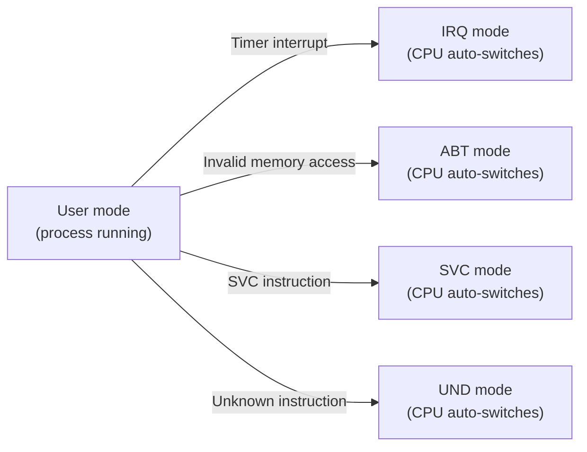
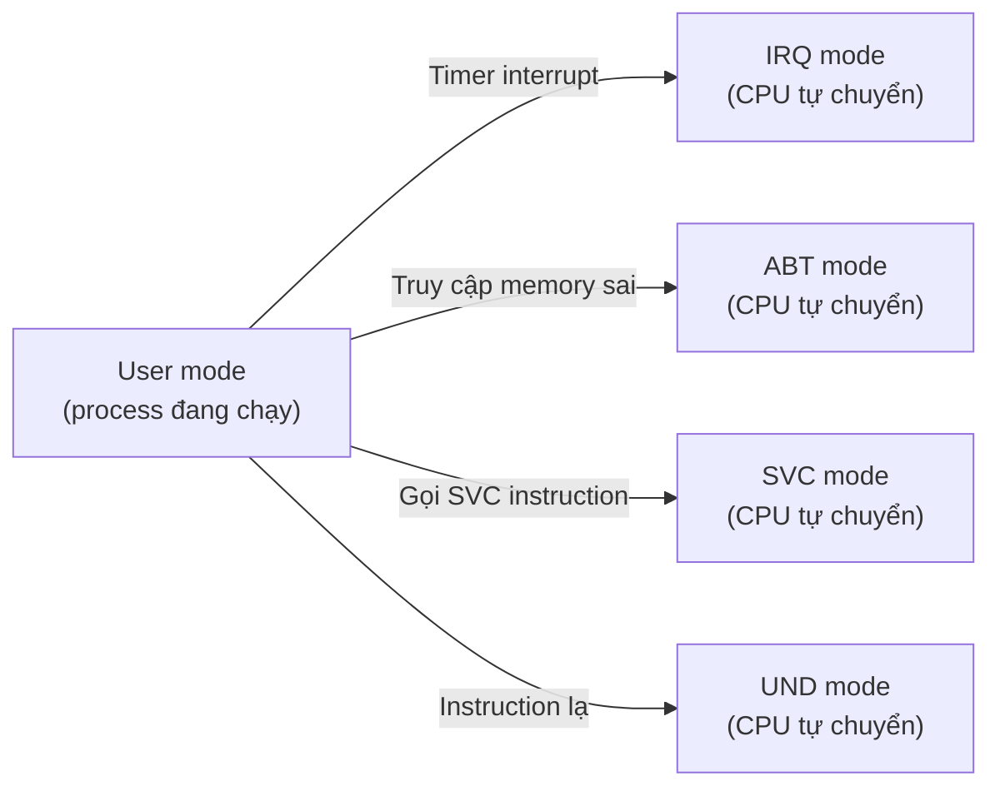

# Chapter 00 — Foundation: From C to silicon


<a id="english"></a>

**English** · [Tiếng Việt](#tiếng-việt)

> You write C and know what an OS is at a conceptual level. But you haven't seen how C
> actually runs on hardware, you can't read assembly, and you don't know how the CPU
> operates at the register level. This chapter fills exactly those gaps — just enough
> to follow the next 10 chapters.
>
> Every section connects directly to a later chapter. Nothing here is trivia.

---

## 1. C doesn't run on its own

When you write:

```c
int x = 5;
int y = x + 3;
```

What do you think happens? The computer "understands" C and runs it?

No. The CPU has no idea what C is. It doesn't know what `int` is, what `+` is, what a
variable is. The CPU only does one thing: **fetch an instruction from memory, decode,
execute**. Repeat. Forever.

An instruction is machine code — a sequence of numbers the CPU understands. Each
instruction does exactly one simple thing: copy a number into a register, add two
registers, read one memory cell. That's it.

The compiler (gcc, clang) translates C into instructions. The code above, compiled for
ARM, becomes something like:

```
mov   r0, #5        ← place the number 5 into register r0
add   r1, r0, #3    ← r1 = r0 + 3 = 8
```

That's all. No magic. `int x = 5` is just "place the number 5 into a cell inside the CPU".

### Registers — memory cells inside the CPU

A register is the smallest, fastest memory — sitting inside the CPU, accessed in one
clock cycle. ARM has 16 main registers (r0–r15), each holding 32 bits (4 bytes).

The CPU performs every operation **on registers**, not on RAM. To compute `a + b` when
a and b live in RAM:

```
                    RAM                         CPU
              ┌─────────────┐            ┌──────────────┐
              │ a = 5       │──load──▶   │ r0 = 5       │
              │ b = 3       │──load──▶   │ r1 = 3       │
              │             │            │ add r2,r0,r1  │
              │ c = ?       │◀──store──  │ r2 = 8       │
              └─────────────┘            └──────────────┘
```

Three steps: load a into r0, load b into r1, add, store the result back into RAM.
**Every** C operation has to go through this.

### Why this matters

On Linux, when you write C, the compiler + OS + runtime handles everything underneath.
You never need to know about registers, instructions, or memory layout.

But on bare-metal — no OS, no runtime. **You have to build the environment that C needs
to run.** That's the first thing the kernel has to do (→ Chapter 01).

---

## 2. Reading ARM assembly — just enough to follow the code

Section 1 said C compiles to instructions. But when reading kernel code, you'll meet
real assembly — not pseudocode. This section teaches you to read ARM assembly at the
level **required to understand `start.S` and the asm snippets in the project**, not
how to write it.

### The general pattern

Most ARM instructions look like this:

```
opcode   destination, source1, source2
```

Examples:

```asm
add   r2, r0, r1      @ r2 = r0 + r1
sub   r3, r3, #1       @ r3 = r3 - 1
mov   r0, #5           @ r0 = 5
```

- `r0`, `r1`, ... `r12` — general-purpose registers (introduced in Section 1)
- `#5` — immediate value. The `#` means "literal number", not a register
- `@` — comment in ARM assembly (like `//` in C)

### Reading/writing memory

```asm
ldr   r0, [r1]         @ r0 = *r1          (load: read from memory)
str   r0, [r1]         @ *r1 = r0          (store: write to memory)
ldr   r0, [r1, #4]     @ r0 = *(r1 + 4)   (offset of 4 bytes)
str   r0, [r1], #4     @ *r1 = r0; r1 += 4 (post-increment)
```

`[r1]` = the address in r1, equivalent to `*ptr` in C.
`[r1, #4]` = address r1 + 4, equivalent to `*(ptr + 1)` for `uint32_t *ptr`.

`ldr r0, =_bss_start` — a special form: load the **address** of symbol `_bss_start`
into r0. Equivalent to `r0 = &_bss_start` in C.

### Branches

```asm
b     label            @ jump to label (goto)
bl    kmain            @ jump to kmain, save the return address into LR
bx    lr               @ jump to the address in LR (return)
blo   label            @ jump if previous cmp result was "lower" (unsigned <)
```

`bl` = branch and link — **calling a function** in assembly. Like `kmain()` in C, except
the CPU also saves the return address (into LR).

### Compare and conditional execution

```asm
cmp   r0, r1           @ compare r0 with r1 (set flags, no result stored)
strlo r2, [r0], #4     @ store ONLY IF r0 < r1 (lo = lower, unsigned)
```

ARM lets you **attach a condition to an instruction**: `strlo` = `str` + `lo` (only
executes if the "lower" condition is true). This is how ARM writes loops without `if`.

### Special instructions you'll see in the project

| Instruction | Meaning | Seen in |
|-------------|----------|-------|
| `cpsid if` | Disable IRQ and FIQ | Chapter 01: first line of `start.S` |
| `cps #0x13` | Switch CPU to SVC mode | Chapter 01: stack setup |
| `mrs r0, cpsr` | Read CPSR into r0 | Chapter 01: `kmain` reads the mode |
| `msr cpsr, r0` | Write r0 into CPSR | Chapter 02, 05: change mode |
| `mcr p15, ...` | Write to coprocessor CP15 (MMU, cache) | Chapter 02: set VBAR, Chapter 03: enable MMU |
| `stmia r0, {r0-r12}` | Store multiple consecutive registers to memory | Chapter 05: context switch |
| `ldmia r0, {r0-r12}` | Load multiple registers from memory | Chapter 05: context switch |
| `svc #0` | Supervisor Call (syscall) | Chapter 07: user → kernel |

No need to memorize this. When you meet one in a later chapter, come back and look it up.

---

## 3. Function call = stack manipulation

> This section is for readers who don't yet know how the stack works at the hardware
> level. If you already understand stack frames, SP, and LR — skip ahead to Section 4.

When C calls a function:

```c
int result = add(5, 3);
```

What actually happens? The CPU runs instructions sequentially — how does it "jump" into
`add`, run it, and come back to exactly the right spot?

### Problem 1: Return to where?

The CPU has a special register called **PC** (Program Counter) — it holds the address
of the next instruction. The CPU runs the instruction at PC, then PC increments. Linear.

When calling a function, the CPU needs to:
1. **Remember** the return address (the instruction right after the call)
2. **Jump** PC to the start of the function
3. When the function finishes, **restore** PC to the remembered address

ARM uses the **LR** register (Link Register, r14) to hold the return address:

```
bl  add       ← "branch and link": save next-instruction address into LR, jump to add
              ← when add finishes, it runs "bx lr" = jump to the address in LR
```

### Problem 2: What about nested calls?

`main` calls `foo`, `foo` calls `bar`. When `foo` calls `bar`, LR gets overwritten — the
address to return to `main` is lost. We need a place to store many return addresses, in
order.

That's why the stack exists.

### Stack — a pile of plates

The stack is a region of RAM the CPU uses like a pile of plates: **put on top, take from
the top** (Last In, First Out).

Register **SP** (Stack Pointer, r13) points to the top of the stack. For each function call:

```
Calling foo():                          foo() returns:
┌───────────────┐                       ┌───────────────┐
│               │ ◀── SP (new top)     │               │
│  old LR      │     push LR           │               │ ◀── SP (back to old)
│  locals       │     reserve space    │               │     pop, freed
├───────────────┤                       ├───────────────┤
│  ... caller   │                       │  ... caller   │
└───────────────┘                       └───────────────┘
     ▲ stack grows downward                 ▲ stack shrinks
```

Each function call **pushes** a frame (stack frame) onto the stack: LR (return address),
local variables, arguments. On return, it **pops** the frame — SP goes back to where it
was, the plate is removed.

You can nest calls as deep as you want — each level pushes a frame, return pops it back.

### What if there's no stack?

The C compiler **assumes** the stack already exists. Every function call emits push/pop
instructions on SP. If SP isn't set, or points to invalid memory:

- The first push writes to a garbage address → **overwrites random data** or **crashes**
- Function return reads LR from a garbage address → jumps to a random instruction → crash

No clear symptom. No error message. Just wrong behavior or a hang.

On Linux, the OS creates a stack for each program before running it. On bare-metal —
**nobody does that for you**. The first job of boot code is to set SP to a valid RAM
region (→ Chapter 01, `start.S` first line after masking IRQs).

---

## 4. Memory is just a bus address

When C writes:

```c
*ptr = 42;
```

The CPU puts the address on the **memory bus**, together with the data (42) and a
"write" signal. Whatever sits at that address receives the data.

The CPU **does not know and does not care** what's at that address.

### Same instruction, different address = completely different effect

```
Write to 0x80000000 → writes to RAM     → stores data normally
Write to 0x44E09000 → writes to UART    → sends a character out the serial port
Write to 0x48040000 → writes to Timer   → configures the timer hardware
```

All three are `str r0, [r1]` (store register into address). The CPU can't tell the
difference. What differs is **what sits at that address** — a RAM chip or a hardware
controller.

```
         CPU
          │
          │  address + data
          ▼
    ┌─────────────┐
    │  Memory Bus  │
    └──┬──────┬───┘
       │      │
       ▼      ▼
    ┌─────┐ ┌──────┐
    │ RAM │ │ UART │  ← same bus, different address range
    └─────┘ └──────┘
```

Accessing hardware via memory addresses is called **MMIO** (Memory-Mapped I/O).
On ARM, almost all hardware uses MMIO — there are no special I/O instructions.

### Consequence for a kernel developer

Controlling hardware = **read/write the right address, the right value, in the right
order**. No API, no library needed. You only need to know:

- Which address (look it up in the datasheet/TRM)
- What value to write (look up the register description)
- What order (some hardware requires writing register A before B)

For example, sending the character 'A' out the UART on BeagleBone Black:

```c
/* UART0 transmit register is at address 0x44E09000 + 0x00 */
*((volatile uint32_t *)0x44E09000) = 'A';
```

One line of C. No driver framework, no HAL. This is the essence of bare-metal
(→ Chapter 01, UART driver).

### Why `volatile`?

The compiler is clever — it optimizes code. If it sees you write to an address without
reading it back, it may drop the write ("dead store elimination"). For RAM, that's fine.
For a hardware register — **disaster**: you want to send a character out UART and the
compiler deletes the write.

`volatile` tells the compiler: "this address has side effects — don't optimize, don't
drop, don't reorder".

---

## 5. CPU modes and privilege

If all code could access any address, then any program could:
- Overwrite the kernel → crash the whole system
- Disable interrupts → nobody can stop it
- Read another program's data → break security

The CPU needs a way to distinguish **trusted code** from **untrusted code**.

### ARM solves this with CPU modes

ARM has several modes, each with a different privilege level:

```
┌─────────────────────────────────────────────────────────┐
│                    Privileged modes                       │
│  ┌──────────┐ ┌──────────┐ ┌──────────┐ ┌──────────┐   │
│  │   SVC    │ │   IRQ    │ │   ABT    │ │   UND    │   │
│  │ Kernel   │ │ Interrupt│ │  Fault   │ │ Unknown  │   │
│  │ runs here│ │ handler  │ │ handler  │ │ handler  │   │
│  └──────────┘ └──────────┘ └──────────┘ └──────────┘   │
│  ┌──────────┐                                            │
│  │   FIQ    │  ← fast interrupt, high priority          │
│  └──────────┘                                            │
├─────────────────────────────────────────────────────────┤
│                   Unprivileged mode                       │
│  ┌──────────────────────────────────────────────────┐   │
│  │                   User mode                       │   │
│  │  Processes run here — cannot disable interrupts,  │   │
│  │  cannot access kernel memory, cannot touch        │   │
│  │  hardware registers.                              │   │
│  └──────────────────────────────────────────────────┘   │
└─────────────────────────────────────────────────────────┘
```

- **User mode:** least privileged. User programs run here. No hardware access, no
  disabling interrupts, no touching the page table.
- **SVC mode (Supervisor):** full privilege. The kernel runs here.
- **IRQ/FIQ mode:** CPU **automatically** switches here when receiving a hardware
  interrupt.
- **ABT mode (Abort):** CPU auto-switches on an invalid memory access (Data Abort,
  Prefetch Abort).
- **UND mode (Undefined):** CPU auto-switches on an unrecognized instruction.

### Banked registers — each mode has its own SP

This is an important detail: when the CPU changes mode, **some registers automatically
swap to a mode-specific copy**. At minimum SP (stack pointer); some modes also have
their own LR.

```
                User mode         IRQ mode          SVC mode
              ┌───────────┐    ┌───────────┐    ┌───────────┐
  r0 – r12    │  shared   │    │  shared   │    │  shared   │
              ├───────────┤    ├───────────┤    ├───────────┤
  SP (r13)    │ SP_usr    │    │ SP_irq    │    │ SP_svc    │  ← different!
  LR (r14)    │ LR_usr    │    │ LR_irq    │    │ LR_svc    │  ← different!
              └───────────┘    └───────────┘    └───────────┘
```

So: when an interrupt fires, the CPU switches to IRQ mode and SP **automatically** becomes
SP_irq — a completely different stack pointer. The code that was running on the User stack
is not affected.

This is why boot code must **set up a dedicated SP for each mode** (→ Chapter 01,
`start.S`: switch to FIQ mode → set SP, switch to IRQ mode → set SP, ...).

### The CPU switches modes automatically

Code never "asks" to switch mode. **Hardware forces it**:



This event is called an **exception**. Each kind of exception drops the CPU into the
matching mode. A user program cannot elevate its own privilege — only an exception can
change the mode. This is the foundation of the entire system's security.

The exception mechanism is explained in detail in → Chapter 02.

### CPSR — the CPU knows its current mode

The CPU stores its current mode in the **CPSR** register (Current Program Status Register).
You don't need to memorize the full layout — just know that CPSR holds three important
things:

- **MODE bits [4:0]** — current mode (0x13 = SVC, 0x12 = IRQ, 0x10 = User, ...)
- **I bit [7]** — if 1, IRQ is masked (CPU ignores interrupts)
- **F bit [6]** — if 1, FIQ is masked

Boot code starts with `cpsid if` — sets I=1, F=1 — **masking all interrupts** before
doing anything else (→ Chapter 01, first line of `start.S`).

The remaining CPSR bit fields will be explained in later chapters as needed.

---

## Links

This chapter has no code. It provides the mental model needed to read the next 10 chapters:

| Concept | Section | Used in chapter |
|------------|------|----------------|
| Instructions, registers | 1 | 01 (boot assembly), 02 (exception handler) |
| ARM assembly syntax | 2 | 01 (`start.S`), 02 (handler asm), 05 (context switch) |
| Stack, SP, function calls | 3 | 01 (stack setup), 05 (context switch) |
| Memory bus, MMIO, volatile | 4 | 01 (UART driver), 04 (timer/INTC driver) |
| CPU modes, privilege, banked SP | 5 | 01 (mode switching), 02 (exception), 05 (User vs SVC), 07 (syscall) |
| CPSR, IRQ masking | 5 | 01 (cpsid), 04 (interrupt enable), 06 (scheduler atomic) |

**Next: Chapter 01 — Boot: From power-on to UART output →**

---

<a id="tiếng-việt"></a>

**Tiếng Việt** · [English](#english)

> Bạn viết C, biết OS là gì ở mức khái niệm. Nhưng bạn chưa biết C thật sự chạy thế nào
> trên hardware, chưa đọc được assembly, chưa biết CPU hoạt động ở mức register.
> Chapter này bổ sung đúng những thứ đó — đủ để đọc hiểu 10 chapter tiếp theo.
>
> Mỗi phần kết nối trực tiếp vào chapter sau. Không có kiến thức nào ở đây là "biết cho vui".

---

## 1. C không tự chạy được

Khi bạn viết:

```c
int x = 5;
int y = x + 3;
```

Bạn nghĩ gì xảy ra? Máy tính "hiểu" C rồi chạy?

Không. CPU không biết C là gì. Nó không biết `int` là gì, không biết `+` là gì, không biết
biến là gì. CPU chỉ biết làm một việc: **đọc instruction từ memory, decode, execute**.
Lặp lại. Mãi mãi.

Instruction là mã máy — chuỗi số mà CPU hiểu. Mỗi instruction làm đúng 1 việc đơn giản:
copy số vào register, cộng 2 register, đọc 1 ô nhớ. Không hơn.

Compiler (gcc, clang) là thứ dịch C thành instruction. Đoạn code trên, sau khi compile
cho ARM, trở thành thứ kiểu như:

```
mov   r0, #5        ← đặt số 5 vào register r0
add   r1, r0, #3    ← r1 = r0 + 3 = 8
```

Đó là tất cả. Không có phép thuật. `int x = 5` chỉ là "đặt số 5 vào 1 ô nhớ bên trong CPU".

### Register — ô nhớ bên trong CPU

Register là bộ nhớ nhỏ nhất, nhanh nhất — nằm ngay trong CPU, truy cập trong 1 chu kỳ xung nhịp.
ARM có 16 register chính (r0–r15), mỗi register chứa 32 bit (4 byte).

CPU làm mọi phép tính **trên register**, không trên RAM. Muốn tính `a + b` khi a và b
nằm trong RAM:

```
                    RAM                         CPU
              ┌─────────────┐            ┌──────────────┐
              │ a = 5       │──load──▶   │ r0 = 5       │
              │ b = 3       │──load──▶   │ r1 = 3       │
              │             │            │ add r2,r0,r1  │
              │ c = ?       │◀──store──  │ r2 = 8       │
              └─────────────┘            └──────────────┘
```

3 bước: load a vào r0, load b vào r1, cộng, store kết quả ngược lại RAM.
Đây là thứ **mỗi** phép tính C đều phải đi qua.

### Tại sao điều này quan trọng

Trên Linux, khi bạn viết C, compiler + OS + runtime lo hết phần bên dưới.
Bạn không cần biết register, instruction, hay memory layout.

Nhưng trên bare-metal — không có OS, không có runtime. **Bạn phải tự tạo ra
môi trường mà C cần để chạy được.** Đó là việc đầu tiên kernel phải làm
(→ Chapter 01).

---

## 2. Đọc ARM assembly — vừa đủ để theo dõi code

Phần 1 nói C compile thành instruction. Nhưng khi đọc kernel code, bạn sẽ gặp assembly
thật — không phải pseudocode. Phần này dạy đọc ARM assembly ở mức **đủ để hiểu `start.S`
và các đoạn assembly trong project**, không phải dạy viết.

### Pattern chung

Hầu hết ARM instruction theo dạng:

```
opcode   destination, source1, source2
```

Ví dụ:

```asm
add   r2, r0, r1      @ r2 = r0 + r1
sub   r3, r3, #1       @ r3 = r3 - 1
mov   r0, #5           @ r0 = 5
```

- `r0`, `r1`, ... `r12` — register đa dụng (Chapter 00.1 đã giới thiệu)
- `#5` — giá trị trực tiếp (immediate). Dấu `#` nghĩa là "con số", không phải register
- `@` — comment trong ARM assembly (giống `//` trong C)

### Đọc/ghi memory

```asm
ldr   r0, [r1]         @ r0 = *r1          (load: đọc từ memory)
str   r0, [r1]         @ *r1 = r0          (store: ghi vào memory)
ldr   r0, [r1, #4]     @ r0 = *(r1 + 4)   (offset 4 byte)
str   r0, [r1], #4     @ *r1 = r0; r1 += 4 (post-increment)
```

`[r1]` = address trong r1, tương tự `*ptr` trong C.
`[r1, #4]` = address r1 + 4, tương tự `*(ptr + 1)` với `uint32_t *ptr`.

`ldr r0, =_bss_start` — dạng đặc biệt: load **address** của symbol `_bss_start` vào r0.
Tương tự `r0 = &_bss_start` trong C.

### Nhảy (branch)

```asm
b     label            @ nhảy đến label (goto)
bl    kmain            @ nhảy đến kmain, lưu địa chỉ quay về vào LR
bx    lr               @ nhảy về địa chỉ trong LR (return)
blo   label            @ nhảy nếu kết quả cmp trước đó là "lower" (unsigned <)
```

`bl` = branch and link — **gọi function** trong assembly. Tương tự `kmain()` trong C,
nhưng CPU cũng lưu luôn chỗ quay về (vào LR).

### So sánh và thực thi có điều kiện

```asm
cmp   r0, r1           @ so sánh r0 với r1 (set flag, không lưu kết quả)
strlo r2, [r0], #4     @ store CHỈ KHI r0 < r1 (lo = lower, unsigned)
```

ARM cho phép **gắn điều kiện vào instruction**: `strlo` = `str` + `lo` (chỉ thực hiện
nếu điều kiện "lower" đúng). Đây là cách ARM làm vòng lặp mà không cần `if`.

### Các instruction đặc biệt sẽ gặp trong project

| Instruction | Ý nghĩa | Gặp ở |
|-------------|----------|-------|
| `cpsid if` | Disable IRQ và FIQ | Chapter 01: `start.S` dòng đầu |
| `cps #0x13` | Chuyển CPU sang SVC mode | Chapter 01: setup stacks |
| `mrs r0, cpsr` | Đọc CPSR register vào r0 | Chapter 01: `kmain` đọc mode |
| `msr cpsr, r0` | Ghi r0 vào CPSR | Chapter 02, 05: thay đổi mode |
| `mcr p15, ...` | Ghi vào coprocessor CP15 (MMU, cache) | Chapter 02: set VBAR, Chapter 03: enable MMU |
| `stmia r0, {r0-r12}` | Store nhiều register liên tiếp vào memory | Chapter 05: context switch |
| `ldmia r0, {r0-r12}` | Load nhiều register từ memory | Chapter 05: context switch |
| `svc #0` | Gọi Supervisor Call (syscall) | Chapter 07: user → kernel |

Không cần nhớ hết bây giờ. Khi gặp trong chapter sau, quay lại bảng này tra cứu.

---

## 3. Function call = thao tác trên stack

> Phần này dành cho bạn nào chưa rõ stack hoạt động thế nào ở mức hardware.
> Nếu bạn đã hiểu stack frame, SP, LR — bỏ qua, nhảy thẳng sang phần 4.

Khi C gọi function:

```c
int result = add(5, 3);
```

Chuyện gì thật sự xảy ra? CPU đang chạy từng instruction tuần tự — làm sao nó "nhảy"
vào function `add`, chạy xong rồi quay về đúng chỗ cũ?

### Vấn đề 1: Quay về đâu?

CPU có register đặc biệt tên **PC** (Program Counter) — nó chứa địa chỉ của instruction
tiếp theo. CPU chạy instruction tại PC, rồi PC tự tăng lên. Tuần tự.

Khi gọi function, CPU cần:
1. **Nhớ** địa chỉ quay về (instruction ngay sau lệnh gọi)
2. **Nhảy** PC đến đầu function
3. Khi function xong, **khôi phục** PC về địa chỉ đã nhớ

ARM dùng register **LR** (Link Register, r14) để lưu địa chỉ quay về:

```
bl  add       ← "branch and link": lưu địa chỉ dòng tiếp vào LR, nhảy đến add
              ← khi add xong, nó chạy "bx lr" = nhảy về địa chỉ trong LR
```

### Vấn đề 2: Function gọi function thì sao?

`main` gọi `foo`, `foo` gọi `bar`. Khi `foo` gọi `bar`, LR bị ghi đè — địa chỉ quay về
`main` mất. Cần chỗ lưu nhiều địa chỉ quay về, theo thứ tự.

Đây là lý do stack tồn tại.

### Stack — chồng đĩa

Stack là vùng RAM mà CPU dùng như chồng đĩa: **đặt lên trên, lấy từ trên xuống**
(Last In, First Out).

Register **SP** (Stack Pointer, r13) trỏ đến đỉnh stack. Mỗi function call:

```
Gọi foo():                              foo() return:
┌───────────────┐                       ┌───────────────┐
│               │ ◀── SP (đỉnh mới)    │               │
│  LR cũ       │     push LR           │               │ ◀── SP (trở lại)
│  biến local   │     cấp chỗ          │               │     pop, giải phóng
├───────────────┤                       ├───────────────┤
│  ... caller   │                       │  ... caller   │
└───────────────┘                       └───────────────┘
     ▲ stack mọc xuống                      ▲ stack co lại
```

Mỗi function call **push** một "khung" (stack frame) lên stack: LR (địa chỉ quay về),
biến local, argument. Khi return, **pop** khung đó — SP quay lại vị trí cũ, đĩa được lấy ra.

Gọi sâu bao nhiêu cấp cũng được — mỗi cấp push 1 khung, return thì pop ngược lại.

### Không có stack thì sao?

C compiler **giả định** stack đã có sẵn. Mỗi lời gọi function đều sinh ra instruction
push/pop trên SP. Nếu SP chưa được set, hoặc trỏ vào vùng memory không hợp lệ:

- Push đầu tiên ghi vào địa chỉ rác → **ghi đè data ngẫu nhiên** hoặc **crash**
- Function return đọc LR từ địa chỉ rác → nhảy đến instruction ngẫu nhiên → crash

Không có triệu chứng rõ ràng. Không có error message. Chỉ có hành vi sai hoặc treo.

Trên Linux, OS tạo stack cho mỗi program trước khi chạy. Trên bare-metal — **không ai làm điều đó**.
Việc đầu tiên của boot code là set SP cho đúng vùng RAM (→ Chapter 01, `start.S` dòng đầu tiên
sau mask IRQ).

---

## 4. Memory chỉ là bus address

Khi C viết:

```c
*ptr = 42;
```

CPU gửi address lên **memory bus**, kèm data (42) và tín hiệu "write". Bất kỳ thứ gì
nằm ở address đó sẽ nhận data.

CPU **không biết và không quan tâm** cái gì ở address đó.

### Cùng instruction, khác address = khác hoàn toàn

```
Ghi vào 0x80000000 → ghi vào RAM     → lưu data bình thường
Ghi vào 0x44E09000 → ghi vào UART    → gửi ký tự ra serial port
Ghi vào 0x48040000 → ghi vào Timer   → cấu hình timer hardware
```

Tất cả đều là `str r0, [r1]` (store register vào address). CPU không phân biệt.
Sự khác biệt là **ai ngồi ở address đó** — RAM chip hay hardware controller.

```
         CPU
          │
          │  address + data
          ▼
    ┌─────────────┐
    │  Memory Bus  │
    └──┬──────┬───┘
       │      │
       ▼      ▼
    ┌─────┐ ┌──────┐
    │ RAM │ │ UART │  ← cùng bus, khác address range
    └─────┘ └──────┘
```

Cách truy cập hardware qua memory address gọi là **MMIO** (Memory-Mapped I/O).
Trên ARM, hầu hết mọi hardware đều dùng MMIO — không có instruction đặc biệt cho I/O.

### Hệ quả cho kernel developer

Điều khiển hardware = **đọc/ghi đúng address, đúng giá trị, đúng thứ tự**. Không cần API,
không cần library. Chỉ cần biết:

- Address nào (tra trong datasheet/TRM)
- Ghi giá trị gì (tra register description)
- Thứ tự nào (một số hardware yêu cầu ghi register A trước B)

Ví dụ, gửi ký tự 'A' ra UART trên BeagleBone Black:

```c
/* UART0 transmit register nằm ở address 0x44E09000 + 0x00 */
*((volatile uint32_t *)0x44E09000) = 'A';
```

Một dòng C. Không có driver framework, không có HAL. Đây là bản chất của bare-metal
(→ Chapter 01, UART driver).

### Tại sao `volatile`?

Compiler thông minh — nó tối ưu code. Nếu thấy bạn ghi vào 1 address mà không đọc lại,
nó có thể bỏ lệnh ghi đi ("dead store elimination"). Với RAM, điều này hợp lý.
Với hardware register — **thảm họa**: bạn muốn gửi ký tự ra UART mà compiler xóa mất lệnh ghi.

`volatile` nói với compiler: "address này có side effect — đừng tối ưu, đừng bỏ, đừng sắp xếp lại".

---

## 5. CPU mode và privilege

Nếu mọi code đều truy cập mọi address, thì bất kỳ chương trình nào cũng có thể:
- Ghi đè kernel → crash toàn hệ thống
- Disable interrupt → không ai dừng được nó
- Đọc dữ liệu chương trình khác → vi phạm bảo mật

CPU cần cách phân biệt **code đáng tin** và **code không đáng tin**.

### ARM giải quyết bằng CPU mode

ARM có nhiều mode, mỗi mode có mức đặc quyền khác nhau:

```
┌─────────────────────────────────────────────────────────┐
│                    Privileged modes                       │
│  ┌──────────┐ ┌──────────┐ ┌──────────┐ ┌──────────┐   │
│  │   SVC    │ │   IRQ    │ │   ABT    │ │   UND    │   │
│  │ Kernel   │ │ Interrupt│ │  Fault   │ │ Unknown  │   │
│  │ chạy đây │ │ handler  │ │ handler  │ │ handler  │   │
│  └──────────┘ └──────────┘ └──────────┘ └──────────┘   │
│  ┌──────────┐                                            │
│  │   FIQ    │  ← interrupt nhanh, ưu tiên cao           │
│  └──────────┘                                            │
├─────────────────────────────────────────────────────────┤
│                   Unprivileged mode                       │
│  ┌──────────────────────────────────────────────────┐   │
│  │                   User mode                       │   │
│  │  Process chạy đây — không thể disable interrupt,  │   │
│  │  không thể truy cập kernel memory, không thể      │   │
│  │  chạm hardware register.                          │   │
│  └──────────────────────────────────────────────────┘   │
└─────────────────────────────────────────────────────────┘
```

- **User mode:** ít quyền nhất. User program chạy ở đây. Không truy cập hardware,
  không disable interrupt, không thay đổi page table.
- **SVC mode (Supervisor):** toàn quyền. Kernel chạy ở đây.
- **IRQ/FIQ mode:** CPU **tự động** chuyển sang khi nhận interrupt từ hardware.
- **ABT mode (Abort):** CPU tự chuyển khi truy cập memory sai (Data Abort, Prefetch Abort).
- **UND mode (Undefined):** CPU tự chuyển khi gặp instruction không nhận ra.

### Banked registers — mỗi mode có SP riêng

Đây là chi tiết quan trọng: khi CPU chuyển mode, **một số register tự động đổi sang bản copy riêng
của mode đó**. Ít nhất SP (stack pointer), một số mode có thêm LR.

```
                User mode         IRQ mode          SVC mode
              ┌───────────┐    ┌───────────┐    ┌───────────┐
  r0 – r12   │  chung    │    │  chung    │    │  chung    │
              ├───────────┤    ├───────────┤    ├───────────┤
  SP (r13)    │ SP_usr    │    │ SP_irq    │    │ SP_svc    │  ← khác nhau!
  LR (r14)    │ LR_usr    │    │ LR_irq    │    │ LR_svc    │  ← khác nhau!
              └───────────┘    └───────────┘    └───────────┘
```

Nghĩa là: khi interrupt xảy ra, CPU chuyển sang IRQ mode, SP **tự động** trở thành SP_irq —
stack pointer khác hoàn toàn. Code đang chạy trên User stack không bị ảnh hưởng.

Đây là lý do boot code phải **setup SP riêng cho từng mode** (→ Chapter 01, `start.S`:
chuyển vào FIQ mode → set SP, chuyển IRQ mode → set SP, ...).

### CPU chuyển mode tự động

Code không "xin" chuyển mode. **Hardware cưỡng chế**:



Sự kiện này gọi là **exception**. Mỗi loại exception đưa CPU vào mode tương ứng.
User program không thể tự nâng quyền — chỉ có exception mới chuyển được mode.
Đây là nền tảng bảo mật của toàn bộ hệ thống.

Cơ chế exception sẽ được giải thích chi tiết ở → Chapter 02.

### CPSR — CPU biết mình đang ở mode nào

CPU lưu mode hiện tại trong register **CPSR** (Current Program Status Register).
Bạn không cần nhớ layout chi tiết — chỉ cần biết CPSR chứa 3 thứ quan trọng:

- **MODE bits [4:0]** — mode hiện tại (0x13 = SVC, 0x12 = IRQ, 0x10 = User, ...)
- **I bit [7]** — nếu = 1, IRQ bị mask (CPU không nhận interrupt)
- **F bit [6]** — nếu = 1, FIQ bị mask

Boot code bắt đầu bằng `cpsid if` — set I=1, F=1 — **mask tất cả interrupt** trước khi
làm bất cứ thứ gì (→ Chapter 01, dòng đầu tiên của `start.S`).

Chi tiết CPSR bit field sẽ được giải thích khi cần ở chapter sau.

---

## Liên kết

Chapter này không có code. Nó cung cấp mental model để đọc hiểu 10 chapter tiếp theo:

| Khái niệm | Phần | Dùng ở chapter |
|------------|------|----------------|
| Instruction, register | 1 | 01 (boot assembly), 02 (exception handler) |
| ARM assembly syntax | 2 | 01 (`start.S`), 02 (handler asm), 05 (context switch) |
| Stack, SP, function call | 3 | 01 (setup stacks), 05 (context switch) |
| Memory bus, MMIO, volatile | 4 | 01 (UART driver), 04 (timer/INTC driver) |
| CPU mode, privilege, banked SP | 5 | 01 (mode switching), 02 (exception), 05 (User vs SVC), 07 (syscall) |
| CPSR, IRQ mask | 5 | 01 (cpsid), 04 (interrupt enable), 06 (scheduler atomic) |

**Tiếp theo: Chapter 01 — Boot: Từ power-on đến UART output →**
