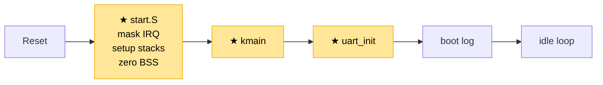
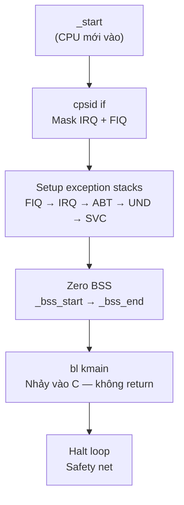
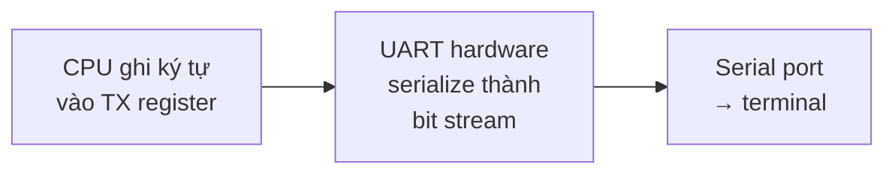

# Chapter 01 — Boot: Từ power-on đến UART output

> CPU vừa nhận điện. Không có OS, không có stack, không có khái niệm "chương trình".
> Chỉ có silicon và một địa chỉ cố định. Chapter này giải thích: từ trạng thái đó,
> làm thế nào để chạy được dòng C đầu tiên và in được ký tự ra serial port.

---

## Đã xây dựng đến đâu

Đây là chapter đầu tiên — toàn bộ đều mới (★). Sau chapter này, system trông như sau:

```
┌──────────────────────────────────────────────────────┐
│                    User space                       │
│                    (chưa có)                         │
└──────────────────────────────────────────────────────┘
━━━━━━━━━━━━━━━━━━━━━━━━━━━━━━━━━━━━━━━━━━━━━━━━━━━━━━━
┌──────────────────────────────────────────────────────┐
│                  Kernel (SVC mode)                   │
│                                                      │
│   ┌─────────────────┐                                │
│   │  ★ kmain        │── boot log ra UART             │
│   └─────────────────┘                                │
│           │                                          │
│           ▼                                          │
│   ┌─────────────────┐    ┌─────────────────────┐     │
│   │ ★ UART driver   │    │ ★ Boot sequence     │     │
│   │   PL011 (QEMU)  │    │   (start.S)         │     │
│   │   NS16550 (BBB) │    │   stacks/BSS/jumpC  │     │
│   └─────────────────┘    └─────────────────────┘     │
│                                                      │
│   MMU: OFF · IRQ: masked · Exceptions: chưa có       │
└──────────────────────────────────────────────────────┘
━━━━━━━━━━━━━━━━━━━━━━━━━━━━━━━━━━━━━━━━━━━━━━━━━━━━━━━
                      Hardware
                CPU · RAM · UART
```

**Flow khởi động:**



System đi từ **không có gì** (CPU vừa cấp điện) đến **chạy được C code và in được text**.
Đây là điểm xuất phát — mọi chapter sau xây dựng tiếp lên trên nền này.

---

## Nguyên lý

### CPU khi mới cấp nguồn

CPU không biết gì. Nó không biết có OS, không biết có kernel, không biết bạn đã compile
chương trình gì. Nó chỉ biết một thứ: **đọc instruction tại một địa chỉ cố định** (reset vector),
rồi chạy.

Trên ARM:
- QEMU realview-pb-a8: QEMU load ELF trực tiếp, đặt PC tại entry point (`_start`)
- BeagleBone Black: CPU bắt đầu từ ROM nội bộ → ROM đọc bootloader (SPL) từ SD card vào SRAM →
  SPL init DDR → SPL copy kernel vào DDR → nhảy đến `_start`

Sau khi đến `_start`, cả 2 platform đều ở cùng trạng thái: **PC trỏ vào code của bạn,
MMU tắt, mọi address là physical, không ai setup gì cả**.

### Tại sao không nhảy thẳng vào C?

C compiler **giả định** 3 điều khi code bắt đầu chạy:

1. **Stack đã có** — mỗi function call đều push/pop trên SP (Chapter 00, phần 2)
2. **BSS = 0** — biến global chưa khởi tạo phải bằng 0 theo chuẩn C
3. **Interrupt được kiểm soát** — nếu interrupt fire bất ngờ, có handler xử lý

Bare-metal không có gì trong số đó. Gọi function C đầu tiên mà chưa setup stack →
push vào địa chỉ rác → crash. Biến global chứa rác → logic sai âm thầm.
Interrupt fire khi đang setup → CPU nhảy vào handler chưa tồn tại → crash không dấu vết.

**Assembly phải tạo ra 3 điều kiện đó trước khi nhảy vào C.**

---

## Bối cảnh

```
Trạng thái CPU lúc này:
- PC      : trỏ vào _start (physical address)
- MMU     : OFF — mọi address là physical
- IRQ/FIQ : trạng thái không xác định (có thể đang enabled)
- SP      : chưa set — chứa giá trị rác
- BSS     : chưa zero — chứa dữ liệu rác
- UART    : chưa init — không thể in gì ra
- Có gì   : chỉ có code trong RAM, không gì khác
```

---

## Vấn đề

Nếu không giải quyết ở bước này:

- **Không có stack** → C code crash ngay instruction đầu tiên. Function call push LR vào SP,
  mà SP là rác → ghi vào địa chỉ ngẫu nhiên → corrupt data hoặc fault.
- **BSS chứa rác** → biến global `uint32_t tick_count;` không phải 0 mà là giá trị ngẫu nhiên.
  Logic chạy sai, nhưng không crash → bug âm thầm, cực khó phát hiện.
- **Interrupt không kiểm soát** → IRQ fire khi đang setup stack (SP mới set nửa chừng)
  → CPU chuyển mode, SP_irq chưa set → crash không debug được vì UART chưa init.

---

## Thiết kế

### Boot sequence



**Thứ tự bắt buộc, không đảo được:**

1. Mask interrupt **trước tiên** — ngăn IRQ fire khi chưa sẵn sàng
2. Setup stacks — C cần stack để chạy function
3. Zero BSS — C cần BSS = 0 cho global variables
4. Jump C — mọi điều kiện đã đủ

Nếu đảo 1 và 2: interrupt fire khi đang set SP → crash.
Nếu đảo 2 và 4: C chạy mà chưa có stack → crash.
Nếu bỏ 3: global variable có giá trị rác → bug âm thầm.

### Tại sao 5 exception stacks?

ARM có nhiều CPU mode (Chapter 00, phần 4). Mỗi mode có **SP riêng** (banked register).
Khi exception xảy ra, CPU tự động chuyển mode → SP tự động đổi. Nếu SP của mode đó
chưa được set → push vào rác → crash.

Boot code phải set SP cho **tất cả mode có thể xảy ra**:

| Mode | Mode bits | Stack size | Tại sao |
|------|-----------|------------|---------|
| FIQ  | 0x11 | 512 B | Interrupt nhanh, chỉ làm trampoline ngắn |
| IRQ  | 0x12 | 1 KB | Timer interrupt, trampoline rồi switch SVC |
| ABT  | 0x17 | 1 KB | Memory fault handler, in debug info |
| UND  | 0x1B | 1 KB | Undefined instruction handler, in debug info |
| SVC  | 0x13 | 8 KB | Kernel chạy ở đây — cần nhiều nhất cho C code |

SVC 8 KB vì toàn bộ kernel C code chạy ở SVC mode: function call sâu, biến local lớn.
Exception stacks chỉ cần đủ cho vài instruction trampoline rồi switch sang SVC.

### Platform differences

| | QEMU realview-pb-a8 | BeagleBone Black |
|---|---|---|
| Load | QEMU `-kernel` load ELF trực tiếp vào RAM | ROM → SPL → DDR init → copy kernel → jump |
| RAM base | 0x70000000 (128 MB) | 0x80000000 (512 MB) |
| Kernel PA | 0x70100000 | 0x80000000 |
| UART | PL011 (ARM PrimeCell) | NS16550 (AM335x UART0) |

Code C **giống nhau**. Khác nhau là linker script (address) và UART driver (register set).

---

## Cách hoạt động

### CPU đi qua các mode để setup banked SP

ARMv7 có **banked SP** — mỗi mode có SP riêng biệt. Khi CPU đang ở mode X, instruction
`ldr sp, ...` chỉ ghi vào SP_X. Muốn set SP cho mode Y → phải `cps` chuyển sang mode Y trước.

Boot code tuần tự đi qua 5 mode để set 5 SP. Sau mỗi `cps + ldr sp`, banked SP của mode đó
chuyển từ "rác" sang "valid". Mode cuối cùng (SVC) là mode kernel sẽ chạy:

```
Trước boot                 Sau cps #0x11+ldr        ...sau cps #0x13+ldr (cuối)
─────────────────          ─────────────────────    ──────────────────────────
Mode hiện tại: ?           Mode hiện tại: FIQ       Mode hiện tại: SVC ✓
Đang chạy: rom/qemu        Đang chạy: start.S       Đang chạy: start.S → bl kmain

Banked SPs:                Banked SPs:              Banked SPs:
  SP_fiq: ???                SP_fiq: _fiq_top  ✓      SP_fiq: _fiq_top  ✓
  SP_irq: ???                SP_irq: ???              SP_irq: _irq_top  ✓
  SP_abt: ???                SP_abt: ???              SP_abt: _abt_top  ✓
  SP_und: ???                SP_und: ???              SP_und: _und_top  ✓
  SP_svc: ???                SP_svc: ???              SP_svc: _svc_top  ✓

C code:                    C code:                  C code:
  ✗ không gọi được           ✗ chưa gọi được          ✓ gọi kmain được
  (chưa có stack)            (vẫn ở FIQ, SVC          (đang ở SVC, SVC stack
                              chưa setup)              đã set, all banked OK)
```

3 điểm quan trọng:

- **Banked SP độc lập** — `ldr sp, =X` ở FIQ mode KHÔNG ảnh hưởng SP_svc. Đó là vì sao phải
  setup từng mode một, không thể set 1 lần xong.
- **`cps #0x13` PHẢI là cuối cùng** — sau lệnh này CPU ở SVC mode, `bl kmain` sẽ chạy C code
  trên SVC stack (8 KB). Nếu mode cuối là UND/ABT, kmain chạy với stack 1 KB → overflow nhanh.
- **Mặt khác, sao phải set SP cho IRQ/ABT/UND/FIQ luôn?** — vì sau này (Chapter 02 trở đi),
  exception có thể fire bất kỳ lúc nào. Khi đó CPU tự đổi sang IRQ/ABT/UND mode → dùng
  banked SP tương ứng → nếu chưa set thì crash. Setup sẵn từ boot là bước phòng thủ.

### Boot end-to-end

```mermaid
sequenceDiagram
    participant ROM as ROM/QEMU loader
    participant Start as start.S
    participant UART
    participant kmain

    ROM->>Start: PC ← _start
    Note over Start: cpsid if<br/>(mask IRQ + FIQ)
    Note over Start: cps→FIQ, ldr sp<br/>cps→IRQ, ldr sp<br/>cps→ABT, ldr sp<br/>cps→UND, ldr sp<br/>cps→SVC, ldr sp
    Note over Start: zero BSS<br/>(loop _bss_start → _bss_end)
    Start->>kmain: bl kmain
    kmain->>UART: uart_init()
    kmain->>UART: uart_printf("RingNova...")
    kmain->>UART: in boot log<br/>(.text/.data/.bss/CPSR)
    Note over kmain: for(;;) — idle loop
```

Reader chỉ cần nhìn diagram là biết: từ ROM → start.S setup môi trường → kmain init UART
→ in log. Không cần hiểu chi tiết instruction.

---

## Implementation

### start.S — Reset entry point

File: `kernel/arch/arm/boot/start.S`

Toàn bộ boot sequence nằm trong file này. Đi qua từng block:

**Block 1 — Mask interrupt:**

```asm
cpsid   if
```

Một instruction. `cps` = Change Processor State. `id` = Interrupt Disable.
`if` = cả IRQ (I) và FIQ (F). Sau dòng này, CPSR.I = 1 và CPSR.F = 1 —
CPU sẽ **không nhận** bất kỳ interrupt nào cho đến khi ta chủ động enable lại.

Tại sao phải làm đầu tiên: nếu hardware nào đó đang assert IRQ line
(timer từ lần boot trước chưa clear), CPU sẽ nhảy vào IRQ handler ngay — mà handler
chưa tồn tại.

**Block 2 — Setup exception stacks:**

```asm
/* FIQ mode — 512 B */
cps     #0x11
ldr     sp, =_fiq_stack_top

/* IRQ mode — 1 KB */
cps     #0x12
ldr     sp, =_irq_stack_top

/* Abort mode — 1 KB */
cps     #0x17
ldr     sp, =_abt_stack_top

/* Undefined mode — 1 KB */
cps     #0x1B
ldr     sp, =_und_stack_top

/* SVC mode — 8 KB; kernel runs here */
cps     #0x13
ldr     sp, =_svc_stack_top
```

Pattern lặp lại: `cps` chuyển sang mode → `ldr sp` set stack pointer cho mode đó.

`_fiq_stack_top`, `_irq_stack_top`, ... là symbol từ linker script — chúng trỏ đến **đỉnh**
của vùng RAM được dành cho từng stack. Stack mọc xuống, nên SP bắt đầu ở đỉnh.

**SVC phải là mode cuối cùng** — vì `kmain` chạy ở SVC mode. Sau block này, CPU ở SVC mode
với SP_svc đã set.

**Block 3 — Zero BSS:**

```asm
ldr     r0, =_bss_start
ldr     r1, =_bss_end
mov     r2, #0
.Lzero_bss:
    cmp     r0, r1
    strlo   r2, [r0], #4    /* store 0, advance 4 bytes */
    blo     .Lzero_bss
```

Vòng lặp đơn giản: từ `_bss_start` đến `_bss_end`, ghi 0 vào mỗi 4 byte.

`_bss_start` và `_bss_end` là symbol từ linker script — linker biết BSS section
bắt đầu và kết thúc ở đâu trong RAM.

`strlo` = store if lower (cmp r0, r1 → nếu r0 < r1 thì store). `[r0], #4` = ghi vào
address r0 rồi tăng r0 thêm 4 (post-increment). Hiệu quả: ghi 0, tiến 4 byte, lặp.

**Block 4 — Jump to C:**

```asm
bl      kmain
```

`bl` = branch and link — lưu địa chỉ quay về vào LR, nhảy đến `kmain`.
`kmain` không bao giờ return. Nếu nó return (bug), CPU rơi vào halt loop:

```asm
.Lhalt:
    b       .Lhalt
```

Vòng lặp vô hạn — safety net. Tốt hơn chạy vào instruction rác.

### Linker script — Bản đồ memory

File: `kernel/linker/kernel_qemu.ld` (QEMU) / `kernel/linker/kernel_bbb.ld` (BBB)

Linker script nói với linker: **đặt code, data, stacks ở đâu trong RAM**.

Lấy QEMU làm ví dụ:

```
MEMORY
{
    RAM (rwx) : ORIGIN = 0x70100000, LENGTH = 127M
}
```

Kernel bắt đầu tại 0x70100000. 1 MB đầu (0x70000000–0x700FFFFF) để trống — dành cho
exception vector table và peripheral map sau này.

Sections được sắp xếp tuần tự trong RAM:

```
0x70100000  ┌──────────────────┐
            │ .text            │  code + rodata
            │  .text.start     │  ← _start PHẢI ở đây (đầu tiên)
            │  .text.*         │
            ├──────────────────┤
            │ .data            │  biến global đã khởi tạo
            ├──────────────────┤
            │ .bss  (NOLOAD)   │  biến global chưa khởi tạo
            ├──────────────────┤
            │ .stack (NOLOAD)  │  exception stacks
            │  FIQ   512 B    │
            │  IRQ   1 KB     │
            │  ABT   1 KB     │
            │  UND   1 KB     │
            │  SVC   8 KB     │
            ├──────────────────┤
            │ _heap_start      │  (future)
            ▼                  ▼
```

`.text.start` **phải đứng đầu** `.text` section. Lý do: QEMU/SPL nhảy đến address đầu tiên
trong RAM (ORIGIN). Nếu `_start` không ở đó, CPU chạy vào data hoặc function khác → crash.

Stack section dùng `NOLOAD` — nó chiếm address space trong RAM nhưng không có dữ liệu
trong file ELF. `PROVIDE(_fiq_stack_top = .)` export symbol cho `start.S` sử dụng.

### UART driver — Nói chuyện với thế giới bên ngoài

File: `kernel/drivers/uart/uart.c`

UART (Universal Asynchronous Receiver-Transmitter) là hardware gửi/nhận data qua serial port.
Trên cả QEMU và BBB, đây là cách duy nhất để output text — không có màn hình, không có printf,
chỉ có serial.

Concept giống nhau trên cả 2 platform:



Nhưng register set **khác nhau hoàn toàn** — đây là lý do driver cần `#ifdef` theo platform.

**PL011 (QEMU) — init flow:**

```c
void uart_init(void) {
    /* 1. Tắt UART trước khi cấu hình */
    REG32(UART0_BASE + PL011_CR) = 0;

    /* 2. Set baud rate: 115200 bps
          IBRD = 13, FBRD = 1 (tính từ 24MHz UART clock) */
    REG32(UART0_BASE + PL011_IBRD) = 13U;
    REG32(UART0_BASE + PL011_FBRD) = 1U;

    /* 3. 8-bit data, no parity, 1 stop bit, FIFO enabled */
    REG32(UART0_BASE + PL011_LCR_H) = PL011_LCR_WLEN8 | PL011_LCR_FEN;

    /* 4. Tắt tất cả interrupt — polling only */
    REG32(UART0_BASE + PL011_IMSC) = 0;

    /* 5. Bật UART: TX + RX enabled */
    REG32(UART0_BASE + PL011_CR) = PL011_CR_UARTEN | PL011_CR_TXE | PL011_CR_RXE;
}
```

Mỗi dòng là **ghi vào 1 hardware register** tại `UART0_BASE + offset`. Đây là MMIO
(Chapter 00, phần 3). `REG32(addr)` macro dereference volatile pointer:

```c
#define REG32(addr)  (*((volatile uint32_t *)(addr)))
```

**NS16550 (BBB) — khác register, cùng concept:**

NS16550 trên AM335x có thêm bước đặc thù: phải set **MDR1** (Mode Definition Register)
về reset mode trước khi cấu hình, rồi set lại 16x oversampling mode sau khi xong.
Baud divisor cũng truy cập qua DLL/DLH register, cần bật **DLAB** bit trong LCR trước.

Dù register set khác, pattern luôn giống: disable → configure → enable.

**uart_putc — Gửi 1 ký tự:**

```c
/* PL011 version */
void uart_putc(char c) {
    if (c == '\n')              /* Auto CR/LF cho terminal */
        uart_putc('\r');

    while (REG32(UART0_BASE + PL011_FR) & PL011_FR_TXFF)
        ;                       /* Chờ TX FIFO có chỗ */

    REG32(UART0_BASE + PL011_DR) = (uint32_t)c;  /* Ghi ký tự */
}
```

Polling loop: đọc Flag Register, check bit TXFF (TX FIFO Full). Nếu đầy → chờ.
Khi có chỗ → ghi ký tự vào Data Register → UART hardware serialize và gửi ra wire.

**uart_printf — Debug output:**

`uart_printf` là printf tự viết, build trên `uart_putc`. Nó không dùng libc (bare-metal
không có libc). Support: `%c`, `%s`, `%d`, `%u`, `%x`, `%p`, `%08x`, `%%`.

Tại sao cần ngay từ đầu: **không có debugger nào tốt hơn serial output khi system
chưa ổn định**. Mọi bug từ đây về sau đều debug bằng `uart_printf`.

### kmain — C entry point

File: `kernel/main.c`

Khi `bl kmain` chạy, CPU đã ở SVC mode, stack đã set, BSS đã zero. C code chạy được.

```c
void kmain(void) {
    uart_init();

    uart_printf("================================================\n");
    uart_printf("  RingNova — ARMv7-A bare-metal kernel\n");
    uart_printf("================================================\n");

    uart_printf("[UART] init done @ %p\n", UART0_BASE);
    uart_printf("[BOOT] platform : %s\n", PLATFORM_NAME);
    uart_printf("[BOOT] .text    : %p — %p\n", &_text_start, &_text_end);
    uart_printf("[BOOT] .bss     : %p — %p\n", &_bss_start, &_bss_end);
    /* ... */
    uart_printf("[BOOT] boot complete — entering idle loop\n");

    for (;;) ;    /* Halt — scheduler chưa có */
}
```

`kmain` làm 2 việc:
1. Init UART — từ giờ có thể in ra serial port
2. In boot log — xác nhận mọi thứ hoạt động: platform, memory layout, CPSR state

Boot log là bằng chứng: **nếu bạn thấy text trên terminal, toàn bộ boot sequence đã đúng** —
stack OK (function call thành công), BSS OK (linker symbols đúng), UART OK (hardware hoạt động).

`read_cpsr()` dùng inline assembly để đọc CPSR register — verify CPU đang ở SVC mode (0x13)
và IRQ vẫn masked.

---

## Liên kết

### Files trong code

| File | Vai trò |
|------|---------|
| `kernel/arch/arm/boot/start.S` | Reset entry point, setup stacks, zero BSS, jump C |
| `kernel/main.c` | C entry point, boot log |
| `kernel/drivers/uart/uart.c` | UART driver (PL011 + NS16550) |
| `kernel/drivers/uart/uart.h` | UART public API |
| `kernel/include/board.h` | Hardware addresses cho cả 2 platform |
| `kernel/linker/kernel_qemu.ld` | Linker script QEMU |
| `kernel/linker/kernel_bbb.ld` | Linker script BBB |

### Dependencies

- Chapter 00 — Foundation: register, stack, MMIO, CPU mode (cần hiểu trước)

### Tiếp theo

**Chapter 02 — Exceptions →** Boot xong, UART hoạt động. Nhưng nếu CPU gặp lỗi
(truy cập memory sai, instruction lạ) thì nhảy vào đâu? Chưa có handler → crash mù.
Chapter 02 giải quyết điều đó.
