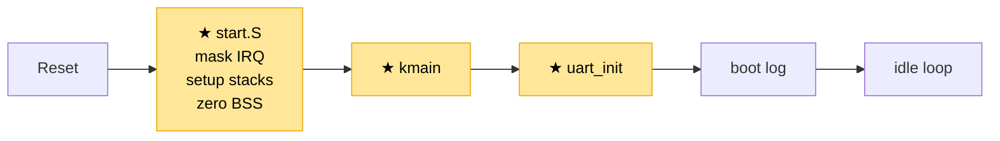
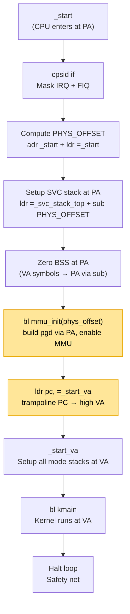
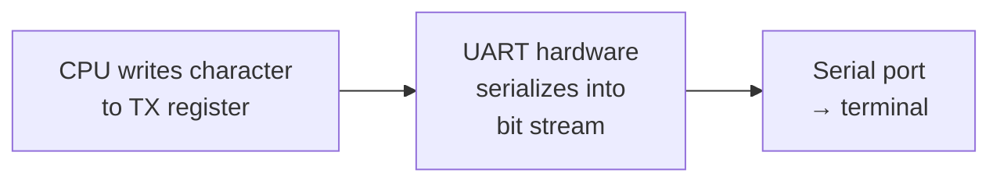
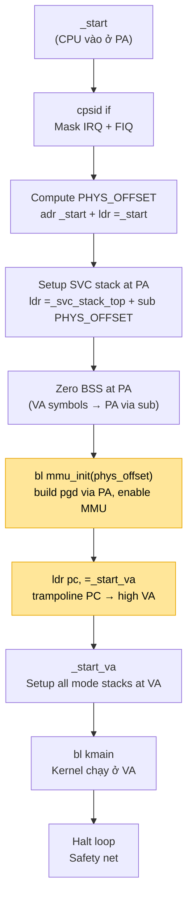
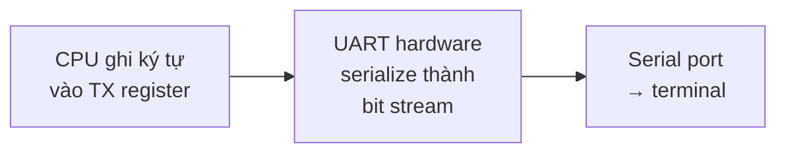

# Chapter 01 — Boot: From power-on to UART output

<a id="english"></a>

**English** · [Tiếng Việt](#tiếng-việt)

> The CPU just received power. No OS, no stack, no concept of "program".
> Just silicon and a fixed address. This chapter explains: from that state,
> how to run the first line of C and print a character to the serial port.

---

## What has been built so far

This is the first chapter — everything is new (★). After this chapter, the system looks like this:

```
┌──────────────────────────────────────────────────────┐
│                    User space                        │
│                    (not yet)                         │
└──────────────────────────────────────────────────────┘
━━━━━━━━━━━━━━━━━━━━━━━━━━━━━━━━━━━━━━━━━━━━━━━━━━━━━━━
┌──────────────────────────────────────────────────────┐
│                  Kernel (SVC mode)                   │
│                                                      │
│   ┌─────────────────┐                                │
│   │  ★ kmain        │── boot log to UART             │
│   └─────────────────┘                                │
│           │                                          │
│           ▼                                          │
│   ┌─────────────────┐    ┌─────────────────────┐     │
│   │ ★ UART driver   │    │ ★ Boot sequence     │     │
│   │   PL011 (QEMU)  │    │   (start.S)         │     │
│   │   NS16550 (BBB) │    │   stacks/BSS/jumpC  │     │
│   └─────────────────┘    └─────────────────────┘     │
│                                                      │
│   MMU: OFF · IRQ: masked · Exceptions: not yet       │
└──────────────────────────────────────────────────────┘
━━━━━━━━━━━━━━━━━━━━━━━━━━━━━━━━━━━━━━━━━━━━━━━━━━━━━━━
                      Hardware
                CPU · RAM · UART
```

**Boot flow:**



The system goes from **nothing** (CPU just powered on) to **running C code and printing text**.
This is the starting point — every subsequent chapter builds on top of this foundation.

---

## Principle

### CPU at power-on

The CPU knows nothing. It doesn't know there's an OS, a kernel, or any compiled program.
It only knows one thing: **read the instruction at a fixed address** (reset vector), then run.

On ARM:
- QEMU realview-pb-a8: QEMU loads the ELF directly, sets PC to the entry point (`_start`)
- BeagleBone Black: CPU starts from internal ROM → ROM reads the bootloader (SPL) from SD card into SRAM →
  SPL inits DDR → SPL copies kernel into DDR → jumps to `_start`

After reaching `_start`, both platforms are in the same state: **PC points into your code,
MMU is off, every address is physical, nothing has been set up**.

### Why not jump straight into C?

The C compiler **assumes** 3 things when code starts running:

1. **Stack exists** — every function call pushes/pops on SP (Chapter 00, section 2)
2. **BSS = 0** — uninitialized global variables must be zero per the C standard
3. **Interrupts are controlled** — if an interrupt fires unexpectedly, there's a handler

Bare-metal has none of that. Calling the first C function without a stack →
push to a garbage address → crash. Global variables contain garbage → silent logic bugs.
Interrupt fires during setup → CPU jumps into a non-existent handler → crash with no trace.

**Assembly must create those 3 conditions before jumping into C.**

---

## Context

```
CPU state at this point:
- PC      : pointing at the first byte of the image (physical address, LMA)
            — ELF e_entry set = LMA = 0x70100000 (QEMU) / 0x80000000 (BBB)
            Symbol `_start` in ELF resolves to VA 0xC0100000, but MMU is off
            so PC must be PA for the CPU to find the code.
- MMU     : OFF — every address is physical
- IRQ/FIQ : unknown state (may be enabled)
- SP      : not set — contains garbage
- BSS     : not zeroed — contains garbage
- UART    : not initialized — cannot print anything
- Have    : only code in RAM, nothing else
```

---

## Problem

If not resolved at this step:

- **No stack** → C code crashes on the very first instruction. Function call pushes LR onto SP,
  but SP is garbage → writes to a random address → corrupts data or faults.
- **BSS contains garbage** → global variable `uint32_t tick_count;` is not 0 but a random value.
  Logic runs wrong, but doesn't crash → silent bug, extremely hard to find.
- **Uncontrolled interrupts** → IRQ fires while setting up the stack (SP half-set)
  → CPU switches mode, SP_irq not set → crash with no debug trace because UART isn't initialized.

---

## Design

### Boot sequence



**Mandatory order, cannot be reordered:**

1. Mask interrupts **first** — prevent IRQ from firing before we're ready
2. Compute PHYS_OFFSET — needed to convert VA symbols to PA addresses while MMU is off
3. Setup SVC stack (PA) — enough for C function `mmu_init` to have a stack
4. Zero BSS (PA) — C needs BSS = 0 for global variables
5. `bl mmu_init` — enable MMU (details in Chapter 03). After return, MMU is on, PC still at PA
   via identity map
6. `ldr pc, =_start_va` — trampoline PC from PA to high VA (literal pool contains VA 0xC01...)
7. Setup remaining 4 mode stacks (FIQ/IRQ/ABT/UND) + repeat SVC stack — now at VA
8. `bl kmain` — kernel runs entirely at VA

If 1 and 3 are swapped: interrupt fires while setting SP → crash.
If 3 and 8 are swapped: C runs without a stack → crash.
If 4 is skipped: global variables contain garbage → silent bug.
If 6 (trampoline) is skipped: kernel continues running at PA via identity, `&kmain` prints PA but
MMU isn't actually being used — a "half-baked" state this design avoids.

### Why 5 exception stacks?

ARM has multiple CPU modes (Chapter 00, section 4). Each mode has its **own SP** (banked register).
When an exception occurs, the CPU automatically switches mode → SP automatically changes. If that
mode's SP hasn't been set → push to garbage → crash.

Boot code must set SP for **every mode that can occur**:

| Mode | Mode bits | Stack size | Why |
|------|-----------|------------|-----|
| FIQ  | 0x11 | 512 B | Fast interrupt, only a short trampoline |
| IRQ  | 0x12 | 1 KB | Timer interrupt, trampoline then switch SVC |
| ABT  | 0x17 | 1 KB | Memory fault handler, prints debug info |
| UND  | 0x1B | 1 KB | Undefined instruction handler, prints debug info |
| SVC  | 0x13 | 8 KB | Kernel runs here — needs the most for C code |

SVC is 8 KB because all kernel C code runs in SVC mode: deep function calls, large locals.
Exception stacks only need enough for a few trampoline instructions before switching to SVC.

### Platform differences

| | QEMU realview-pb-a8 | BeagleBone Black |
|---|---|---|
| Load | QEMU `-kernel` loads ELF directly into RAM | ROM → SPL → DDR init → copy kernel → jump |
| RAM base | 0x70000000 (128 MB) | 0x80000000 (512 MB) |
| Kernel PA | 0x70100000 | 0x80000000 |
| UART | PL011 (ARM PrimeCell) | NS16550 (AM335x UART0) |

The C code is **identical**. The differences are the linker script (addresses) and UART driver (register set).

---

## How it works

### CPU walks through modes to set up banked SP

ARMv7 has **banked SP** — each mode has its own separate SP. When the CPU is in mode X,
`ldr sp, ...` only writes to SP_X. To set SP for mode Y → must `cps` to mode Y first.

Boot code sequentially walks through 5 modes to set 5 SPs. After each `cps + ldr sp`, the banked
SP of that mode changes from "garbage" to "valid". The last mode (SVC) is where the kernel will run:

```
Before boot                After cps #0x11+ldr        ...after cps #0x13+ldr (last)
─────────────────          ─────────────────────────    ──────────────────────────
Current mode: ?            Current mode: FIQ            Current mode: SVC ✓
Running: rom/qemu          Running: start.S             Running: start.S → bl kmain

Banked SPs:                Banked SPs:                  Banked SPs:
  SP_fiq: ???                SP_fiq: _fiq_top  ✓          SP_fiq: _fiq_top  ✓
  SP_irq: ???                SP_irq: ???                  SP_irq: _irq_top  ✓
  SP_abt: ???                SP_abt: ???                  SP_abt: _abt_top  ✓
  SP_und: ???                SP_und: ???                  SP_und: _und_top  ✓
  SP_svc: ???                SP_svc: ???                  SP_svc: _svc_top  ✓

C code:                    C code:                      C code:
  ✗ cannot call              ✗ not yet                    ✓ can call kmain
  (no stack)                 (still in FIQ, SVC           (in SVC, SVC stack
                              not set yet)                 set, all banked OK)
```

3 key points:

- **Banked SP is independent** — `ldr sp, =X` in FIQ mode does NOT affect SP_svc. That's why
  each mode must be set up individually, not just once.
- **`cps #0x13` MUST be last** — after this instruction the CPU is in SVC mode, `bl kmain` will
  run C code on the SVC stack (8 KB). If the last mode is UND/ABT, kmain runs with a 1 KB stack → overflow quickly.
- **Why set SP for IRQ/ABT/UND/FIQ too?** — because later (Chapter 02 onwards),
  exceptions can fire at any time. The CPU then auto-switches to IRQ/ABT/UND mode → uses
  the corresponding banked SP → if not set, crash. Setting up at boot is a defensive measure.

### Boot end-to-end

```mermaid
sequenceDiagram
    participant ROM as ROM/QEMU loader
    participant Start as start.S
    participant UART
    participant kmain

    ROM->>Start: PC ← _start
    Note over Start: cpsid if<br/>(mask IRQ + FIQ)
    Note over Start: cps→FIQ, ldr sp<br/>cps→IRQ, ldr sp<br/>cps→ABT, ldr sp<br/>cps→UND, ldr sp<br/>cps→SVC, ldr sp
    Note over Start: zero BSS<br/>(loop _bss_start → _bss_end)
    Start->>kmain: bl kmain
    kmain->>UART: uart_init()
    kmain->>UART: uart_printf("RingNova...")
    kmain->>UART: print boot log<br/>(.text/.data/.bss/CPSR)
    Note over kmain: for(;;) — idle loop
```

---

## Implementation

### start.S — Reset entry point

File: `kernel/arch/arm/boot/start.S`

The entire boot sequence lives in this file. Walking through each block:

**Block 1 — Mask interrupts:**

```asm
cpsid   if
```

One instruction. `cps` = Change Processor State. `id` = Interrupt Disable.
`if` = both IRQ (I) and FIQ (F). After this line, CPSR.I = 1 and CPSR.F = 1 —
the CPU will **not accept** any interrupt until we explicitly re-enable them.

Why first: if some hardware is asserting an IRQ line
(timer from a previous boot not cleared), the CPU will jump into the IRQ handler immediately —
but the handler doesn't exist yet.

**Block 2 — Setup exception stacks:**

```asm
/* FIQ mode — 512 B */
cps     #0x11
ldr     sp, =_fiq_stack_top

/* IRQ mode — 1 KB */
cps     #0x12
ldr     sp, =_irq_stack_top

/* Abort mode — 1 KB */
cps     #0x17
ldr     sp, =_abt_stack_top

/* Undefined mode — 1 KB */
cps     #0x1B
ldr     sp, =_und_stack_top

/* SVC mode — 8 KB; kernel runs here */
cps     #0x13
ldr     sp, =_svc_stack_top
```

Repeating pattern: `cps` switches to mode → `ldr sp` sets the stack pointer for that mode.

`_fiq_stack_top`, `_irq_stack_top`, ... are symbols from the linker script — they point to the **top**
of the RAM region reserved for each stack. Stacks grow downward, so SP starts at the top.

**SVC must be the last mode** — because `kmain` runs in SVC mode. After this block, the CPU is in SVC mode
with SP_svc set.

**Block 3 — Zero BSS:**

```asm
ldr     r0, =_bss_start
ldr     r1, =_bss_end
mov     r2, #0
.Lzero_bss:
    cmp     r0, r1
    strlo   r2, [r0], #4    /* store 0, advance 4 bytes */
    blo     .Lzero_bss
```

Simple loop: from `_bss_start` to `_bss_end`, write 0 to every 4 bytes.

`_bss_start` and `_bss_end` are linker script symbols — the linker knows where the BSS section
starts and ends in RAM.

`strlo` = store if lower (cmp r0, r1 → if r0 < r1 then store). `[r0], #4` = write to
address r0 then increment r0 by 4 (post-increment). Effect: write 0, advance 4 bytes, repeat.

**Block 4 — Jump to mmu_init, trampoline, then kmain:**

```asm
mov     r0, r4                  @ r0 = phys_offset
bl      mmu_init                @ PC-relative, runs at PA

ldr     pc, =_start_va          @ absolute load = VA trampoline

_start_va:
    /* re-setup all mode stacks at VA */
    ...
    bl      kmain
```

`bl mmu_init` is PC-relative — offset = (VA_target − VA_bl) equals the PA difference, so
this call runs at PA. Inside `mmu_init`, the kernel builds `boot_pgd` via PA pointer and
flips `SCTLR.M=1`. MMU turns on immediately, identity map keeps PC alive at PA until the
function returns, then returns to `_start`.

`ldr pc, =_start_va` loads the literal `_start_va` (high VA `0xC01000..`) then jumps. This is
the trampoline moment: the next instruction fetch goes through the MMU at VA. From label `_start_va`
onwards, everything runs at VA.

`kmain` never returns. If it does (bug), the CPU falls into a halt loop:

```asm
.Lhalt:
    wfi
    b       .Lhalt
```

Infinite loop — safety net. Better than running into garbage instructions.

### Linker script — Memory map (dual MEMORY VMA/LMA)

File: `kernel/linker/kernel_qemu.ld` (QEMU) / `kernel/linker/kernel_bbb.ld` (BBB)

The linker script tells the linker two things:

1. **Where bytes are loaded** (LMA — load memory address): where QEMU/SPL copies the kernel image.
2. **Where symbols resolve** (VMA — virtual memory address): where code points to at runtime.

These two addresses are **different**: LMA is a PA in RAM (so QEMU/SPL knows where to place bytes),
VMA is the high VA `0xC0100000` (so symbols resolve through the MMU when the kernel runs). The linker
achieves this by declaring 2 MEMORY regions:

```
MEMORY
{
    /* PHYS — QEMU -kernel loads image here (LMA) */
    PHYS (rwx) : ORIGIN = 0x70100000, LENGTH = 127M

    /* VIRT — symbols resolve here (VMA) */
    VIRT (rwx) : ORIGIN = 0xC0100000, LENGTH = 127M
}

SECTIONS {
    .text : { ... } > VIRT AT> PHYS    /* VMA=VIRT, LMA=PHYS */
    ...
}
```

`> VIRT AT> PHYS` means "spread VMA in VIRT, LMA in PHYS in parallel". The ELF output has
2 address columns — `objdump -h` prints VMA `0xc010xxxx` alongside LMA `0x7010xxxx`.

**Entry point** (`ENTRY(_start_phys)` + `_start_phys = LOADADDR(.text);`) sets `e_entry`
in the ELF header to the PA, not the VA of `_start`. QEMU reads e_entry to set the initial PC —
MMU is off so it must be PA.

Sections are arranged (VMA in VIRT, LMA in PHYS correspondingly):

```text
VMA 0xC0100000  ┌──────────────────┐  LMA 0x70100000
                │ .text            │  code + rodata
                │  .text.start     │  ← _start
                │  .text.*         │
                ├──────────────────┤
                │ .user_stub       │  user code template
                ├──────────────────┤
                │ .data            │  initialized global variables
                ├──────────────────┤
                │ .bss  (NOLOAD)   │  boot_pgd (16 KB aligned), proc_pgd, others
                ├──────────────────┤
                │ .stack (NOLOAD)  │  FIQ 512 · IRQ 1K · ABT 1K · UND 1K · SVC 8K
                ├──────────────────┤
                │ _end             │  no heap allocator
                ▼                  ▼
```

The stack section uses `NOLOAD` — occupies VMA but has no bytes in the ELF. `PROVIDE(_fiq_stack_top = .)`
exports the symbol for `start.S`. These symbols resolve to **VA** — pre-MMU start.S must subtract
PHYS_OFFSET to get PA.

### UART driver — Talking to the outside world

Files: `kernel/drivers/uart/uart_core.c` + `pl011.c` (QEMU) or `ns16550.c` (BBB)

UART (Universal Asynchronous Receiver-Transmitter) is the hardware that sends/receives data over the serial port.
On both QEMU and BBB, this is the only way to output text — no screen, no printf, just serial.

The concept is the same on both platforms:



But the register sets are **completely different** — that's why the driver needs `#ifdef` per platform.

**PL011 (QEMU) — init flow:**

```c
void uart_init(void) {
    /* 1. Disable UART before configuring */
    REG32(UART0_BASE + PL011_CR) = 0;

    /* 2. Set baud rate: 115200 bps
          IBRD = 13, FBRD = 1 (calculated from 24MHz UART clock) */
    REG32(UART0_BASE + PL011_IBRD) = 13U;
    REG32(UART0_BASE + PL011_FBRD) = 1U;

    /* 3. 8-bit data, no parity, 1 stop bit, FIFO enabled */
    REG32(UART0_BASE + PL011_LCR_H) = PL011_LCR_WLEN8 | PL011_LCR_FEN;

    /* 4. Disable all interrupts — polling only */
    REG32(UART0_BASE + PL011_IMSC) = 0;

    /* 5. Enable UART: TX + RX enabled */
    REG32(UART0_BASE + PL011_CR) = PL011_CR_UARTEN | PL011_CR_TXE | PL011_CR_RXE;
}
```

Each line is **writing to one hardware register** at `UART0_BASE + offset`. This is MMIO
(Chapter 00, section 3). `REG32(addr)` macro dereferences a volatile pointer:

```c
#define REG32(addr)  (*((volatile uint32_t *)(addr)))
```

**NS16550 (BBB) — different registers, same concept:**

NS16550 on AM335x has an extra platform-specific step: must set **MDR1** (Mode Definition Register)
to reset mode before configuring, then set it back to 16x oversampling mode after. The baud divisor
is also accessed via DLL/DLH registers, requiring the **DLAB** bit in LCR to be set first.

Despite different register sets, the pattern is always the same: disable → configure → enable.

**uart_putc — Send 1 character:**

```c
/* PL011 version */
void uart_putc(char c) {
    if (c == '\n')              /* Auto CR/LF for terminal */
        uart_putc('\r');

    while (REG32(UART0_BASE + PL011_FR) & PL011_FR_TXFF)
        ;                       /* Wait for TX FIFO to have space */

    REG32(UART0_BASE + PL011_DR) = (uint32_t)c;  /* Write character */
}
```

Polling loop: read Flag Register, check TXFF bit (TX FIFO Full). If full → wait.
When space is available → write character to Data Register → UART hardware serializes and sends on wire.

**uart_printf — Debug output:**

`uart_printf` is a custom printf built on `uart_putc`. It doesn't use libc (bare-metal
has no libc). Supports: `%c`, `%s`, `%d`, `%u`, `%x`, `%p`, `%08x`, `%%`.

Why needed from the start: **no debugger beats serial output when the system is unstable**.
Every bug from here on is debugged with `uart_printf`.

### kmain — C entry point

File: `kernel/main.c`

When `bl kmain` runs, the CPU is in SVC mode, stack is set, BSS is zeroed. C code can run.

```c
void kmain(void) {
    uart_init();

    uart_printf("================================================\n");
    uart_printf("  RingNova — ARMv7-A bare-metal kernel\n");
    uart_printf("================================================\n");

    uart_printf("[UART] init done @ %p\n", UART0_BASE);
    uart_printf("[BOOT] platform : %s\n", PLATFORM_NAME);
    uart_printf("[BOOT] .text    : %p — %p\n", &_text_start, &_text_end);
    uart_printf("[BOOT] .bss     : %p — %p\n", &_bss_start, &_bss_end);
    /* ... */
    uart_printf("[BOOT] boot complete — entering idle loop\n");

    for (;;) ;    /* Halt — scheduler not yet */
}
```

`kmain` does 2 things:
1. Init UART — from now on we can print to the serial port
2. Print boot log — confirms everything works: platform, memory layout, CPSR state

The boot log is proof: **if you see text on the terminal, the entire boot sequence was correct** —
stack OK (function call succeeded), BSS OK (linker symbols correct), UART OK (hardware works).

`read_cpsr()` uses inline assembly to read the CPSR register — verifies the CPU is in SVC mode (0x13)
and IRQ is still masked.

---

## Links

### Files in the codebase

| File | Role |
|------|---------|
| `kernel/arch/arm/boot/start.S` | Reset entry point, setup stacks, zero BSS, jump C |
| `kernel/main.c` | C entry point, boot log |
| `kernel/drivers/uart/uart_core.c` | UART subsystem — ring buffer + printf + dispatch |
| `kernel/drivers/uart/pl011.c` | `struct uart_ops pl011_ops` — QEMU |
| `kernel/drivers/uart/ns16550.c` | `struct uart_ops ns16550_ops` — BBB |
| `kernel/include/drivers/uart.h` | Subsystem contract (ops + API) |
| `kernel/platform/<board>/board.h` | Hardware addresses per-board |
| `kernel/platform/<board>/board.c` | `platform_init_devices()` — bind chip ops + addresses |
| `kernel/linker/kernel_qemu.ld` / `kernel_bbb.ld` | Per-platform linker scripts |

### Dependencies

- Chapter 00 — Foundation: registers, stack, MMIO, CPU modes (must understand first)

### Next up

**Chapter 02 — Exceptions →** Boot done, UART works. But if the CPU hits an error
(bad memory access, unknown instruction) where does it jump? No handler yet → silent crash.
Chapter 02 fixes that.

---

<a id="tiếng-việt"></a>

**Tiếng Việt** · [English](#english)

> CPU vừa nhận điện. Không có OS, không có stack, không có khái niệm "chương trình".
> Chỉ có silicon và một địa chỉ cố định. Chapter này giải thích: từ trạng thái đó,
> làm thế nào để chạy được dòng C đầu tiên và in được ký tự ra serial port.

---

## Đã xây dựng đến đâu

Đây là chapter đầu tiên — toàn bộ đều mới (★). Sau chapter này, system trông như sau:

```
┌──────────────────────────────────────────────────────┐
│                    User space                       │
│                    (chưa có)                         │
└──────────────────────────────────────────────────────┘
━━━━━━━━━━━━━━━━━━━━━━━━━━━━━━━━━━━━━━━━━━━━━━━━━━━━━━━
┌──────────────────────────────────────────────────────┐
│                  Kernel (SVC mode)                   │
│                                                      │
│   ┌─────────────────┐                                │
│   │  ★ kmain        │── boot log ra UART             │
│   └─────────────────┘                                │
│           │                                          │
│           ▼                                          │
│   ┌─────────────────┐    ┌─────────────────────┐     │
│   │ ★ UART driver   │    │ ★ Boot sequence     │     │
│   │   PL011 (QEMU)  │    │   (start.S)         │     │
│   │   NS16550 (BBB) │    │   stacks/BSS/jumpC  │     │
│   └─────────────────┘    └─────────────────────┘     │
│                                                      │
│   MMU: OFF · IRQ: masked · Exceptions: chưa có       │
└──────────────────────────────────────────────────────┘
━━━━━━━━━━━━━━━━━━━━━━━━━━━━━━━━━━━━━━━━━━━━━━━━━━━━━━━
                      Hardware
                CPU · RAM · UART
```

**Flow khởi động:**


System đi từ **không có gì** (CPU vừa cấp điện) đến **chạy được C code và in được text**.
Đây là điểm xuất phát — mọi chapter sau xây dựng tiếp lên trên nền này.

---

## Nguyên lý

### CPU khi mới cấp nguồn

CPU không biết gì. Nó không biết có OS, không biết có kernel, không biết bạn đã compile
chương trình gì. Nó chỉ biết một thứ: **đọc instruction tại một địa chỉ cố định** (reset vector),
rồi chạy.

Trên ARM:
- QEMU realview-pb-a8: QEMU load ELF trực tiếp, đặt PC tại entry point (`_start`)
- BeagleBone Black: CPU bắt đầu từ ROM nội bộ → ROM đọc bootloader (SPL) từ SD card vào SRAM →
  SPL init DDR → SPL copy kernel vào DDR → nhảy đến `_start`

Sau khi đến `_start`, cả 2 platform đều ở cùng trạng thái: **PC trỏ vào code của bạn,
MMU tắt, mọi address là physical, không ai setup gì cả**.

### Tại sao không nhảy thẳng vào C?

C compiler **giả định** 3 điều khi code bắt đầu chạy:

1. **Stack đã có** — mỗi function call đều push/pop trên SP (Chapter 00, phần 2)
2. **BSS = 0** — biến global chưa khởi tạo phải bằng 0 theo chuẩn C
3. **Interrupt được kiểm soát** — nếu interrupt fire bất ngờ, có handler xử lý

Bare-metal không có gì trong số đó. Gọi function C đầu tiên mà chưa setup stack →
push vào địa chỉ rác → crash. Biến global chứa rác → logic sai âm thầm.
Interrupt fire khi đang setup → CPU nhảy vào handler chưa tồn tại → crash không dấu vết.

**Assembly phải tạo ra 3 điều kiện đó trước khi nhảy vào C.**

---

## Bối cảnh

```
Trạng thái CPU lúc này:
- PC      : trỏ vào byte đầu của image (physical address, LMA)
            — ELF e_entry đặt = LMA = 0x70100000 (QEMU) / 0x80000000 (BBB)
            Symbol `_start` trong ELF resolve ra VA 0xC0100000, nhưng lúc này
            MMU off nên PC phải là PA để CPU tìm được code.
- MMU     : OFF — mọi address là physical
- IRQ/FIQ : trạng thái không xác định (có thể đang enabled)
- SP      : chưa set — chứa giá trị rác
- BSS     : chưa zero — chứa dữ liệu rác
- UART    : chưa init — không thể in gì ra
- Có gì   : chỉ có code trong RAM, không gì khác
```

---

## Vấn đề

Nếu không giải quyết ở bước này:

- **Không có stack** → C code crash ngay instruction đầu tiên. Function call push LR vào SP,
  mà SP là rác → ghi vào địa chỉ ngẫu nhiên → corrupt data hoặc fault.
- **BSS chứa rác** → biến global `uint32_t tick_count;` không phải 0 mà là giá trị ngẫu nhiên.
  Logic chạy sai, nhưng không crash → bug âm thầm, cực khó phát hiện.
- **Interrupt không kiểm soát** → IRQ fire khi đang setup stack (SP mới set nửa chừng)
  → CPU chuyển mode, SP_irq chưa set → crash không debug được vì UART chưa init.

---

## Thiết kế

### Boot sequence



**Thứ tự bắt buộc, không đảo được:**

1. Mask interrupt **trước tiên** — ngăn IRQ fire khi chưa sẵn sàng
2. Compute PHYS_OFFSET — cần để convert VA symbol thành PA address trong khi MMU off
3. Setup SVC stack (PA) — đủ để C function `mmu_init` có stack
4. Zero BSS (PA) — C cần BSS = 0 cho global variables
5. `bl mmu_init` — bật MMU (chi tiết Chapter 03). Sau khi return, MMU on, PC vẫn ở PA
   qua identity map
6. `ldr pc, =_start_va` — trampoline PC từ PA sang VA cao (literal pool chứa VA 0xC01...)
7. Setup 4 mode stack còn lại (FIQ/IRQ/ABT/UND) + lặp lại SVC stack — giờ ở VA
8. `bl kmain` — kernel chạy hoàn toàn ở VA

Nếu đảo 1 và 3: interrupt fire khi đang set SP → crash.
Nếu đảo 3 và 8: C chạy mà chưa có stack → crash.
Nếu bỏ 4: global variable có giá trị rác → bug âm thầm.
Nếu bỏ 6 (trampoline): kernel chạy tiếp ở PA qua identity, `&kmain` in ra PA nhưng
MMU thật sự không được dùng — đó là state "nửa nạc nửa mỡ" mà thiết kế này tránh.

### Tại sao 5 exception stacks?

ARM có nhiều CPU mode (Chapter 00, phần 4). Mỗi mode có **SP riêng** (banked register).
Khi exception xảy ra, CPU tự động chuyển mode → SP tự động đổi. Nếu SP của mode đó
chưa được set → push vào rác → crash.

Boot code phải set SP cho **tất cả mode có thể xảy ra**:

| Mode | Mode bits | Stack size | Tại sao |
|------|-----------|------------|---------|
| FIQ  | 0x11 | 512 B | Interrupt nhanh, chỉ làm trampoline ngắn |
| IRQ  | 0x12 | 1 KB | Timer interrupt, trampoline rồi switch SVC |
| ABT  | 0x17 | 1 KB | Memory fault handler, in debug info |
| UND  | 0x1B | 1 KB | Undefined instruction handler, in debug info |
| SVC  | 0x13 | 8 KB | Kernel chạy ở đây — cần nhiều nhất cho C code |

SVC 8 KB vì toàn bộ kernel C code chạy ở SVC mode: function call sâu, biến local lớn.
Exception stacks chỉ cần đủ cho vài instruction trampoline rồi switch sang SVC.

### Platform differences

| | QEMU realview-pb-a8 | BeagleBone Black |
|---|---|---|
| Load | QEMU `-kernel` load ELF trực tiếp vào RAM | ROM → SPL → DDR init → copy kernel → jump |
| RAM base | 0x70000000 (128 MB) | 0x80000000 (512 MB) |
| Kernel PA | 0x70100000 | 0x80000000 |
| UART | PL011 (ARM PrimeCell) | NS16550 (AM335x UART0) |

Code C **giống nhau**. Khác nhau là linker script (address) và UART driver (register set).

---

## Cách hoạt động

### CPU đi qua các mode để setup banked SP

ARMv7 có **banked SP** — mỗi mode có SP riêng biệt. Khi CPU đang ở mode X, instruction
`ldr sp, ...` chỉ ghi vào SP_X. Muốn set SP cho mode Y → phải `cps` chuyển sang mode Y trước.

Boot code tuần tự đi qua 5 mode để set 5 SP. Sau mỗi `cps + ldr sp`, banked SP của mode đó
chuyển từ "rác" sang "valid". Mode cuối cùng (SVC) là mode kernel sẽ chạy:

```
Trước boot                 Sau cps #0x11+ldr        ...sau cps #0x13+ldr (cuối)
─────────────────          ─────────────────────    ──────────────────────────
Mode hiện tại: ?           Mode hiện tại: FIQ       Mode hiện tại: SVC ✓
Đang chạy: rom/qemu        Đang chạy: start.S       Đang chạy: start.S → bl kmain

Banked SPs:                Banked SPs:              Banked SPs:
  SP_fiq: ???                SP_fiq: _fiq_top  ✓      SP_fiq: _fiq_top  ✓
  SP_irq: ???                SP_irq: ???              SP_irq: _irq_top  ✓
  SP_abt: ???                SP_abt: ???              SP_abt: _abt_top  ✓
  SP_und: ???                SP_und: ???              SP_und: _und_top  ✓
  SP_svc: ???                SP_svc: ???              SP_svc: _svc_top  ✓

C code:                    C code:                  C code:
  ✗ không gọi được           ✗ chưa gọi được          ✓ gọi kmain được
  (chưa có stack)            (vẫn ở FIQ, SVC          (đang ở SVC, SVC stack
                              chưa setup)              đã set, all banked OK)
```

3 điểm quan trọng:

- **Banked SP độc lập** — `ldr sp, =X` ở FIQ mode KHÔNG ảnh hưởng SP_svc. Đó là vì sao phải
  setup từng mode một, không thể set 1 lần xong.
- **`cps #0x13` PHẢI là cuối cùng** — sau lệnh này CPU ở SVC mode, `bl kmain` sẽ chạy C code
  trên SVC stack (8 KB). Nếu mode cuối là UND/ABT, kmain chạy với stack 1 KB → overflow nhanh.
- **Mặt khác, sao phải set SP cho IRQ/ABT/UND/FIQ luôn?** — vì sau này (Chapter 02 trở đi),
  exception có thể fire bất kỳ lúc nào. Khi đó CPU tự đổi sang IRQ/ABT/UND mode → dùng
  banked SP tương ứng → nếu chưa set thì crash. Setup sẵn từ boot là bước phòng thủ.

### Boot end-to-end

```mermaid
sequenceDiagram
    participant ROM as ROM/QEMU loader
    participant Start as start.S
    participant UART
    participant kmain

    ROM->>Start: PC ← _start
    Note over Start: cpsid if<br/>(mask IRQ + FIQ)
    Note over Start: cps→FIQ, ldr sp<br/>cps→IRQ, ldr sp<br/>cps→ABT, ldr sp<br/>cps→UND, ldr sp<br/>cps→SVC, ldr sp
    Note over Start: zero BSS<br/>(loop _bss_start → _bss_end)
    Start->>kmain: bl kmain
    kmain->>UART: uart_init()
    kmain->>UART: uart_printf("RingNova...")
    kmain->>UART: in boot log<br/>(.text/.data/.bss/CPSR)
    Note over kmain: for(;;) — idle loop
```

Reader chỉ cần nhìn diagram là biết: từ ROM → start.S setup môi trường → kmain init UART
→ in log. Không cần hiểu chi tiết instruction.

---

## Implementation

### start.S — Reset entry point

File: `kernel/arch/arm/boot/start.S`

Toàn bộ boot sequence nằm trong file này. Đi qua từng block:

**Block 1 — Mask interrupt:**

```asm
cpsid   if
```

Một instruction. `cps` = Change Processor State. `id` = Interrupt Disable.
`if` = cả IRQ (I) và FIQ (F). Sau dòng này, CPSR.I = 1 và CPSR.F = 1 —
CPU sẽ **không nhận** bất kỳ interrupt nào cho đến khi ta chủ động enable lại.

Tại sao phải làm đầu tiên: nếu hardware nào đó đang assert IRQ line
(timer từ lần boot trước chưa clear), CPU sẽ nhảy vào IRQ handler ngay — mà handler
chưa tồn tại.

**Block 2 — Setup exception stacks:**

```asm
/* FIQ mode — 512 B */
cps     #0x11
ldr     sp, =_fiq_stack_top

/* IRQ mode — 1 KB */
cps     #0x12
ldr     sp, =_irq_stack_top

/* Abort mode — 1 KB */
cps     #0x17
ldr     sp, =_abt_stack_top

/* Undefined mode — 1 KB */
cps     #0x1B
ldr     sp, =_und_stack_top

/* SVC mode — 8 KB; kernel runs here */
cps     #0x13
ldr     sp, =_svc_stack_top
```

Pattern lặp lại: `cps` chuyển sang mode → `ldr sp` set stack pointer cho mode đó.

`_fiq_stack_top`, `_irq_stack_top`, ... là symbol từ linker script — chúng trỏ đến **đỉnh**
của vùng RAM được dành cho từng stack. Stack mọc xuống, nên SP bắt đầu ở đỉnh.

**SVC phải là mode cuối cùng** — vì `kmain` chạy ở SVC mode. Sau block này, CPU ở SVC mode
với SP_svc đã set.

**Block 3 — Zero BSS:**

```asm
ldr     r0, =_bss_start
ldr     r1, =_bss_end
mov     r2, #0
.Lzero_bss:
    cmp     r0, r1
    strlo   r2, [r0], #4    /* store 0, advance 4 bytes */
    blo     .Lzero_bss
```

Vòng lặp đơn giản: từ `_bss_start` đến `_bss_end`, ghi 0 vào mỗi 4 byte.

`_bss_start` và `_bss_end` là symbol từ linker script — linker biết BSS section
bắt đầu và kết thúc ở đâu trong RAM.

`strlo` = store if lower (cmp r0, r1 → nếu r0 < r1 thì store). `[r0], #4` = ghi vào
address r0 rồi tăng r0 thêm 4 (post-increment). Hiệu quả: ghi 0, tiến 4 byte, lặp.

**Block 4 — Jump to mmu_init, trampoline, then kmain:**

```asm
mov     r0, r4                  @ r0 = phys_offset
bl      mmu_init                @ PC-relative, runs at PA

ldr     pc, =_start_va          @ absolute load = VA trampoline

_start_va:
    /* re-setup all mode stacks at VA */
    ...
    bl      kmain
```

`bl mmu_init` là PC-relative — offset = (VA_target − VA_bl) giống chênh lệch PA, nên
call này chạy ở PA. Bên trong `mmu_init`, kernel build `boot_pgd` qua PA pointer và
flip `SCTLR.M=1`. MMU on ngay lập tức, identity map giữ PC sống sót ở PA cho đến hết
function, rồi return về `_start`.

`ldr pc, =_start_va` load literal `_start_va` (VA cao `0xC01000..`) rồi jump. Đây là
khoảnh khắc trampoline: instruction kế tiếp fetch qua MMU tại VA. Từ nhãn `_start_va`
trở đi, mọi thứ chạy ở VA.

`kmain` không bao giờ return. Nếu nó return (bug), CPU rơi vào halt loop:

```asm
.Lhalt:
    wfi
    b       .Lhalt
```

Vòng lặp vô hạn — safety net. Tốt hơn chạy vào instruction rác.

### Linker script — Bản đồ memory (dual MEMORY VMA/LMA)

File: `kernel/linker/kernel_qemu.ld` (QEMU) / `kernel/linker/kernel_bbb.ld` (BBB)

Linker script nói với linker hai việc:

1. **Bytes được load ở đâu** (LMA — load memory address): chỗ QEMU/SPL copy ảnh kernel.
2. **Symbol resolve ở đâu** (VMA — virtual memory address): chỗ code runtime trỏ tới.

Hai địa chỉ này **khác nhau**: LMA là PA trong RAM (để QEMU/SPL biết đặt bytes ở đâu),
VMA là VA cao `0xC0100000` (để symbol resolve qua MMU khi kernel chạy). Linker đạt được
bằng cách khai báo 2 MEMORY region:

```
MEMORY
{
    /* PHYS — QEMU -kernel load image vào đây (LMA) */
    PHYS (rwx) : ORIGIN = 0x70100000, LENGTH = 127M

    /* VIRT — symbol resolve tại đây (VMA) */
    VIRT (rwx) : ORIGIN = 0xC0100000, LENGTH = 127M
}

SECTIONS {
    .text : { ... } > VIRT AT> PHYS    /* VMA=VIRT, LMA=PHYS */
    ...
}
```

`> VIRT AT> PHYS` nghĩa là "rải VMA trong VIRT, LMA trong PHYS song song". ELF output có
2 cột address — `objdump -h` in VMA `0xc010xxxx` cùng LMA `0x7010xxxx`.

**Entry point** (`ENTRY(_start_phys)` + `_start_phys = LOADADDR(.text);`) đặt `e_entry`
trong ELF header bằng PA, không phải VA của `_start`. QEMU đọc e_entry đặt PC ban đầu —
MMU off nên phải là PA.

Sections được sắp xếp (VMA trong VIRT, LMA trong PHYS tương ứng):

```text
VMA 0xC0100000  ┌──────────────────┐  LMA 0x70100000
                │ .text            │  code + rodata
                │  .text.start     │  ← _start
                │  .text.*         │
                ├──────────────────┤
                │ .user_stub       │  user code template
                ├──────────────────┤
                │ .data            │  biến global đã khởi tạo
                ├──────────────────┤
                │ .bss  (NOLOAD)   │  boot_pgd (16 KB aligned), proc_pgd, others
                ├──────────────────┤
                │ .stack (NOLOAD)  │  FIQ 512 · IRQ 1K · ABT 1K · UND 1K · SVC 8K
                ├──────────────────┤
                │ _end             │  không có heap allocator
                ▼                  ▼
```

Stack section dùng `NOLOAD` — chiếm VMA nhưng không có bytes trong ELF. `PROVIDE(_fiq_stack_top = .)`
export symbol cho `start.S`. Các symbol này resolve ra **VA** — pre-MMU start.S phải sub
PHYS_OFFSET để ra PA.

### UART driver — Nói chuyện với thế giới bên ngoài

Files: `kernel/drivers/uart/uart_core.c` + `pl011.c` (QEMU) hoặc `ns16550.c` (BBB)

UART (Universal Asynchronous Receiver-Transmitter) là hardware gửi/nhận data qua serial port.
Trên cả QEMU và BBB, đây là cách duy nhất để output text — không có màn hình, không có printf,
chỉ có serial.

Concept giống nhau trên cả 2 platform:



Nhưng register set **khác nhau hoàn toàn** — đây là lý do driver cần `#ifdef` theo platform.

**PL011 (QEMU) — init flow:**

```c
void uart_init(void) {
    /* 1. Tắt UART trước khi cấu hình */
    REG32(UART0_BASE + PL011_CR) = 0;

    /* 2. Set baud rate: 115200 bps
          IBRD = 13, FBRD = 1 (tính từ 24MHz UART clock) */
    REG32(UART0_BASE + PL011_IBRD) = 13U;
    REG32(UART0_BASE + PL011_FBRD) = 1U;

    /* 3. 8-bit data, no parity, 1 stop bit, FIFO enabled */
    REG32(UART0_BASE + PL011_LCR_H) = PL011_LCR_WLEN8 | PL011_LCR_FEN;

    /* 4. Tắt tất cả interrupt — polling only */
    REG32(UART0_BASE + PL011_IMSC) = 0;

    /* 5. Bật UART: TX + RX enabled */
    REG32(UART0_BASE + PL011_CR) = PL011_CR_UARTEN | PL011_CR_TXE | PL011_CR_RXE;
}
```

Mỗi dòng là **ghi vào 1 hardware register** tại `UART0_BASE + offset`. Đây là MMIO
(Chapter 00, phần 3). `REG32(addr)` macro dereference volatile pointer:

```c
#define REG32(addr)  (*((volatile uint32_t *)(addr)))
```

**NS16550 (BBB) — khác register, cùng concept:**

NS16550 trên AM335x có thêm bước đặc thù: phải set **MDR1** (Mode Definition Register)
về reset mode trước khi cấu hình, rồi set lại 16x oversampling mode sau khi xong.
Baud divisor cũng truy cập qua DLL/DLH register, cần bật **DLAB** bit trong LCR trước.

Dù register set khác, pattern luôn giống: disable → configure → enable.

**uart_putc — Gửi 1 ký tự:**

```c
/* PL011 version */
void uart_putc(char c) {
    if (c == '\n')              /* Auto CR/LF cho terminal */
        uart_putc('\r');

    while (REG32(UART0_BASE + PL011_FR) & PL011_FR_TXFF)
        ;                       /* Chờ TX FIFO có chỗ */

    REG32(UART0_BASE + PL011_DR) = (uint32_t)c;  /* Ghi ký tự */
}
```

Polling loop: đọc Flag Register, check bit TXFF (TX FIFO Full). Nếu đầy → chờ.
Khi có chỗ → ghi ký tự vào Data Register → UART hardware serialize và gửi ra wire.

**uart_printf — Debug output:**

`uart_printf` là printf tự viết, build trên `uart_putc`. Nó không dùng libc (bare-metal
không có libc). Support: `%c`, `%s`, `%d`, `%u`, `%x`, `%p`, `%08x`, `%%`.

Tại sao cần ngay từ đầu: **không có debugger nào tốt hơn serial output khi system
chưa ổn định**. Mọi bug từ đây về sau đều debug bằng `uart_printf`.

### kmain — C entry point

File: `kernel/main.c`

Khi `bl kmain` chạy, CPU đã ở SVC mode, stack đã set, BSS đã zero. C code chạy được.

```c
void kmain(void) {
    uart_init();

    uart_printf("================================================\n");
    uart_printf("  RingNova — ARMv7-A bare-metal kernel\n");
    uart_printf("================================================\n");

    uart_printf("[UART] init done @ %p\n", UART0_BASE);
    uart_printf("[BOOT] platform : %s\n", PLATFORM_NAME);
    uart_printf("[BOOT] .text    : %p — %p\n", &_text_start, &_text_end);
    uart_printf("[BOOT] .bss     : %p — %p\n", &_bss_start, &_bss_end);
    /* ... */
    uart_printf("[BOOT] boot complete — entering idle loop\n");

    for (;;) ;    /* Halt — scheduler chưa có */
}
```

`kmain` làm 2 việc:
1. Init UART — từ giờ có thể in ra serial port
2. In boot log — xác nhận mọi thứ hoạt động: platform, memory layout, CPSR state

Boot log là bằng chứng: **nếu bạn thấy text trên terminal, toàn bộ boot sequence đã đúng** —
stack OK (function call thành công), BSS OK (linker symbols đúng), UART OK (hardware hoạt động).

`read_cpsr()` dùng inline assembly để đọc CPSR register — verify CPU đang ở SVC mode (0x13)
và IRQ vẫn masked.

---

## Liên kết

### Files trong code

| File | Vai trò |
|------|---------|
| `kernel/arch/arm/boot/start.S` | Reset entry point, setup stacks, zero BSS, jump C |
| `kernel/main.c` | C entry point, boot log |
| `kernel/drivers/uart/uart_core.c` | UART subsystem — ring buffer + printf + dispatch |
| `kernel/drivers/uart/pl011.c` | `struct uart_ops pl011_ops` — QEMU |
| `kernel/drivers/uart/ns16550.c` | `struct uart_ops ns16550_ops` — BBB |
| `kernel/include/drivers/uart.h` | Subsystem contract (ops + API) |
| `kernel/platform/<board>/board.h` | Hardware addresses per-board |
| `kernel/platform/<board>/board.c` | `platform_init_devices()` — bind chip ops + addresses |
| `kernel/linker/kernel_qemu.ld` / `kernel_bbb.ld` | Per-platform linker scripts |

### Dependencies

- Chapter 00 — Foundation: register, stack, MMIO, CPU mode (cần hiểu trước)

### Tiếp theo

**Chapter 02 — Exceptions →** Boot xong, UART hoạt động. Nhưng nếu CPU gặp lỗi
(truy cập memory sai, instruction lạ) thì nhảy vào đâu? Chưa có handler → crash mù.
Chapter 02 giải quyết điều đó.
