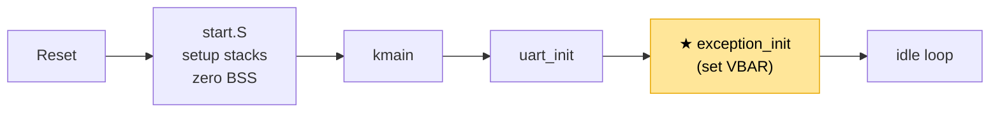
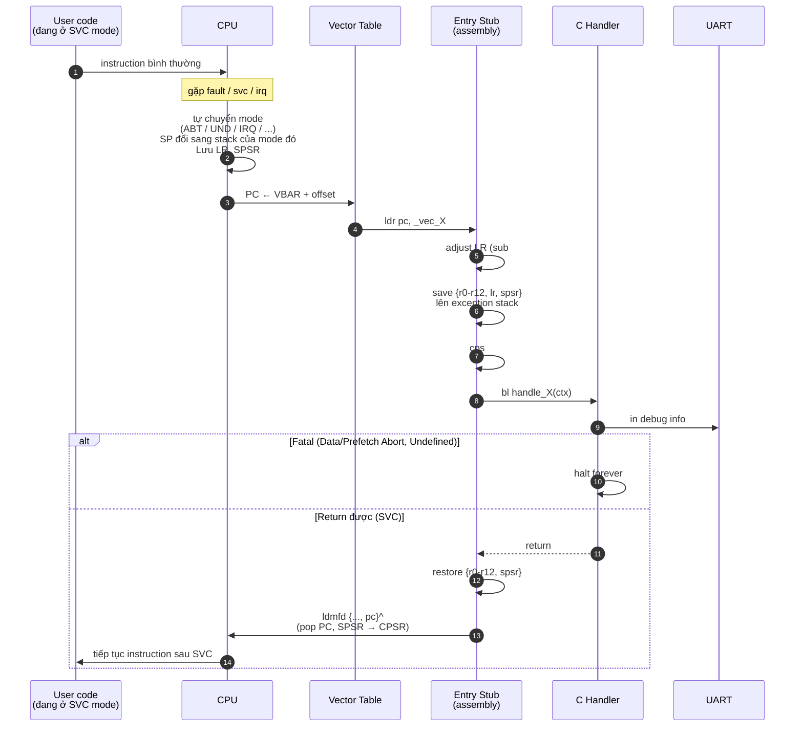

# Chapter 02 — Exceptions: Bắt lỗi thay vì crash mù

> Boot xong, UART hoạt động. Nhưng nếu CPU gặp tình huống bất thường — truy cập địa chỉ
> sai, instruction không hợp lệ, hardware cần chú ý — thì nó nhảy vào đâu? Chưa có gì
> ở đó → CPU chạy vào rác → crash không dấu vết. Chapter này tạo "lưới an toàn" để
> mọi sự kiện bất thường đều được bắt và xử lý có kiểm soát.

---

## Đã xây dựng đến đâu

Sau chapter này, system trông như sau. Module có dấu ★ là **mới trong chapter này**,
còn lại đã có từ các chapter trước.

```
┌──────────────────────────────────────────────────────┐
│                    User space                       │
│                                                      │
│                    (chưa có)                         │
└──────────────────────────────────────────────────────┘
━━━━━━━━━━━━━━━━━━━━━━━━━━━━━━━━━━━━━━━━━━━━━━━━━━━━━━━
┌──────────────────────────────────────────────────────┐
│                   Kernel (SVC mode)                  │
│                                                      │
│   ┌────────────┐   ┌─────────────────────────┐       │
│   │   kmain    │──▶│ ★ Exception Handler     │       │
│   │            │   │   ├─ vector table       │       │
│   │            │   │   ├─ entry stubs        │       │
│   │            │   │   ├─ C handlers         │       │
│   │            │   │   └─ DFAR/DFSR decode   │       │
│   └────────────┘   └─────────────────────────┘       │
│          │                                           │
│          ▼                                           │
│   ┌────────────┐   ┌─────────────────────────┐       │
│   │   UART     │   │    Boot sequence        │       │
│   │  driver    │   │    (start.S)            │       │
│   │ (PL011 +   │   │    stacks / BSS / C     │       │
│   │  NS16550)  │   │                         │       │
│   └────────────┘   └─────────────────────────┘       │
│                                                      │
│           MMU: OFF   ·   IRQ: masked                 │
└──────────────────────────────────────────────────────┘
━━━━━━━━━━━━━━━━━━━━━━━━━━━━━━━━━━━━━━━━━━━━━━━━━━━━━━━
                      Hardware
              CPU · RAM · UART · (timer/INTC chưa dùng)
```

**Flow khởi động hiện tại:**



Điểm mới: sau `uart_init`, kmain gọi `exception_init()` → CPU có vector table hợp lệ →
mọi exception từ đây trở đi đều có handler. Trước khi sang Chapter 03 (MMU), đây là
điểm "an toàn" — nếu MMU setup sai, exception handler sẽ in DFAR/DFSR thay vì crash câm.

---

## Nguyên lý

### CPU không biết "crash" là gì

Một quan niệm sai phổ biến: khi CPU gặp lỗi thì nó "crash". Thực ra, CPU **không có
khái niệm crash**. Nó chỉ biết đọc instruction tại PC, decode, execute, tăng PC, lặp lại.
Nếu instruction sai → behavior không xác định. Nếu address sai → read/write rác.
Nếu không có ai chặn lại → CPU chạy mãi vào vùng rác.

Cái chúng ta gọi là "crash" thực ra là: **CPU chạy vào vùng không phải code của chúng ta,
rồi hành vi không thể dự đoán**.

ARMv7 giải quyết bằng một cơ chế đơn giản: khi gặp tình huống đặc biệt, CPU **tự động
nhảy đến một địa chỉ cố định**. Code tại địa chỉ đó có trách nhiệm xử lý. Nếu có code đúng
→ hệ thống kiểm soát được. Nếu không → vẫn crash mù, nhưng lần này là lỗi của kernel,
không phải CPU.

### Exception là gì

Exception là **bất kỳ sự kiện nào khiến CPU dừng dòng thực thi hiện tại và nhảy đến handler**.
Nó không phải "lỗi" — nó là **cơ chế**. Cùng một cơ chế phục vụ:

- **Timer fire** → IRQ → kernel lấy lại CPU để schedule
- **Process truy cập địa chỉ cấm** → Data Abort → kernel quyết định: kill process hay mở rộng memory?
- **User program gọi kernel** → SVC → kernel chạy syscall
- **Instruction lạ** → Undefined → kernel có thể emulate (ví dụ: FPU không có)

Exception là **ngôn ngữ duy nhất phần cứng dùng để nói chuyện với phần mềm**. Không có exception,
kernel điếc và mù — không biết timer đã fire, không biết process làm gì sai, không có cách nào
cho user mode vào được kernel mode.

### Vector table — nơi CPU biết phải nhảy đâu

CPU không biết handler ở đâu. Nó chỉ biết một điều: khi exception xảy ra, **nhảy đến
slot cố định trong một bảng**. Bảng đó gọi là **vector table**.

ARMv7 có đúng 8 slot:

| offset | exception | xảy ra khi |
| --- | --- | --- |
| 0x00 | Reset | CPU vừa cấp nguồn hoặc reset |
| 0x04 | Undefined Instruction | Decode instruction không hợp lệ |
| 0x08 | Supervisor Call (SVC) | Instruction `svc #N` (syscall) |
| 0x0C | Prefetch Abort | Fetch instruction từ địa chỉ không valid |
| 0x10 | Data Abort | Load/store từ địa chỉ không valid |
| 0x14 | Reserved | — |
| 0x18 | IRQ | External interrupt (timer, UART, ...) |
| 0x1C | FIQ | Fast interrupt (priority cao) |

Mỗi slot chiếm 4 byte — đúng 1 instruction ARM. Đó không phải handler — đó là
**instruction dẫn đến handler**. Pattern phổ biến: `ldr pc, [pc, #offset]` — load địa chỉ
handler từ literal pool kế bên, nhảy đến đó.

Mặc định CPU tìm vector table tại địa chỉ 0. Nhưng có thể thay đổi qua **VBAR** (Vector
Base Address Register) — kernel ghi address mình muốn vào VBAR, CPU sẽ dùng address đó
làm gốc vector table.

---

## Bối cảnh

```
Trạng thái CPU lúc này:
- PC        : trỏ vào kmain, đã in được boot log
- MMU       : OFF — mọi address là physical
- IRQ/FIQ   : masked (chưa enable)
- SP        : SVC stack, đang chạy C code
- VBAR      : chưa set → CPU đang dùng default (thường 0x00000000)
- Có gì     : UART hoạt động, boot log in được
- Chưa có gì: handler cho bất kỳ exception nào
```

Nếu bây giờ có Data Abort xảy ra, CPU nhảy đến `VBAR + 0x10`. VBAR đang là 0, nên nhảy đến
`0x00000010`. Tại đó không có code của chúng ta — là vùng rác. CPU fetch instruction rác,
decode, execute, hành vi không dự đoán được.

---

## Vấn đề

- **Debug không thể** — bất kỳ bug nào liên quan memory (pointer sai, unaligned access,
  stack overflow) đều dẫn đến crash câm. Không biết PC, register, địa chỉ nào gây lỗi.

- **Không làm được MMU (Chapter 03)** — enable MMU sai một tí → Data Abort ngay instruction
  tiếp theo. Không có handler → không biết sai ở đâu. MMU bug là loại bug khó nhất, cần
  debug output chính xác nhất. **Exception handler phải có TRƯỚC MMU.**

- **Không làm được interrupt (Chapter 04)** — timer fire → IRQ → nhảy đến slot IRQ →
  không có code → crash.

- **Không làm được syscall (Chapter 07)** — user program gọi `svc #N` → nhảy đến SVC
  slot → không có code → không vào được kernel.

Exception handling là **tiên quyết cho mọi thứ sau** — không phải một feature, mà là hạ tầng.

---

## Thiết kế

### Vector table: 32 byte + literal pool

```
0x00  ldr pc, _vec_reset       ─┐
0x04  ldr pc, _vec_undef        │
0x08  ldr pc, _vec_svc          │  8 instruction × 4 byte
0x0C  ldr pc, _vec_pabort       │  = 32 byte
0x10  ldr pc, _vec_dabort       │
0x14  nop                       │
0x18  ldr pc, _vec_irq          │
0x1C  ldr pc, _vec_fiq         ─┘

_vec_reset:   .word _start                       ┐
_vec_undef:   .word exception_entry_undef        │  literal pool
_vec_svc:     .word exception_entry_svc          │  kề ngay vector table
...                                              ┘
```

**Tại sao `ldr pc` thay vì `b handler`?** — Instruction `b` chỉ jump được ±32 MB. Nếu
handler ở xa hơn (kernel có thể load ở 0x70100000 hoặc 0x80000000, handler ở bất kỳ đâu
trong 4 GB) → `b` không đủ. `ldr pc, [literal]` load address 32-bit đầy đủ → jump được
bất kỳ đâu.

### VBAR — đặt vector table ở đâu

Kernel ghi address của vector table vào VBAR (cp15 register). CPU sẽ tính slot dựa trên
VBAR + offset:

```
VBAR = &_vectors_start   (ví dụ: 0x70100080)

Data Abort xảy ra:
  PC ← VBAR + 0x10 = 0x70100090
  CPU fetch `ldr pc, _vec_dabort` → nhảy đến handle_data_abort
```

**Constraint**: VBAR phải **32-byte aligned**. Linker script thêm `. = ALIGN(32)` trước
section `.vectors`.

### LR adjustment — mỗi exception khác nhau

Khi exception xảy ra, CPU lưu địa chỉ quay về vào LR (banked theo mode). Nhưng địa chỉ đó
**không phải luôn là instruction gây lỗi** — tùy loại exception mà nó lệch đi do pipeline.

| Exception | LR value | Adjust | Ý nghĩa |
|-----------|----------|--------|---------|
| Undefined | PC_fault + 4 | `sub lr, #4` | → instruction gây lỗi |
| SVC | PC_svc + 4 | — | → instruction KẾ TIẾP (đúng chỗ cần return) |
| Prefetch Abort | PC_fault + 4 | `sub lr, #4` | → instruction gây lỗi |
| Data Abort | PC_fault + 8 | `sub lr, #8` | → instruction gây lỗi (pipeline) |
| IRQ | PC_next + 4 | `sub lr, #4` | → instruction bị ngắt |
| FIQ | PC_next + 4 | `sub lr, #4` | → instruction bị ngắt |

**SVC là ngoại lệ duy nhất không adjust** — vì SVC là lời gọi có chủ ý, không phải lỗi.
Sau khi xử lý, handler phải return về **instruction sau SVC**, không phải chính SVC (nếu
adjust sẽ gọi lại → infinite loop).

### Exception stack là trampoline, không phải workspace

Khi exception xảy ra, CPU tự động chuyển sang mode tương ứng (ABT/UND/IRQ/...) và dùng
**SP riêng** của mode đó (banked, đã setup trong `start.S`). Mỗi mode chỉ có 1 stack nhỏ
(1 KB) — **chia sẻ** cho mọi exception cùng loại.

Không thể chạy logic phức tạp trên stack này:
- Exception stack nhỏ, không đủ cho C function sâu
- Shared → nested exception cùng loại sẽ corrupt

**Pattern đúng**: stub trên exception stack chỉ làm trampoline — save vài register, switch
sang SVC mode, rồi C handler chạy trên SVC stack (8 KB). Chi tiết ở phần Cách hoạt động.

---

## Cách hoạt động

### Lifecycle của một exception

Diagram dưới mô tả flow chung cho mọi exception type. Chỉ khác nhau ở bước "Adjust LR"
(theo bảng ở phần Thiết kế) và nhánh cuối (fatal/return).



**Điểm quan trọng:**
- Bước 3: **CPU tự làm** — chuyển mode, banked SP đổi, LR/SPSR được hardware lưu. Code
  không điều khiển gì cả.
- Bước 7: **Trampoline** — sau `cps #0x13`, từ đây C handler chạy trên SVC stack (8 KB),
  không còn bị giới hạn bởi exception stack nhỏ.
- Bước 11: **`^` quan trọng** — `ldmfd {..., pc}^` không chỉ pop PC mà còn copy SPSR → CPSR,
  restore toàn bộ trạng thái CPU (mode, flags, IRQ mask) nguyên trạng trước exception.

### Mode & stack thay đổi trong lúc xử lý

Minh họa cụ thể khi Data Abort xảy ra từ SVC mode:

```
(1) Trước exception              (2) Trong entry stub              (3) Trong C handler
    (code bình thường)              (exception mode)                 (sau cps #0x13)
─────────────────────        ───────────────────────────       ───────────────────────────
Mode:  SVC                   Mode:  ABT                        Mode:  SVC (quay lại)
SP  :  _svc_stack_top        SP  :  _abt_stack_top             SP  :  _svc_stack_top
                                    (banked, 1 KB)                    (banked, 8 KB)

[SVC stack]                  [ABT stack]                       [SVC stack]
┌──────────────┐             ┌──────────────┐                  ┌──────────────┐
│              │             │   lr (adj)   │ ← vừa push       │              │
│  kmain       │             │   r12        │                  │  kmain       │
│  frame       │             │   ...        │                  │  frame       │
│              │             │   r0         │                  ├──────────────┤
│              │             │   spsr       │ ← sp_abt         │  handle_X    │
│              │             │              │   r0 = sp_abt    │  frame       │
└──────────────┘             └──────────────┘   (con trỏ ctx)  │  (8 KB OK)   │
                                                                └──────────────┘
```

3 điều xảy ra ở bước (2) → (3):
1. **`cps #0x13` đổi mode** — hardware tự đổi banked SP: từ `_abt_stack_top` sang `_svc_stack_top`
2. **r0 giữ nguyên** — nó đang trỏ vào frame trên ABT stack, vẫn truy cập được từ SVC mode
   (cùng không gian địa chỉ, chỉ khác mode)
3. **C handler dùng SVC stack** cho biến local, uart_printf, function call sâu — không động
   vào ABT stack nữa

Đây là lý do gọi exception stack là **trampoline**: chỉ dùng trong vài instruction (bước 2),
rồi "nhảy" sang SVC stack (bước 3) để làm việc thật.

---

## Implementation

### Files

| File | Nội dung |
|------|----------|
| [vectors.S](../../../kernel/arch/arm/exception/vectors.S) | Vector table (8 slot + literal pool) |
| [exception_entry.S](../../../kernel/arch/arm/exception/exception_entry.S) | 6 entry stub: undef, svc, pabort, dabort, irq, fiq |
| [exception_handlers.c](../../../kernel/arch/arm/exception/exception_handlers.c) | C handlers: đọc fault register, dump context, halt/return |
| [exception.h](../../../kernel/include/exception.h) | `exception_context_t` struct + handler prototypes |

### Điểm chính

**Vector table** — 8 slot dùng pattern `ldr pc, _vec_X`, literal pool đặt kề ngay sau.
Section `.vectors` trong linker script được align 32 byte để VBAR hợp lệ.

**Entry stub** — mọi stub có cùng skeleton (chỉ khác LR adjust):

```asm
/* Ví dụ: Data Abort */
exception_entry_dabort:
    sub     lr, lr, #8           /* adjust theo bảng Thiết kế */
    stmfd   sp!, {r0-r12, lr}    /* save context */
    mrs     r0, spsr
    stmfd   sp!, {r0}
    mov     r0, sp               /* r0 = &exception_context_t */
    cps     #0x13                /* switch SVC mode */
    bl      handle_data_abort    /* C handler chạy trên SVC stack */
    b       .                    /* fatal — không return */
```

Undefined và Prefetch Abort dùng **cùng pattern**, chỉ khác `sub lr, #4` và tên handler.
SVC bỏ bước `cps` (đã ở SVC rồi) và kết thúc bằng `ldmfd {..., pc}^` để return.

**C handler** — hình dạng thống nhất:
1. Đọc fault register đặc thù (DFAR/DFSR cho Data Abort, IFAR/IFSR cho Prefetch)
2. In `[PANIC]` + fault register + full register dump ra UART
3. Halt forever (fatal) hoặc return (SVC)

**exception_init** — ghi VBAR và `isb`:

```c
void exception_init(void) {
    uint32_t vbar = (uint32_t)&_vectors_start;
    __asm__ volatile("mcr p15, 0, %0, c12, c0, 0" :: "r"(vbar));
    __asm__ volatile("isb" ::: "memory");   /* flush pipeline */
}
```

`isb` đảm bảo VBAR mới có hiệu lực trước khi bất kỳ exception nào có thể xảy ra.

---

## Testing

Không thể test hết 7 exception ngay ở Phase 2 — nhiều cái cần MMU/timer để trigger.
Test 3 loại đại diện đủ bao phủ các cơ chế then chốt.

| Test | Cách trigger | Bao phủ cơ chế | Kết quả |
|------|-------------|----------------|---------|
| **SVC #42** | `asm("svc #42")` | Vector routing, context save/restore, return path | Handler in syscall number, return về instruction sau SVC |
| **Undefined** | `.word 0xE7F000F0` (opcode permanently undefined) | LR adjust -4, mode switch (UND → SVC), fatal halt | PANIC dump với PC đúng địa chỉ `.word` |
| **Data Abort** | Bật `SCTLR.A` + đọc 32-bit tại địa chỉ lẻ | LR adjust -8, đọc fault register (DFAR/DFSR), fatal halt | PANIC dump với DFAR = địa chỉ unaligned, DFSR = 0x01 (alignment) |

**Tại sao không test unmapped memory?** — QEMU với MMU off không fault khi đọc địa chỉ
không có peripheral (trả về 0). Phải dùng alignment check để tạo Data Abort reliable.
Sau khi có MMU (Chapter 03), có thể test bằng cách đọc vùng VA không map.

**Các exception chưa test:**
- **Prefetch Abort** — cần MMU để tạo unmapped instruction region. Chapter 03 sẽ test.
- **IRQ** — chưa enable interrupt. Chapter 04 sẽ test qua timer.
- **FIQ** — không dùng trong RingNova.

3 test đủ vì **mọi entry stub chia sẻ cùng pattern**: Data Abort chứng minh LR adjust +
fatal path + fault register access, Undefined chứng minh mode switch, SVC chứng minh
return path. Prefetch Abort và IRQ dùng y hệt pattern — tự động được verify khi Phase 3/4
dùng thật.

---

## Liên kết

### Files trong code

| File | Vai trò |
|------|---------|
| [kernel/arch/arm/exception/vectors.S](../../../kernel/arch/arm/exception/vectors.S) | Vector table |
| [kernel/arch/arm/exception/exception_entry.S](../../../kernel/arch/arm/exception/exception_entry.S) | Entry stubs |
| [kernel/arch/arm/exception/exception_handlers.c](../../../kernel/arch/arm/exception/exception_handlers.c) | C handlers + VBAR setup |
| [kernel/include/exception.h](../../../kernel/include/exception.h) | Context struct + prototypes |
| [kernel/linker/kernel_qemu.ld](../../../kernel/linker/kernel_qemu.ld) | `.vectors` section alignment |
| [kernel/linker/kernel_bbb.ld](../../../kernel/linker/kernel_bbb.ld) | (same cho BBB) |

### Dependencies

- **Chapter 01 — Boot**: exception stacks phải setup trước (`start.S`) vì entry stub dùng chúng
- **Chapter 00 — Foundation**: CPU mode, banked register — cần hiểu tại sao mỗi mode có SP riêng

### Tiếp theo

**Chapter 03 — MMU →** Exception handler hoạt động → có "mắt" để debug. Giờ có thể an toàn
bật MMU. Nếu page table sai → Data Abort → handler in DFAR/DFSR → biết chính xác lỗi ở đâu.
Không có Chapter 02, Chapter 03 là đi trong bóng tối.
