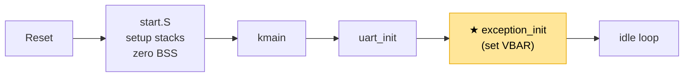
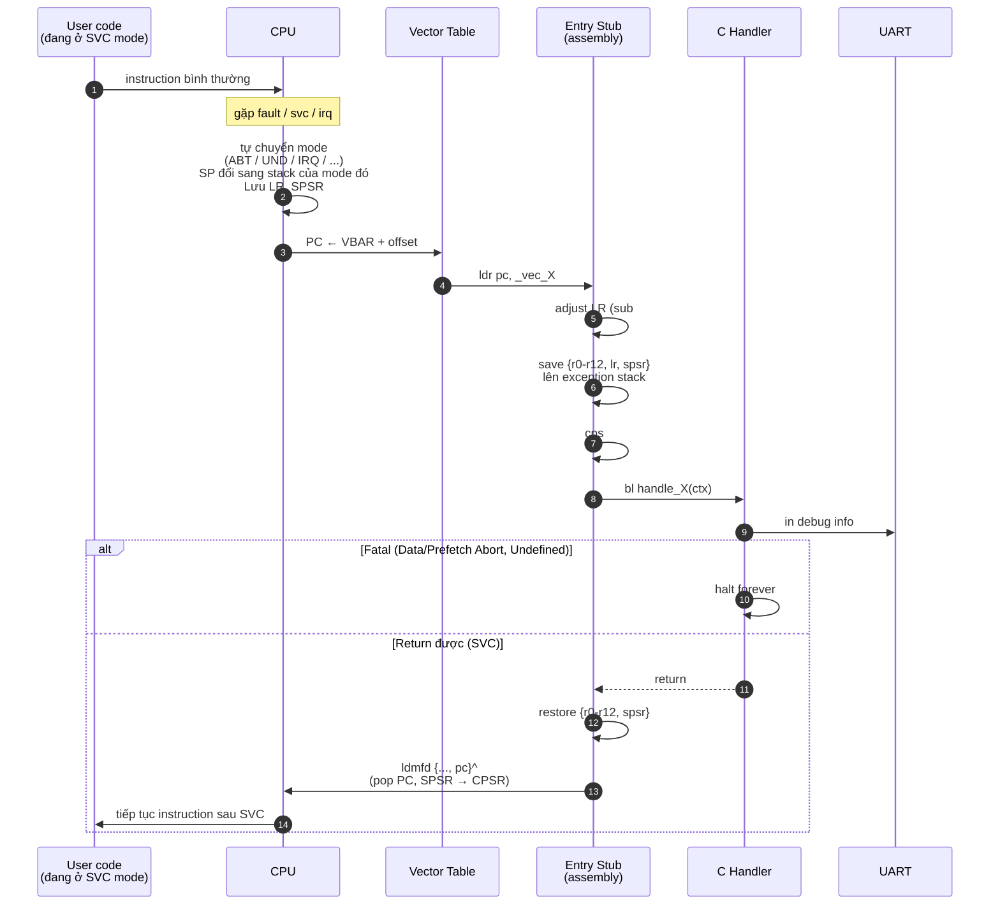

# Chapter 02 — Exceptions: Exception handling instead of uncontrolled crashes

<a id="english"></a>

**English** · [Tiếng Việt](#tiếng-việt)

> Boot is done, UART works. But if the CPU hits something unusual — a bad address,
> an invalid instruction, hardware asking for attention — where does it jump? Nothing
> is there yet → the CPU runs into garbage → silent crash. This chapter builds the
> safety net so every abnormal event is caught and handled under control.

---

## What has been built so far

After this chapter, the system looks like the diagram below. Modules marked with ★
are **new in this chapter**; the rest already existed in previous chapters.

```
┌──────────────────────────────────────────────────────┐
│                    User space                       │
│                                                      │
│                    (chưa có)                         │
└──────────────────────────────────────────────────────┘
━━━━━━━━━━━━━━━━━━━━━━━━━━━━━━━━━━━━━━━━━━━━━━━━━━━━━━━
┌──────────────────────────────────────────────────────┐
│                   Kernel (SVC mode)                  │
│                                                      │
│   ┌────────────┐   ┌─────────────────────────┐       │
│   │   kmain    │──▶│ ★ Exception Handler     │       │
│   │            │   │   ├─ vector table       │       │
│   │            │   │   ├─ entry stubs        │       │
│   │            │   │   ├─ C handlers         │       │
│   │            │   │   └─ DFAR/DFSR decode   │       │
│   └────────────┘   └─────────────────────────┘       │
│          │                                           │
│          ▼                                           │
│   ┌────────────┐   ┌─────────────────────────┐       │
│   │   UART     │   │    Boot sequence        │       │
│   │  driver    │   │    (start.S)            │       │
│   │ (PL011 +   │   │    stacks / BSS / C     │       │
│   │  NS16550)  │   │                         │       │
│   └────────────┘   └─────────────────────────┘       │
│                                                      │
│           MMU: OFF   ·   IRQ: masked                 │
└──────────────────────────────────────────────────────┘
━━━━━━━━━━━━━━━━━━━━━━━━━━━━━━━━━━━━━━━━━━━━━━━━━━━━━━━
                      Hardware
              CPU · RAM · UART · (timer/INTC chưa dùng)
```

**Current boot flow:**



What is new: after `uart_init`, kmain calls `exception_init()` → the CPU has a valid
vector table → every exception from here on has a handler. Before jumping to Chapter 03
(MMU), this is the "safe" point — if MMU setup is wrong, the exception handler prints
DFAR/DFSR instead of crashing silently.

---

## Principle

### The CPU does not know what "crash" means

A common misconception: when the CPU hits an error, it "crashes". In reality, the CPU
has **no concept of crash**. It only knows: fetch the instruction at PC, decode, execute,
increment PC, repeat. If the instruction is bad → undefined behavior. If the address is
bad → read/write garbage. If nothing stops it → the CPU keeps running into garbage regions.

What we call "crash" is really: **the CPU runs into a region that is not our code, and
its behavior becomes unpredictable**.

ARMv7 solves this with a simple mechanism: when a special situation occurs, the CPU
**automatically jumps to a fixed address**. The code at that address is responsible for
handling it. If correct code is there → the system stays in control. If not → still a
silent crash, but this time it is the kernel's fault, not the CPU's.

### What is an exception

An exception is **any event that causes the CPU to stop the current execution stream and
jump to a handler**. It is not an "error" — it is a **mechanism**. The same mechanism serves:

- **Timer fires** → IRQ → kernel reclaims the CPU to schedule
- **A process touches a forbidden address** → Data Abort → kernel decides: kill the process or grow memory?
- **A user program calls the kernel** → SVC → kernel runs the syscall
- **A strange instruction appears** → Undefined → kernel can emulate (e.g. no FPU present)

Exceptions are **the only language hardware uses to talk to software**. Without them,
the kernel is deaf and blind — no way to know the timer fired, no way to know what the
process did wrong, no way for user mode to enter kernel mode.

### Vector table — where the CPU knows to jump

The CPU does not know where the handler lives. It only knows one thing: when an exception
happens, **jump to a fixed slot in a table**. That table is the **vector table**.

ARMv7 has exactly 8 slots:

| offset | exception | when it happens |
| --- | --- | --- |
| 0x00 | Reset | CPU just powered on or reset |
| 0x04 | Undefined Instruction | Decode hit an invalid instruction |
| 0x08 | Supervisor Call (SVC) | `svc #N` instruction (syscall) |
| 0x0C | Prefetch Abort | Instruction fetch from an invalid address |
| 0x10 | Data Abort | Load/store from an invalid address |
| 0x14 | Reserved | — |
| 0x18 | IRQ | External interrupt (timer, UART, ...) |
| 0x1C | FIQ | Fast interrupt (higher priority) |

Each slot is 4 bytes — exactly 1 ARM instruction. That is not the handler — it is the
**instruction that leads to the handler**. The common pattern: `ldr pc, [pc, #offset]` —
load the handler address from the literal pool next to it, jump there.

By default the CPU looks for the vector table at address 0. But it can be changed via
**VBAR** (Vector Base Address Register) — the kernel writes the desired address into VBAR,
and the CPU uses that address as the base of the vector table.

---

## Context

```
CPU state right now:
- PC        : pointing into kmain, boot log already printed
- MMU       : OFF — every address is physical
- IRQ/FIQ   : masked (not enabled yet)
- SP        : SVC stack, running C code
- VBAR      : not set → CPU uses default (usually 0x00000000)
- Have     : UART working, boot log is visible
- Missing  : handlers for any exception
```

If a Data Abort happens now, the CPU jumps to `VBAR + 0x10`. VBAR is 0, so it jumps to
`0x00000010`. There is no code of ours there — it is garbage. The CPU fetches a garbage
instruction, decodes, executes — behavior unpredictable.

---

## Problem

- **Debugging is impossible** — any memory-related bug (bad pointer, unaligned access,
  stack overflow) leads to a silent crash. No PC, register, or faulting address to work with.

- **Cannot do MMU (Chapter 03)** — enable MMU slightly wrong → Data Abort on the very next
  instruction. No handler → no clue where the error is. MMU bugs are the hardest kind of
  bug and need the most precise debug output. **Exception handlers must exist BEFORE MMU.**

- **Cannot do interrupts (Chapter 04)** — timer fires → IRQ → jump to IRQ slot → no code
  → crash.

- **Cannot do syscalls (Chapter 07)** — user program calls `svc #N` → jump to the SVC slot
  → no code → no way into the kernel.

Exception handling is **a prerequisite for everything that follows** — not a feature,
but infrastructure.

---

## Design

### Vector table: 32 bytes + literal pool

```
0x00  ldr pc, _vec_reset       ─┐
0x04  ldr pc, _vec_undef        │
0x08  ldr pc, _vec_svc          │  8 instruction × 4 byte
0x0C  ldr pc, _vec_pabort       │  = 32 byte
0x10  ldr pc, _vec_dabort       │
0x14  nop                       │
0x18  ldr pc, _vec_irq          │
0x1C  ldr pc, _vec_fiq         ─┘

_vec_reset:   .word _start                       ┐
_vec_undef:   .word exception_entry_undef        │  literal pool
_vec_svc:     .word exception_entry_svc          │  kề ngay vector table
...                                              ┘
```

**Why `ldr pc` instead of `b handler`?** — The `b` instruction can only jump ±32 MB.
The kernel is linked at VA `0xC0100000`, and C handlers can live anywhere in 4 GB → `b`
may not reach. `ldr pc, [literal]` loads a full 32-bit address → jumps anywhere, high VA
or even user VA if needed.

### VBAR — where to put the vector table

The kernel writes the vector table's address into VBAR (a cp15 register). The CPU then
computes the slot as VBAR + offset:

```text
VBAR = &_vectors_start   (high VA, e.g. 0xC01000A0)

Data Abort occurs:
  PC ← VBAR + 0x10 = 0xC01000B0
  CPU fetches `ldr pc, _vec_dabort` (through the MMU) → jumps to handle_data_abort
```

**Constraint**: VBAR must be **32-byte aligned**. The linker script adds `. = ALIGN(32)`
before the `.vectors` section.

**VBAR must be a VA, not a PA:** `exception_init` is called after the MMU is on and the
trampoline is in place, so `&_vectors_start` resolves to a VA. The CPU fetches the vector
through the MMU at `0xC01000A0+offset` → correct. If VBAR were set to a PA, once the
identity RAM mapping is dropped (chapter 03) the exception would no longer be able to
fetch the vector → triple fault.

### LR adjustment — different per exception

When an exception happens, the CPU saves the return address into LR (banked per mode).
But that address **is not always the faulting instruction** — depending on the exception,
it is offset by pipeline effects.

| Exception | LR value | Adjust | Meaning |
|-----------|----------|--------|---------|
| Undefined | PC_fault + 4 | `sub lr, #4` | → faulting instruction |
| SVC | PC_svc + 4 | — | → the NEXT instruction (the right place to return to) |
| Prefetch Abort | PC_fault + 4 | `sub lr, #4` | → faulting instruction |
| Data Abort | PC_fault + 8 | `sub lr, #8` | → faulting instruction (pipeline) |
| IRQ | PC_next + 4 | `sub lr, #4` | → the interrupted instruction |
| FIQ | PC_next + 4 | `sub lr, #4` | → the interrupted instruction |

**SVC is the only one that is not adjusted** — because SVC is a deliberate call, not an
error. After handling it, the handler must return to **the instruction after SVC**, not
SVC itself (adjusting would call it again → infinite loop).

### The exception stack is a trampoline, not a workspace

When an exception happens, the CPU automatically switches to the corresponding mode
(ABT/UND/IRQ/...) and uses the **banked SP** of that mode (already set up in `start.S`).
Each mode has only one small stack (1 KB) — **shared** across every exception of that kind.

You cannot run complex logic on this stack:
- The exception stack is small, not enough for deep C functions
- Shared → nested exceptions of the same kind will corrupt it

**Correct pattern**: the stub on the exception stack only acts as a trampoline — save a
few registers, switch to SVC mode, then let the C handler run on the SVC stack (8 KB).
Details in the How-it-works section.

---

## How it works

### Lifecycle of an exception

The diagram below describes the common flow for every exception type. They only differ
in the "Adjust LR" step (per the Design table) and the final branch (fatal/return).



**Key points:**
- Step 3: **the CPU does it by itself** — switches mode, banked SP changes, LR/SPSR saved
  by hardware. Code has no control here.
- Step 7: **trampoline** — after `cps #0x13`, from here on the C handler runs on the
  SVC stack (8 KB), no longer limited by the small exception stack.
- Step 11: **`^` matters** — `ldmfd {..., pc}^` not only pops PC but also copies SPSR →
  CPSR, restoring the full CPU state (mode, flags, IRQ mask) to exactly what it was
  before the exception.

### Mode & stack changes during handling

A concrete illustration when a Data Abort happens from SVC mode:

```
(1) Trước exception              (2) Trong entry stub              (3) Trong C handler
    (code bình thường)              (exception mode)                 (sau cps #0x13)
─────────────────────        ───────────────────────────       ───────────────────────────
Mode:  SVC                   Mode:  ABT                        Mode:  SVC (quay lại)
SP  :  _svc_stack_top        SP  :  _abt_stack_top             SP  :  _svc_stack_top
                                    (banked, 1 KB)                    (banked, 8 KB)

[SVC stack]                  [ABT stack]                       [SVC stack]
┌──────────────┐             ┌──────────────┐                  ┌──────────────┐
│              │             │   lr (adj)   │ ← vừa push       │              │
│  kmain       │             │   r12        │                  │  kmain       │
│  frame       │             │   ...        │                  │  frame       │
│              │             │   r0         │                  ├──────────────┤
│              │             │   spsr       │ ← sp_abt         │  handle_X    │
│              │             │              │   r0 = sp_abt    │  frame       │
└──────────────┘             └──────────────┘   (con trỏ ctx)  │  (8 KB OK)   │
                                                                └──────────────┘
```

Three things happen between step (2) → (3):
1. **`cps #0x13` switches mode** — hardware automatically swaps the banked SP: from
   `_abt_stack_top` to `_svc_stack_top`
2. **r0 is preserved** — it points into the frame on the ABT stack, still reachable from
   SVC mode (same address space, just a different mode)
3. **The C handler uses the SVC stack** for local variables, uart_printf, deep function
   calls — it no longer touches the ABT stack

This is why the exception stack is called a **trampoline**: used only for a few
instructions (step 2), then we "jump" onto the SVC stack (step 3) to do real work.

---

## Implementation

### Files

| File | Contents |
|------|----------|
| [vectors.S](../../kernel/arch/arm/exception/vectors.S) | Vector table (8 slots + literal pool) |
| [exception_entry.S](../../kernel/arch/arm/exception/exception_entry.S) | 6 entry stubs: undef, svc, pabort, dabort, irq, fiq |
| [exception_handlers.c](../../kernel/arch/arm/exception/exception_handlers.c) | C handlers: read fault registers, dump context, halt/return |
| [exception.h](../../kernel/include/exception.h) | `exception_context_t` struct + handler prototypes |

### Key points

**Vector table** — 8 slots using the `ldr pc, _vec_X` pattern, literal pool placed right
after it. The `.vectors` section in the linker script is 32-byte aligned so VBAR is valid.

**Entry stub** — every stub has the same skeleton (only LR adjust differs):

```asm
/* Ví dụ: Data Abort */
exception_entry_dabort:
    sub     lr, lr, #8           /* adjust theo bảng Thiết kế */
    stmfd   sp!, {r0-r12, lr}    /* save context */
    mrs     r0, spsr
    stmfd   sp!, {r0}
    mov     r0, sp               /* r0 = &exception_context_t */
    cps     #0x13                /* switch SVC mode */
    bl      handle_data_abort    /* C handler chạy trên SVC stack */
    b       .                    /* fatal — không return */
```

Undefined and Prefetch Abort use **the same pattern**, only differing in `sub lr, #4`
and the handler name. SVC skips the `cps` step (already in SVC) and ends with
`ldmfd {..., pc}^` to return.

**C handler** — uniform shape:
1. Read the specific fault register (DFAR/DFSR for Data Abort, IFAR/IFSR for Prefetch)
2. Print `[PANIC]` + fault register + a full register dump over UART
3. Halt forever (fatal) or return (SVC)

**exception_init** — write VBAR and `isb`:

```c
void exception_init(void) {
    uint32_t vbar = (uint32_t)&_vectors_start;
    __asm__ volatile("mcr p15, 0, %0, c12, c0, 0" :: "r"(vbar));
    __asm__ volatile("isb" ::: "memory");   /* flush pipeline */
}
```

`isb` ensures the new VBAR takes effect before any exception can possibly occur.

---

## Testing

Not every one of the 7 exceptions can be tested at this step — many need MMU/timer to
trigger. Testing 3 representative kinds is enough to cover the key mechanisms.

| Test | How to trigger | Mechanisms covered | Result |
|------|-------------|----------------|---------|
| **SVC #42** | `asm("svc #42")` | Vector routing, context save/restore, return path | Handler prints the syscall number, returns to the instruction after SVC |
| **Undefined** | `.word 0xE7F000F0` (permanently-undefined opcode) | LR adjust -4, mode switch (UND → SVC), fatal halt | PANIC dump with PC pointing at the `.word` address |
| **Data Abort** | Enable `SCTLR.A` + read 32-bit at an odd address | LR adjust -8, read fault register (DFAR/DFSR), fatal halt | PANIC dump with DFAR = the unaligned address, DFSR = 0x01 (alignment) |

**Why not test unmapped memory?** — QEMU with MMU off does not fault when reading an
address without a peripheral (it returns 0). We must use an alignment check to trigger
a Data Abort reliably. Once MMU is in (Chapter 03), we can test by reading an unmapped
VA region.

**Exceptions not yet tested:**
- **Prefetch Abort** — needs MMU to create an unmapped instruction region. Chapter 03 tests it.
- **IRQ** — interrupts are not enabled yet. Chapter 04 tests it through the timer.
- **FIQ** — not used in RingNova.

3 tests are enough because **every entry stub shares the same pattern**: Data Abort proves
LR adjust + fatal path + fault register access; Undefined proves mode switching; SVC
proves the return path. Prefetch Abort and IRQ use the exact same pattern — they get
verified automatically once MMU and the timer run for real.

---

## Links

### Files in the codebase

| File | Role |
|------|---------|
| [kernel/arch/arm/exception/vectors.S](../../kernel/arch/arm/exception/vectors.S) | Vector table |
| [kernel/arch/arm/exception/exception_entry.S](../../kernel/arch/arm/exception/exception_entry.S) | Entry stubs |
| [kernel/arch/arm/exception/exception_handlers.c](../../kernel/arch/arm/exception/exception_handlers.c) | C handlers + VBAR setup |
| [kernel/include/exception.h](../../kernel/include/exception.h) | Context struct + prototypes |
| [kernel/linker/kernel_qemu.ld](../../kernel/linker/kernel_qemu.ld) | `.vectors` section alignment |
| [kernel/linker/kernel_bbb.ld](../../kernel/linker/kernel_bbb.ld) | (same for BBB) |

### Dependencies

- **Chapter 01 — Boot**: exception stacks must be set up first (`start.S`), because the entry stubs use them
- **Chapter 00 — Foundation**: CPU modes, banked registers — needed to understand why each mode has its own SP

### Next up

**Chapter 03 — MMU →** Exception handlers work → we have "eyes" to debug with. Now we
can safely turn the MMU on. If the page table is wrong → Data Abort → the handler prints
DFAR/DFSR → we know exactly where the error is. Without Chapter 02, Chapter 03 is walking
in the dark.

---

<a id="tiếng-việt"></a>

**Tiếng Việt** · [English](#english)

> Boot xong, UART hoạt động. Nhưng nếu CPU gặp tình huống bất thường — truy cập địa chỉ
> sai, instruction không hợp lệ, hardware cần chú ý — thì nó nhảy vào đâu? Chưa có gì
> ở đó → CPU chạy vào rác → crash không dấu vết. Chapter này tạo "lưới an toàn" để
> mọi sự kiện bất thường đều được bắt và xử lý có kiểm soát.

---

## Đã xây dựng đến đâu

Sau chapter này, system trông như sau. Module có dấu ★ là **mới trong chapter này**,
còn lại đã có từ các chapter trước.

```
┌──────────────────────────────────────────────────────┐
│                    User space                       │
│                                                      │
│                    (chưa có)                         │
└──────────────────────────────────────────────────────┘
━━━━━━━━━━━━━━━━━━━━━━━━━━━━━━━━━━━━━━━━━━━━━━━━━━━━━━━
┌──────────────────────────────────────────────────────┐
│                   Kernel (SVC mode)                  │
│                                                      │
│   ┌────────────┐   ┌─────────────────────────┐       │
│   │   kmain    │──▶│ ★ Exception Handler     │       │
│   │            │   │   ├─ vector table       │       │
│   │            │   │   ├─ entry stubs        │       │
│   │            │   │   ├─ C handlers         │       │
│   │            │   │   └─ DFAR/DFSR decode   │       │
│   └────────────┘   └─────────────────────────┘       │
│          │                                           │
│          ▼                                           │
│   ┌────────────┐   ┌─────────────────────────┐       │
│   │   UART     │   │    Boot sequence        │       │
│   │  driver    │   │    (start.S)            │       │
│   │ (PL011 +   │   │    stacks / BSS / C     │       │
│   │  NS16550)  │   │                         │       │
│   └────────────┘   └─────────────────────────┘       │
│                                                      │
│           MMU: OFF   ·   IRQ: masked                 │
└──────────────────────────────────────────────────────┘
━━━━━━━━━━━━━━━━━━━━━━━━━━━━━━━━━━━━━━━━━━━━━━━━━━━━━━━
                      Hardware
              CPU · RAM · UART · (timer/INTC chưa dùng)
```

**Flow khởi động hiện tại:**


Điểm mới: sau `uart_init`, kmain gọi `exception_init()` → CPU có vector table hợp lệ →
mọi exception từ đây trở đi đều có handler. Trước khi sang Chapter 03 (MMU), đây là
điểm "an toàn" — nếu MMU setup sai, exception handler sẽ in DFAR/DFSR thay vì crash câm.

---

## Nguyên lý

### CPU không biết "crash" là gì

Một quan niệm sai phổ biến: khi CPU gặp lỗi thì nó "crash". Thực ra, CPU **không có
khái niệm crash**. Nó chỉ biết đọc instruction tại PC, decode, execute, tăng PC, lặp lại.
Nếu instruction sai → behavior không xác định. Nếu address sai → read/write rác.
Nếu không có ai chặn lại → CPU chạy mãi vào vùng rác.

Cái chúng ta gọi là "crash" thực ra là: **CPU chạy vào vùng không phải code của chúng ta,
rồi hành vi không thể dự đoán**.

ARMv7 giải quyết bằng một cơ chế đơn giản: khi gặp tình huống đặc biệt, CPU **tự động
nhảy đến một địa chỉ cố định**. Code tại địa chỉ đó có trách nhiệm xử lý. Nếu có code đúng
→ hệ thống kiểm soát được. Nếu không → vẫn crash mù, nhưng lần này là lỗi của kernel,
không phải CPU.

### Exception là gì

Exception là **bất kỳ sự kiện nào khiến CPU dừng dòng thực thi hiện tại và nhảy đến handler**.
Nó không phải "lỗi" — nó là **cơ chế**. Cùng một cơ chế phục vụ:

- **Timer fire** → IRQ → kernel lấy lại CPU để schedule
- **Process truy cập địa chỉ cấm** → Data Abort → kernel quyết định: kill process hay mở rộng memory?
- **User program gọi kernel** → SVC → kernel chạy syscall
- **Instruction lạ** → Undefined → kernel có thể emulate (ví dụ: FPU không có)

Exception là **ngôn ngữ duy nhất phần cứng dùng để nói chuyện với phần mềm**. Không có exception,
kernel điếc và mù — không biết timer đã fire, không biết process làm gì sai, không có cách nào
cho user mode vào được kernel mode.

### Vector table — nơi CPU biết phải nhảy đâu

CPU không biết handler ở đâu. Nó chỉ biết một điều: khi exception xảy ra, **nhảy đến
slot cố định trong một bảng**. Bảng đó gọi là **vector table**.

ARMv7 có đúng 8 slot:

| offset | exception | xảy ra khi |
| --- | --- | --- |
| 0x00 | Reset | CPU vừa cấp nguồn hoặc reset |
| 0x04 | Undefined Instruction | Decode instruction không hợp lệ |
| 0x08 | Supervisor Call (SVC) | Instruction `svc #N` (syscall) |
| 0x0C | Prefetch Abort | Fetch instruction từ địa chỉ không valid |
| 0x10 | Data Abort | Load/store từ địa chỉ không valid |
| 0x14 | Reserved | — |
| 0x18 | IRQ | External interrupt (timer, UART, ...) |
| 0x1C | FIQ | Fast interrupt (priority cao) |

Mỗi slot chiếm 4 byte — đúng 1 instruction ARM. Đó không phải handler — đó là
**instruction dẫn đến handler**. Pattern phổ biến: `ldr pc, [pc, #offset]` — load địa chỉ
handler từ literal pool kế bên, nhảy đến đó.

Mặc định CPU tìm vector table tại địa chỉ 0. Nhưng có thể thay đổi qua **VBAR** (Vector
Base Address Register) — kernel ghi address mình muốn vào VBAR, CPU sẽ dùng address đó
làm gốc vector table.

---

## Bối cảnh

```
Trạng thái CPU lúc này:
- PC        : trỏ vào kmain, đã in được boot log
- MMU       : OFF — mọi address là physical
- IRQ/FIQ   : masked (chưa enable)
- SP        : SVC stack, đang chạy C code
- VBAR      : chưa set → CPU đang dùng default (thường 0x00000000)
- Có gì     : UART hoạt động, boot log in được
- Chưa có gì: handler cho bất kỳ exception nào
```

Nếu bây giờ có Data Abort xảy ra, CPU nhảy đến `VBAR + 0x10`. VBAR đang là 0, nên nhảy đến
`0x00000010`. Tại đó không có code của chúng ta — là vùng rác. CPU fetch instruction rác,
decode, execute, hành vi không dự đoán được.

---

## Vấn đề

- **Debug không thể** — bất kỳ bug nào liên quan memory (pointer sai, unaligned access,
  stack overflow) đều dẫn đến crash câm. Không biết PC, register, địa chỉ nào gây lỗi.

- **Không làm được MMU (Chapter 03)** — enable MMU sai một tí → Data Abort ngay instruction
  tiếp theo. Không có handler → không biết sai ở đâu. MMU bug là loại bug khó nhất, cần
  debug output chính xác nhất. **Exception handler phải có TRƯỚC MMU.**

- **Không làm được interrupt (Chapter 04)** — timer fire → IRQ → nhảy đến slot IRQ →
  không có code → crash.

- **Không làm được syscall (Chapter 07)** — user program gọi `svc #N` → nhảy đến SVC
  slot → không có code → không vào được kernel.

Exception handling là **tiên quyết cho mọi thứ sau** — không phải một feature, mà là hạ tầng.

---

## Thiết kế

### Vector table: 32 byte + literal pool

```
0x00  ldr pc, _vec_reset       ─┐
0x04  ldr pc, _vec_undef        │
0x08  ldr pc, _vec_svc          │  8 instruction × 4 byte
0x0C  ldr pc, _vec_pabort       │  = 32 byte
0x10  ldr pc, _vec_dabort       │
0x14  nop                       │
0x18  ldr pc, _vec_irq          │
0x1C  ldr pc, _vec_fiq         ─┘

_vec_reset:   .word _start                       ┐
_vec_undef:   .word exception_entry_undef        │  literal pool
_vec_svc:     .word exception_entry_svc          │  kề ngay vector table
...                                              ┘
```

**Tại sao `ldr pc` thay vì `b handler`?** — Instruction `b` chỉ jump được ±32 MB. Kernel
linked ở VA `0xC0100000`, handler C ở bất kỳ đâu trong 4 GB → `b` có thể không đủ.
`ldr pc, [literal]` load address 32-bit đầy đủ → jump được bất kỳ đâu, cả VA cao lẫn
VA user nếu cần.

### VBAR — đặt vector table ở đâu

Kernel ghi address của vector table vào VBAR (cp15 register). CPU sẽ tính slot dựa trên
VBAR + offset:

```text
VBAR = &_vectors_start   (VA cao, ví dụ: 0xC01000A0)

Data Abort xảy ra:
  PC ← VBAR + 0x10 = 0xC01000B0
  CPU fetch `ldr pc, _vec_dabort` (đi qua MMU) → nhảy đến handle_data_abort
```

**Constraint**: VBAR phải **32-byte aligned**. Linker script thêm `. = ALIGN(32)` trước
section `.vectors`.

**VBAR phải là VA, không phải PA:** `exception_init` gọi sau khi MMU on + trampoline, nên
`&_vectors_start` resolve ra VA. CPU fetch vector qua MMU tại `0xC01000A0+offset` → đúng.
Nếu trót set VBAR = PA, khi identity RAM bị drop (chapter 03) thì exception không còn
fetch được vector → triple fault.

### LR adjustment — mỗi exception khác nhau

Khi exception xảy ra, CPU lưu địa chỉ quay về vào LR (banked theo mode). Nhưng địa chỉ đó
**không phải luôn là instruction gây lỗi** — tùy loại exception mà nó lệch đi do pipeline.

| Exception | LR value | Adjust | Ý nghĩa |
|-----------|----------|--------|---------|
| Undefined | PC_fault + 4 | `sub lr, #4` | → instruction gây lỗi |
| SVC | PC_svc + 4 | — | → instruction KẾ TIẾP (đúng chỗ cần return) |
| Prefetch Abort | PC_fault + 4 | `sub lr, #4` | → instruction gây lỗi |
| Data Abort | PC_fault + 8 | `sub lr, #8` | → instruction gây lỗi (pipeline) |
| IRQ | PC_next + 4 | `sub lr, #4` | → instruction bị ngắt |
| FIQ | PC_next + 4 | `sub lr, #4` | → instruction bị ngắt |

**SVC là ngoại lệ duy nhất không adjust** — vì SVC là lời gọi có chủ ý, không phải lỗi.
Sau khi xử lý, handler phải return về **instruction sau SVC**, không phải chính SVC (nếu
adjust sẽ gọi lại → infinite loop).

### Exception stack là trampoline, không phải workspace

Khi exception xảy ra, CPU tự động chuyển sang mode tương ứng (ABT/UND/IRQ/...) và dùng
**SP riêng** của mode đó (banked, đã setup trong `start.S`). Mỗi mode chỉ có 1 stack nhỏ
(1 KB) — **chia sẻ** cho mọi exception cùng loại.

Không thể chạy logic phức tạp trên stack này:
- Exception stack nhỏ, không đủ cho C function sâu
- Shared → nested exception cùng loại sẽ corrupt

**Pattern đúng**: stub trên exception stack chỉ làm trampoline — save vài register, switch
sang SVC mode, rồi C handler chạy trên SVC stack (8 KB). Chi tiết ở phần Cách hoạt động.

---

## Cách hoạt động

### Lifecycle của một exception

Diagram dưới mô tả flow chung cho mọi exception type. Chỉ khác nhau ở bước "Adjust LR"
(theo bảng ở phần Thiết kế) và nhánh cuối (fatal/return).


**Điểm quan trọng:**
- Bước 3: **CPU tự làm** — chuyển mode, banked SP đổi, LR/SPSR được hardware lưu. Code
  không điều khiển gì cả.
- Bước 7: **Trampoline** — sau `cps #0x13`, từ đây C handler chạy trên SVC stack (8 KB),
  không còn bị giới hạn bởi exception stack nhỏ.
- Bước 11: **`^` quan trọng** — `ldmfd {..., pc}^` không chỉ pop PC mà còn copy SPSR → CPSR,
  restore toàn bộ trạng thái CPU (mode, flags, IRQ mask) nguyên trạng trước exception.

### Mode & stack thay đổi trong lúc xử lý

Minh họa cụ thể khi Data Abort xảy ra từ SVC mode:

```
(1) Trước exception              (2) Trong entry stub              (3) Trong C handler
    (code bình thường)              (exception mode)                 (sau cps #0x13)
─────────────────────        ───────────────────────────       ───────────────────────────
Mode:  SVC                   Mode:  ABT                        Mode:  SVC (quay lại)
SP  :  _svc_stack_top        SP  :  _abt_stack_top             SP  :  _svc_stack_top
                                    (banked, 1 KB)                    (banked, 8 KB)

[SVC stack]                  [ABT stack]                       [SVC stack]
┌──────────────┐             ┌──────────────┐                  ┌──────────────┐
│              │             │   lr (adj)   │ ← vừa push       │              │
│  kmain       │             │   r12        │                  │  kmain       │
│  frame       │             │   ...        │                  │  frame       │
│              │             │   r0         │                  ├──────────────┤
│              │             │   spsr       │ ← sp_abt         │  handle_X    │
│              │             │              │   r0 = sp_abt    │  frame       │
└──────────────┘             └──────────────┘   (con trỏ ctx)  │  (8 KB OK)   │
                                                                └──────────────┘
```

3 điều xảy ra ở bước (2) → (3):
1. **`cps #0x13` đổi mode** — hardware tự đổi banked SP: từ `_abt_stack_top` sang `_svc_stack_top`
2. **r0 giữ nguyên** — nó đang trỏ vào frame trên ABT stack, vẫn truy cập được từ SVC mode
   (cùng không gian địa chỉ, chỉ khác mode)
3. **C handler dùng SVC stack** cho biến local, uart_printf, function call sâu — không động
   vào ABT stack nữa

Đây là lý do gọi exception stack là **trampoline**: chỉ dùng trong vài instruction (bước 2),
rồi "nhảy" sang SVC stack (bước 3) để làm việc thật.

---

## Implementation

### Files

| File | Nội dung |
|------|----------|
| [vectors.S](../../kernel/arch/arm/exception/vectors.S) | Vector table (8 slot + literal pool) |
| [exception_entry.S](../../kernel/arch/arm/exception/exception_entry.S) | 6 entry stub: undef, svc, pabort, dabort, irq, fiq |
| [exception_handlers.c](../../kernel/arch/arm/exception/exception_handlers.c) | C handlers: đọc fault register, dump context, halt/return |
| [exception.h](../../kernel/include/exception.h) | `exception_context_t` struct + handler prototypes |

### Điểm chính

**Vector table** — 8 slot dùng pattern `ldr pc, _vec_X`, literal pool đặt kề ngay sau.
Section `.vectors` trong linker script được align 32 byte để VBAR hợp lệ.

**Entry stub** — mọi stub có cùng skeleton (chỉ khác LR adjust):

```asm
/* Ví dụ: Data Abort */
exception_entry_dabort:
    sub     lr, lr, #8           /* adjust theo bảng Thiết kế */
    stmfd   sp!, {r0-r12, lr}    /* save context */
    mrs     r0, spsr
    stmfd   sp!, {r0}
    mov     r0, sp               /* r0 = &exception_context_t */
    cps     #0x13                /* switch SVC mode */
    bl      handle_data_abort    /* C handler chạy trên SVC stack */
    b       .                    /* fatal — không return */
```

Undefined và Prefetch Abort dùng **cùng pattern**, chỉ khác `sub lr, #4` và tên handler.
SVC bỏ bước `cps` (đã ở SVC rồi) và kết thúc bằng `ldmfd {..., pc}^` để return.

**C handler** — hình dạng thống nhất:
1. Đọc fault register đặc thù (DFAR/DFSR cho Data Abort, IFAR/IFSR cho Prefetch)
2. In `[PANIC]` + fault register + full register dump ra UART
3. Halt forever (fatal) hoặc return (SVC)

**exception_init** — ghi VBAR và `isb`:

```c
void exception_init(void) {
    uint32_t vbar = (uint32_t)&_vectors_start;
    __asm__ volatile("mcr p15, 0, %0, c12, c0, 0" :: "r"(vbar));
    __asm__ volatile("isb" ::: "memory");   /* flush pipeline */
}
```

`isb` đảm bảo VBAR mới có hiệu lực trước khi bất kỳ exception nào có thể xảy ra.

---

## Testing

Không thể test hết 7 exception ngay tại bước này — nhiều cái cần MMU/timer để trigger.
Test 3 loại đại diện đủ bao phủ các cơ chế then chốt.

| Test | Cách trigger | Bao phủ cơ chế | Kết quả |
|------|-------------|----------------|---------|
| **SVC #42** | `asm("svc #42")` | Vector routing, context save/restore, return path | Handler in syscall number, return về instruction sau SVC |
| **Undefined** | `.word 0xE7F000F0` (opcode permanently undefined) | LR adjust -4, mode switch (UND → SVC), fatal halt | PANIC dump với PC đúng địa chỉ `.word` |
| **Data Abort** | Bật `SCTLR.A` + đọc 32-bit tại địa chỉ lẻ | LR adjust -8, đọc fault register (DFAR/DFSR), fatal halt | PANIC dump với DFAR = địa chỉ unaligned, DFSR = 0x01 (alignment) |

**Tại sao không test unmapped memory?** — QEMU với MMU off không fault khi đọc địa chỉ
không có peripheral (trả về 0). Phải dùng alignment check để tạo Data Abort reliable.
Sau khi có MMU (Chapter 03), có thể test bằng cách đọc vùng VA không map.

**Các exception chưa test:**
- **Prefetch Abort** — cần MMU để tạo unmapped instruction region. Chapter 03 sẽ test.
- **IRQ** — chưa enable interrupt. Chapter 04 sẽ test qua timer.
- **FIQ** — không dùng trong RingNova.

3 test đủ vì **mọi entry stub chia sẻ cùng pattern**: Data Abort chứng minh LR adjust +
fatal path + fault register access, Undefined chứng minh mode switch, SVC chứng minh
return path. Prefetch Abort và IRQ dùng y hệt pattern — tự động được verify khi MMU và
timer chạy thật.

---

## Liên kết

### Files trong code

| File | Vai trò |
|------|---------|
| [kernel/arch/arm/exception/vectors.S](../../kernel/arch/arm/exception/vectors.S) | Vector table |
| [kernel/arch/arm/exception/exception_entry.S](../../kernel/arch/arm/exception/exception_entry.S) | Entry stubs |
| [kernel/arch/arm/exception/exception_handlers.c](../../kernel/arch/arm/exception/exception_handlers.c) | C handlers + VBAR setup |
| [kernel/include/exception.h](../../kernel/include/exception.h) | Context struct + prototypes |
| [kernel/linker/kernel_qemu.ld](../../kernel/linker/kernel_qemu.ld) | `.vectors` section alignment |
| [kernel/linker/kernel_bbb.ld](../../kernel/linker/kernel_bbb.ld) | (same cho BBB) |

### Dependencies

- **Chapter 01 — Boot**: exception stacks phải setup trước (`start.S`) vì entry stub dùng chúng
- **Chapter 00 — Foundation**: CPU mode, banked register — cần hiểu tại sao mỗi mode có SP riêng

### Tiếp theo

**Chapter 03 — MMU →** Exception handler hoạt động → có "mắt" để debug. Giờ có thể an toàn
bật MMU. Nếu page table sai → Data Abort → handler in DFAR/DFSR → biết chính xác lỗi ở đâu.
Không có Chapter 02, Chapter 03 là đi trong bóng tối.
