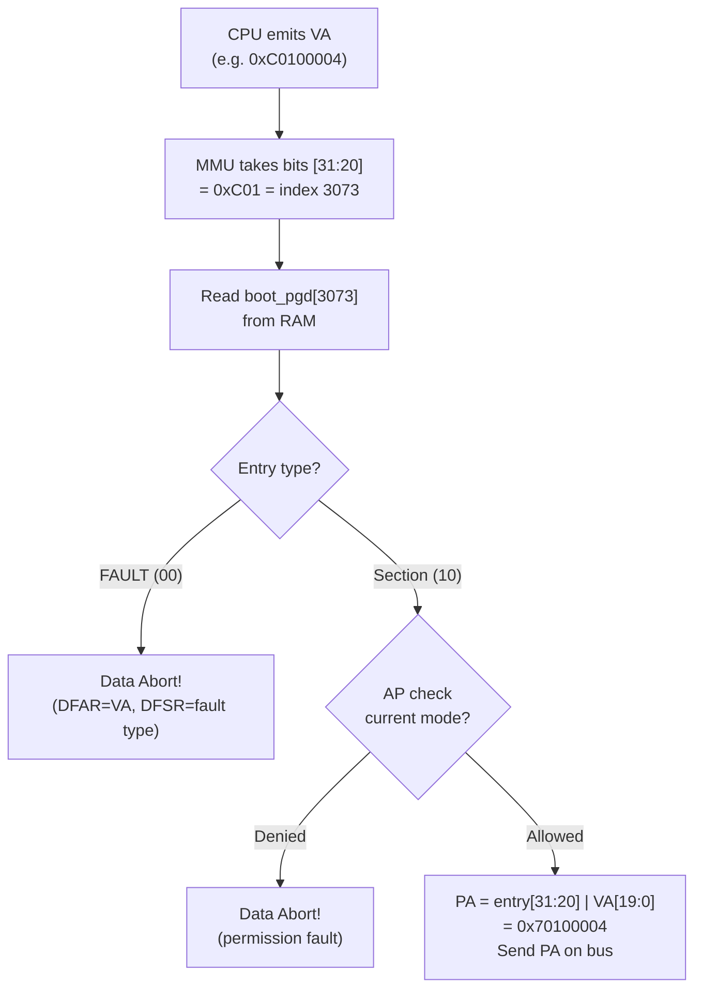
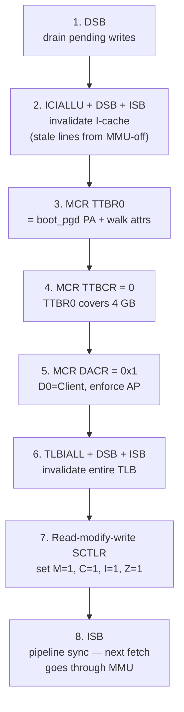
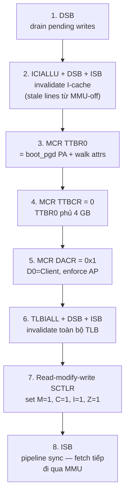

# Chapter 03 — MMU: Isolating the kernel from the world

<a id="english"></a>

**English** · [Tiếng Việt](#tiếng-việt)

> Boot is done, exception handlers work. But every piece of code can see all of RAM — kernel,
> drivers, data — all sitting exposed, no fence, no lock. One wrong line overwrites a UART
> register, overwrites the page table, overwrites its own code — nobody stops it. This chapter
> places a hardware layer between the CPU and RAM to control who sees what.

---

## What has been built so far

Modules marked with ★ are **new in this chapter**; the rest already existed.

```
┌──────────────────────────────────────────────────────┐
│                    User space                        │
│                    (not yet)                         │
└──────────────────────────────────────────────────────┘
━━━━━━━━━━━━━━━━━━━━━━━━━━━━━━━━━━━━━━━━━━━━━━━━━━━━━━━
┌──────────────────────────────────────────────────────┐
│                   Kernel (SVC mode)                  │
│                                                      │
│   ┌────────────┐   ┌─────────────────────────┐       │
│   │   kmain    │──▶│   Exception Handler     │       │
│   │            │   │   vector table / stubs   │       │
│   │            │   │   C handlers + dump      │       │
│   └────────────┘   └─────────────────────────┘       │
│          │                                           │
│          ▼                                           │
│   ┌──────────────────────────────────────────┐       │
│   │  ★ MMU                                   │       │
│   │    ├─ boot_pgd (L1 page table, 16 KB)    │       │
│   │    ├─ identity map (kernel PA)            │       │
│   │    ├─ high VA alias (0xC0000000)          │       │
│   │    ├─ peripheral map (identity, SO+XN)    │       │
│   │    └─ NULL guard (0x00000000 → FAULT)     │       │
│   └──────────────────────────────────────────┘       │
│          │                                           │
│   ┌────────────┐   ┌─────────────────────────┐       │
│   │   UART     │   │    Boot sequence        │       │
│   │  driver    │   │    (start.S)            │       │
│   └────────────┘   └─────────────────────────┘       │
│                                                      │
│           MMU: ★ ON   ·   IRQ: masked                │
└──────────────────────────────────────────────────────┘
━━━━━━━━━━━━━━━━━━━━━━━━━━━━━━━━━━━━━━━━━━━━━━━━━━━━━━━
                      Hardware
              CPU · RAM · UART · (timer/INTC not yet used)
```

**Current boot flow — kernel linked at high VA `0xC0000000`:**

```mermaid
flowchart LR
    A[Reset] --> B[start.S<br/>stacks@PA<br/>zero BSS]
    B --> E["★ mmu_init phys_offset<br/>build pgd via PA<br/>enable MMU"]
    E --> T["★ ldr pc, =_start_va<br/>trampoline PC<br/>→ high VA"]
    T --> V[_start_va<br/>stacks@VA]
    V --> C[kmain]
    C --> D[uart_init]
    D --> F[exception_init<br/>set VBAR]
    F --> G["★ boot self-tests<br/>T1–T9"]
    G --> D2["★ mmu_drop_identity<br/>remove PA range"]
    D2 --> H[idle loop]

    style E fill:#ffe699,stroke:#e8a700,color:#000
    style T fill:#ffe699,stroke:#e8a700,color:#000
    style G fill:#ffe699,stroke:#e8a700,color:#000
    style D2 fill:#ffe699,stroke:#e8a700,color:#000
```

Key points of this design:

1. **`mmu_init` is called before `uart_init`**. UART cannot work before MMU in this schema
   because `uart_printf()` itself dereferences string literals at VA — VA is unmapped before MMU is on.
   Solution: `mmu_init()` runs silently (no `uart_printf`), enables MMU, then kmain inits UART
   and prints logs. MMU layout info is replayed by `mmu_print_status()` from kmain.
2. **Trampoline `ldr pc, =_start_va`** jumps PC from PA (where `start.S` is running via identity map)
   to high VA after MMU is on. From there every instruction fetch goes through the MMU.
3. **`mmu_drop_identity()`** removes the identity PA mapping after self-tests. Stray PA derefs
   afterwards will fault immediately — exposes bugs, no silent corruption.

---

## Principle

### The CPU doesn't distinguish "whose memory"

When C writes `*ptr = 42`, the CPU puts the address on the bus and writes 42. The CPU doesn't know
and doesn't care whether that address belongs to the kernel, a UART register, or the page table itself.
To the CPU, everything is just: **send address, receive/send data**.

Consequence: without anything stopping it, **any code can access any address**. Kernel writes to
0x10009000 (UART)? Fine. User program writes to 0x10009000? Also fine. User program overwrites
kernel code? Still fine. No barrier exists.

### Solution: place a filter between CPU and RAM

Instead of letting the CPU talk directly to RAM, place a hardware component in between. Every time
the CPU emits an address, that hardware:

1. Receives the address from the CPU (called a **virtual address — VA**)
2. Looks it up in a table in RAM (called a **page table**)
3. If a valid entry is found → extracts the corresponding **physical address (PA)**, sends it on the bus
4. If not found, or the entry says "forbidden" → **sends nothing**, instead triggers an exception (Data Abort)

That hardware is called the **MMU** (Memory Management Unit). The page table lives in normal RAM,
created and managed by the kernel. The MMU only reads the table, doesn't create it. **The kernel
controls the table → the kernel decides who sees what.**

### One table, full control

The page table doesn't just translate VA→PA. Each entry also contains **access permissions**:

- Kernel RW, user no-access → user program reads this region = Data Abort
- Read-only → write to it = Data Abort
- Execute Never (XN) → fetch instruction from here = Prefetch Abort

The kernel doesn't need to "forbid" user programs in code. The kernel just needs to **not create an entry**
for that region in the user's page table — from the user process's perspective, the kernel region **doesn't exist**.

---

## Context

```
CPU state just before mmu_init runs:
- PC        : in start.S, after setting up SVC stack + zeroing BSS
              (PC-relative, inside image at PA)
- MMU       : OFF — every address the CPU emits is physical
- IRQ/FIQ   : masked
- SP        : SVC stack (temporarily at PA — enough for mmu_init)
- Exception : VBAR not set → if crash, default vector @ 0 → hang
- UART      : not initialized (uart_printf uses VA strings → can't use)
```

The kernel image is loaded at PA (`0x70100000` QEMU, `0x80000000` BBB) but **the linker emits
symbols at high VA** (`0xC0100000` / `0xC0000000`). Before MMU is on:

- CPU fetches instructions via PA (identity between LMA bytes and physical RAM).
- Every `ldr rX, =sym` loads **VA** from the literal pool — dereferencing that VA will crash.

That's why `start.S` must use PC-relative (`adr _start` + `sub PHYS_OFFSET`) to touch
stack/BSS pre-MMU, and `mmu_init` must receive `phys_offset` as an argument to convert `boot_pgd`
VA → PA before writing.

---

## Problem

1. **No isolation** — any code can access any address. No user processes yet, but when Chapter 05
   creates processes there's no way to prevent them from overwriting kernel memory.

2. **NULL dereference doesn't fault** — `*(int*)0 = 1` on QEMU with MMU off will succeed
   (address 0 is within the RAM range). NULL pointer bugs become silent bugs, undetectable
   until data is corrupted elsewhere.

3. **Addresses depend on hardware** — kernel loads at `0x70100000` on QEMU, `0x80000000`
   on BBB. No abstraction layer, drivers and kernel logic are tightly coupled to the physical
   layout of each board.

4. **Prerequisite for multi-process** — each process needs its own address space (Chapter 05).
   No MMU → no per-process page table → no process isolation.

---

## Design

### Section mapping — why 1 MB, not 4 KB

ARMv7-A MMU supports 2 levels of page tables:
- **L1 section** (1 MB): each entry in the L1 table maps 1 MB VA → 1 MB PA. Only needs one table
  of 4096 entries = 16 KB.
- **L1 → L2 page** (4 KB): L1 entry points to a smaller L2 table (256 entries = 1 KB),
  each L2 entry maps 4 KB.

RingNova chooses **section mapping (1 MB)** because:

- 3 processes, each with 1 MB memory → 1 section descriptor per process
- Kernel image < 1 MB currently → a few sections are enough
- No L2 tables needed → less complexity, less memory, fewer bugs

**Trade-off:** wasteful if a process only needs 100 KB but still occupies a 1 MB entry. Acceptable
for 3 static processes.

### L1 translation table — structure

```
boot_pgd[4096]:    4096 entries × 4 bytes = 16 KB
                   Must be 16 KB aligned (TTBR0 requires bits [13:0] = 0)

┌─────────────────────────────────────────────────────┐
│  Index    VA range              Contents             │
├─────────────────────────────────────────────────────┤
│  [0]      0x00000000-0x000FFFFF  → FAULT (zero=NULL) │
│  [1..9]   ...                    → FAULT              │
│  ...      ...                    → FAULT              │
│  [0x100]  0x10000000-0x100FFFFF  → PA 0x10000000     │ QEMU periph
│  [0x101]  0x10100000-0x101FFFFF  → PA 0x10100000     │ QEMU periph
│  ...                                                  │
│  [0x700]  0x70000000-0x700FFFFF  → PA 0x70000000     │ identity
│  [0x701]  0x70100000-0x701FFFFF  → PA 0x70100000     │ identity
│  ...      (128 sections total)                        │ identity
│  ...                                                  │
│  [0xC00]  0xC0000000-0xC00FFFFF  → PA 0x70000000     │ high VA alias
│  [0xC01]  0xC0100000-0xC01FFFFF  → PA 0x70100000     │ high VA alias
│  ...      (128 sections total)                        │ high VA alias
│  ...                                                  │
│  [0xFFF]  0xFFF00000-0xFFFFFFFF  → FAULT              │
└─────────────────────────────────────────────────────┘
```

**Entry 0 = FAULT** is natural: BSS is zeroed in `start.S`, a section descriptor with
value 0 has bits [1:0] = `0b00` = FAULT type. No special code needed for the NULL guard —
it comes for free.

### Identity map — why it's needed, only lives during the boot window

**The chicken-and-egg problem:** when the CPU executes `mcr ... SCTLR` to enable the MMU, PC is at
PA (e.g. `0x70100XXX`). The next instruction (right after ISB) is also fetched from `0x7010XXXX`.
If the MMU turns on but `0x7010XXXX` isn't in the page table → **Prefetch Abort on the very first
instruction after enabling**.

Solution: **identity map** — map VA `0x7010XXXX` → PA `0x7010XXXX` in boot_pgd. After the MMU
turns on, the CPU fetches at VA `0x7010XXXX`, MMU translates → PA `0x7010XXXX` (same) → survives.

**Identity only needs to "bridge" briefly:**

The kernel is linked at high VA (VMA = `0xC0000000`+), image loaded at PA (LMA = `0x7010...` /
`0x8000...`). Identity lifecycle:

1. **Pre-MMU:** `start.S` runs at PA via LMA. Identity not needed (MMU off).
2. **MMU enable:** `mmu_enable` flips `SCTLR.M=1`. PC still at PA → needs identity for the next instruction fetch.
3. **Trampoline:** `ldr pc, =_start_va` loads the literal VA into PC → PC jumps to high VA.
   From here the kernel runs via the high-VA alias (`0xC0...`).
4. **Post-trampoline:** identity no longer used. All symbols in code resolve to VA.
5. **`mmu_drop_identity()`** (called from kmain after self-tests): clears entries `[0x700..0x77F]`
   and flushes TLB. Stray PA derefs after this point → Data Abort, bug exposed immediately.

**Branch instructions (`bl`, `b`) don't touch identity** — they use PC-relative offsets. The offset
between two symbols is a compile-time constant (VA difference = PA difference since the image shifts uniformly).
Only absolute loads (`ldr rX, =symbol`) load literal VAs.

### High VA alias — 0xC0000000

The page table maps VA `0xC0000000` → PA `RAM_BASE`. This is **where the kernel actually runs after
the trampoline**, not just an aspirational alias. Its role:

- Symbol resolution: `&kmain = 0xC01xxxxx`, `&uart_printf = 0xC01xxxxx`, etc. The compiler generates
  code using VA, instruction fetch goes through the MMU at high VA.
- Per-process page table (Chapter 04): each process has its own L1 table, **without** identity
  RAM — only `0xC0000000+` (kernel), peripherals, and the user section at `0x40000000`. Context
  switch swaps TTBR0 without needing a trampoline because PC is already at high VA.
- Linux ARM 3G/1G convention: kernel in the top 1 GB (`0xC0000000–0xFFFFFFFF`), user in the bottom 3 GB.

### Section descriptor format

Each 32-bit entry in the L1 table:

```
 31        20 19  15 14 12 11 10 9  8  5 4 3 2 1 0
┌───────────┬──────┬─────┬────┬──┬──┬────┬─┬─┬─┬───┐
│ Base PA   │ ---  │ TEX │ AP │nG│ S│ DOM│XN│C│B│ 10│
│ [31:20]   │      │     │    │  │  │    │  │ │ │   │
└───────────┴──────┴─────┴────┴──┴──┴────┴─┴─┴─┴───┘
                                              └── Type = Section
```

Attributes used in RingNova:

| Name | Value | Used for |
|------|-------|----------|
| `PDE_KERNEL_MEM` | Section + C + B + AP=001 + D0 | Kernel RAM (cached, RW, executable) |
| `PDE_DEVICE` | Section + AP=001 + D0 + XN | Peripherals (strongly-ordered, no-execute) |

- **C+B** (cacheable + bufferable): normal memory, write-back. CPU cache reads/writes → fast.
- **Strongly-ordered** (no C, no B): every write to a peripheral must complete before the CPU continues.
  Required for MMIO — if UART writes are cached, characters won't appear on serial.
- **XN** (Execute Never): fetching an instruction from the peripheral region → Prefetch Abort. Prevents
  the CPU from accidentally jumping into register space.
- **AP=001** (kernel RW, user no-access): only code in Privileged mode (SVC, IRQ, ABT, ...)
  can access. User mode touch → Data Abort.
- **Domain 0, DACR=Client**: MMU enforces AP bits. If DACR=Manager then AP is ignored
  (all accesses pass) — dangerous, only for debugging.

### TTBR0, TTBCR, DACR

- **TTBR0** = physical address of the L1 table + walk attributes (cache policy for hardware
  table walk). TTBCR=0 → TTBR0 covers the full 4 GB.
- **DACR** = domain access control. 16 domains, 2 bits each. RingNova uses domain 0
  for everything, set to Client (= enforce AP).

---

## How it works

### One memory access through the MMU



The entire process happens **in hardware**, every instruction. The kernel doesn't intervene
at runtime — it only needs to set up the table correctly at boot.

### MMU enable sequence

Strict order — swapping any step can corrupt:



**Why each barrier matters:**
- **DSB before TTBR0**: writes not yet complete when page table changes → corrupt
- **ICIALLU**: I-cache may contain instructions fetched while MMU was off — if kept, CPU
  could execute instructions from cache that the MMU hasn't verified → bypass isolation
- **TLBIALL**: TLB caches old translations (from when MMU was off or previous tests) — must be cleared
- **ISB after SCTLR**: the next instruction in the pipeline may have been fetched before
  M=1 took effect — ISB forces a pipeline flush, re-fetches through the MMU

---

## Implementation

### Files

| File | Contents |
|------|----------|
| [kernel/include/mmu.h](../../kernel/include/mmu.h) | Section descriptor macros, VA constants, API prototypes |
| [kernel/arch/arm/mm/pgtable.c](../../kernel/arch/arm/mm/pgtable.c) | `boot_pgd[4096]` + `mmu_build_boot_pgd(pgd)` (receives PA pointer) |
| [kernel/arch/arm/mm/mmu_enable.S](../../kernel/arch/arm/mm/mmu_enable.S) | Assembly: TTBR0 → DACR → SCTLR flip → ISB |
| [kernel/arch/arm/mm/mmu.c](../../kernel/arch/arm/mm/mmu.c) | `mmu_init(phys_offset)` + `mmu_print_status` + `mmu_drop_identity` |
| [kernel/arch/arm/boot/start.S](../../kernel/arch/arm/boot/start.S) | Pre-MMU setup, `bl mmu_init`, `ldr pc, =_start_va` trampoline |

### Key points

**Page table allocation** — `boot_pgd` is a static 16 KB array in `.bss.pgd`, 16 KB aligned:

```c
uint32_t boot_pgd[4096]
    __attribute__((aligned(16384)))
    __attribute__((section(".bss.pgd")));
```

BSS is zeroed by `start.S` → all entries default to FAULT. `mmu_build_boot_pgd()` only needs
to fill the entries that need mapping; the rest are automatically NULL guards.

**Build page table** — helper `map_range()` populates consecutive entries:

```c
/* Example: map 128 MB kernel RAM identity */
map_range(RAM_BASE, RAM_BASE, RAM_SIZE, PDE_KERNEL_MEM);
/* Example: map 128 MB kernel high VA alias */
map_range(VA_KERNEL_BASE, RAM_BASE, RAM_SIZE, PDE_KERNEL_MEM);
```

Platform-specific peripheral mapping uses `#ifdef PLATFORM_QEMU / PLATFORM_BBB` — QEMU maps
2 sections at `0x10000000`, BBB maps 1 section `0x44E00000` + 16 sections `0x48000000`.
All use `PDE_DEVICE` (strongly-ordered + XN).

**MMU enable** — assembly routine `mmu_enable(uint32_t pgd_pa)` in
[mmu_enable.S](../../kernel/arch/arm/mm/mmu_enable.S), 8-step sequence as shown in the diagram.
TTBR0 walk attributes `0x4A` = inner WB-WA + outer WB-WA + shareable.

**Linker script** — adds `.bss.pgd` section to `.bss`, 16 KB aligned before placement:

```ld
.bss (NOLOAD) : {
    _bss_start = .;
    . = ALIGN(16384);
    *(.bss.pgd)        /* boot_pgd — 16 KB aligned */
    *(.bss*)
    ...
}
```

---

## Testing

Boot self-tests run automatically every boot (9 tests), printing [PASS] or [FAIL]:

| Test | Checks | If fail means |
|------|--------|---------------|
| **T1** SCTLR.M=1 | MMU is actually on | `mmu_enable` didn't write SCTLR correctly |
| **T2** TTBR0 base == PA of `boot_pgd` | CPU is walking the correct page table at PA (`boot_pgd` symbol is VA, subtract PHYS_OFFSET to get PA) | TTBR0 loaded wrong, or migration forgot to convert VA→PA |
| **T3** VA alias read == PA read | `*0xC0100000 == *0x70100000` — both high VA + identity point to the same PA | High VA map wrong, or identity dropped too early |
| **T4** Identity coherence PA↔VA | Write via PA (identity), read back via VA; then reverse | Identity map not write-coherent with high VA (cache attrs differ) |
| **T5** SVC exception return | `svc #42` → handler → normal return | Exception path broken after MMU on |

One destructive test (enable manually with `#define EXCEPTION_TEST TEST_NULL_DEREF`):

| Test | Trigger | Result |
|------|---------|--------|
| **NULL deref** | `*(int*)0 = 0xDEADBEEF` | Data Abort, DFAR=0x00000000, DFSR=0x805 (translation fault, section) |

The NULL test verifies that entry 0 is truly FAULT — the MMU blocks the access instead of
succeeding (as it would with MMU off on QEMU).

> **Order note:** T3 + T4 must run **before** `mmu_drop_identity()`. After identity is dropped,
> `*((uint32_t*)0x70100000)` faults immediately. In `kmain`, the flow is:
> `run_boot_tests()` → `mmu_drop_identity()` — wrong order = test hangs.

**Not yet tested:**

- Kernel execute from PA is no longer allowed (confirming `mmu_drop_identity` is effective) — needs
  a test case that deliberately jumps to PA and verifies Prefetch Abort.
- BBB hardware (only builds, not flashed yet).

---

## Links

### Files in the codebase

| File | Role |
|------|---------|
| [kernel/include/mmu.h](../../kernel/include/mmu.h) | Descriptor macros + API |
| [kernel/arch/arm/mm/pgtable.c](../../kernel/arch/arm/mm/pgtable.c) | Page table builder |
| [kernel/arch/arm/mm/mmu_enable.S](../../kernel/arch/arm/mm/mmu_enable.S) | Assembly enable sequence |
| [kernel/arch/arm/mm/mmu.c](../../kernel/arch/arm/mm/mmu.c) | Init orchestration |
| [kernel/platform/qemu/board.h](../../kernel/platform/qemu/board.h) / [bbb/board.h](../../kernel/platform/bbb/board.h) | RAM_BASE, PHYS_OFFSET, peripheral addresses per-board |
| [kernel/platform/qemu/periph_map.c](../../kernel/platform/qemu/periph_map.c) / [bbb/periph_map.c](../../kernel/platform/bbb/periph_map.c) | `platform_map_peripherals()` — PA-safe literal map of each board's MMIO windows |
| [kernel/linker/kernel_qemu.ld](../../kernel/linker/kernel_qemu.ld) | Dual MEMORY PHYS/VIRT, `.bss.pgd` placement, `_start_phys` e_entry |
| [kernel/linker/kernel_bbb.ld](../../kernel/linker/kernel_bbb.ld) | (same for BBB) |

### Dependencies

- **Chapter 01 — Boot**: BSS must be zeroed first → `boot_pgd` defaults to FAULT
- **Chapter 02 — Exceptions**: Data Abort handler must exist → debug when MMU setup is wrong

### Next up

**Chapter 04 — Interrupts →** MMU on, peripheral addresses mapped. Now we can set up the INTC
(interrupt controller) and Timer — peripheral drivers read/write registers via VA (peripheral
sections remain identity-mapped, not dropped by `mmu_drop_identity` since only the RAM range is removed).
Timer interrupts are the prerequisite for preemptive scheduling (Chapter 06).

---

<a id="tiếng-việt"></a>

**Tiếng Việt** · [English](#english)

> Boot xong, exception handler hoạt động. Nhưng mọi code đều nhìn thấy toàn bộ RAM — kernel,
> driver, data — tất cả nằm trơ trọi, không rào, không khoá. Một dòng code sai ghi đè UART
> register, ghi đè page table, ghi đè code của chính mình — không ai chặn. Chapter này đặt
> một lớp phần cứng giữa CPU và RAM để kiểm soát ai thấy gì.

---

## Đã xây dựng đến đâu

Module có dấu ★ là **mới trong chapter này**, còn lại đã có từ các chapter trước.

```
┌──────────────────────────────────────────────────────┐
│                    User space                       │
│                                                      │
│                    (chưa có)                         │
└──────────────────────────────────────────────────────┘
━━━━━━━━━━━━━━━━━━━━━━━━━━━━━━━━━━━━━━━━━━━━━━━━━━━━━━━
┌──────────────────────────────────────────────────────┐
│                   Kernel (SVC mode)                  │
│                                                      │
│   ┌────────────┐   ┌─────────────────────────┐       │
│   │   kmain    │──▶│   Exception Handler     │       │
│   │            │   │   vector table / stubs   │       │
│   │            │   │   C handlers + dump      │       │
│   └────────────┘   └─────────────────────────┘       │
│          │                                           │
│          ▼                                           │
│   ┌──────────────────────────────────────────┐       │
│   │  ★ MMU                                   │       │
│   │    ├─ boot_pgd (L1 page table, 16 KB)    │       │
│   │    ├─ identity map (kernel PA)            │       │
│   │    ├─ high VA alias (0xC0000000)          │       │
│   │    ├─ peripheral map (identity, SO+XN)    │       │
│   │    └─ NULL guard (0x00000000 → FAULT)     │       │
│   └──────────────────────────────────────────┘       │
│          │                                           │
│   ┌────────────┐   ┌─────────────────────────┐       │
│   │   UART     │   │    Boot sequence        │       │
│   │  driver    │   │    (start.S)            │       │
│   └────────────┘   └─────────────────────────┘       │
│                                                      │
│           MMU: ★ ON   ·   IRQ: masked                │
└──────────────────────────────────────────────────────┘
━━━━━━━━━━━━━━━━━━━━━━━━━━━━━━━━━━━━━━━━━━━━━━━━━━━━━━━
                      Hardware
              CPU · RAM · UART · (timer/INTC chưa dùng)
```

**Flow khởi động hiện tại — kernel linked ở VA cao `0xC0000000`:**

```mermaid
flowchart LR
    A[Reset] --> B[start.S<br/>stacks@PA<br/>zero BSS]
    B --> E["★ mmu_init phys_offset<br/>build pgd via PA<br/>enable MMU"]
    E --> T["★ ldr pc, =_start_va<br/>trampoline PC<br/>→ high VA"]
    T --> V[_start_va<br/>stacks@VA]
    V --> C[kmain]
    C --> D[uart_init]
    D --> F[exception_init<br/>set VBAR]
    F --> G["★ boot self-tests<br/>T1–T9"]
    G --> D2["★ mmu_drop_identity<br/>remove PA range"]
    D2 --> H[idle loop]

    style E fill:#ffe699,stroke:#e8a700,color:#000
    style T fill:#ffe699,stroke:#e8a700,color:#000
    style G fill:#ffe699,stroke:#e8a700,color:#000
    style D2 fill:#ffe699,stroke:#e8a700,color:#000
```

Điểm cốt lõi của thiết kế này:

1. **`mmu_init` gọi trước `uart_init`**. UART không thể hoạt động trước MMU trong schema mới
   vì bản thân `uart_printf()` dereference string literal ở VA — VA unmapped trước khi MMU bật.
   Giải pháp: `mmu_init()` chạy câm (không `uart_printf`), enable MMU, rồi kmain mới init UART
   và in log. Prints về MMU layout được `mmu_print_status()` phát lại từ kmain.
2. **Trampoline `ldr pc, =_start_va`** nhảy PC từ PA (nơi `start.S` đang chạy qua identity map)
   sang VA cao sau khi MMU bật. Từ đó mọi instruction fetch đi qua MMU.
3. **`mmu_drop_identity()`** cắt bỏ identity PA sau self-tests. Stray PA deref về sau sẽ fault
   ngay — exposes bug, không âm thầm.

---

## Nguyên lý

### CPU không phân biệt "của ai"

Khi C viết `*ptr = 42`, CPU gửi address lên bus, ghi 42. CPU không biết và không quan tâm
address đó thuộc kernel, thuộc UART register, hay thuộc vùng nhớ đang chứa page table của
chính nó. Đối với CPU, mọi thứ chỉ là: **gửi address, nhận/gửi data**.

Hệ quả: nếu không có gì chặn, **bất kỳ code nào cũng truy cập bất kỳ address nào**. Kernel
viết vào 0x10009000 (UART)? Được. User program viết vào 0x10009000? Cũng được. User program
ghi đè code kernel? Vẫn được. Không có rào cản nào.

### Giải pháp: đặt một bộ lọc giữa CPU và RAM

Thay vì để CPU nói chuyện trực tiếp với RAM, đặt một phần cứng ở giữa. Mỗi lần CPU
phát ra address, phần cứng đó:

1. Nhận address từ CPU (gọi là **virtual address — VA**)
2. Tra một cái bảng trong RAM (gọi là **page table**)
3. Nếu tìm thấy entry hợp lệ → lấy ra **physical address (PA)** tương ứng, gửi lên bus
4. Nếu không tìm thấy, hoặc entry nói "cấm" → **không gửi gì**, thay vào đó kích hoạt
   exception (Data Abort)

Phần cứng đó gọi là **MMU** (Memory Management Unit). Page table nằm trong RAM bình thường,
do kernel tạo và quản lý. MMU chỉ đọc bảng, không tự tạo. **Kernel kiểm soát bảng →
kernel quyết định ai thấy gì.**

### Một bảng, toàn quyền kiểm soát

Page table không chỉ dịch VA→PA. Mỗi entry còn chứa **quyền truy cập** (permission bits):

- Kernel RW, user no-access → user program đọc vùng này = Data Abort
- Read-only → ghi vào = Data Abort
- Execute Never (XN) → fetch instruction từ đây = Prefetch Abort

Kernel không cần "cấm" user program bằng code. Kernel chỉ cần **không tạo entry** cho vùng
đó trong page table của user — với user process, vùng kernel **không tồn tại**.

---

## Bối cảnh

```
Trạng thái CPU ngay trước khi mmu_init chạy:
- PC        : trong start.S, sau khi setup SVC stack + zero BSS
              (PC-relative, nằm trong image ở PA)
- MMU       : OFF — mọi address CPU gửi ra bus là physical
- IRQ/FIQ   : masked
- SP        : SVC stack (tạm ở PA — đủ cho mmu_init)
- Exception : VBAR chưa set → nếu crash, default vector @ 0 → hang
- UART      : chưa init (uart_printf dùng VA string → không dùng được)
```

Kernel image được load tại PA (`0x70100000` QEMU, `0x80000000` BBB) nhưng **linker emit
symbol ở VA cao** (`0xC0100000` / `0xC0000000`). Trước khi MMU bật:

- CPU fetch instruction qua PA (identity giữa LMA bytes và physical RAM).
- Mọi `ldr rX, =sym` load **VA** từ literal pool — dereference VA đó sẽ crash.

Đó là lý do `start.S` phải dùng PC-relative (`adr _start` + `sub PHYS_OFFSET`) để chạm
stack/BSS pre-MMU, và `mmu_init` phải nhận `phys_offset` làm đối số để convert `boot_pgd`
VA → PA trước khi ghi.

---

## Vấn đề

1. **Không có isolation** — bất kỳ code nào truy cập bất kỳ address nào. Chưa có user
   process, nhưng khi chapter 05 tạo process thì không có cách nào ngăn process ghi đè
   kernel memory.

2. **NULL dereference không fault** — `*(int*)0 = 1` trên QEMU với MMU off sẽ ghi thành
   công (address 0 nằm trong RAM range). Bug pointer NULL trở thành bug âm thầm, không
   phát hiện được cho đến khi data bị corrupt ở nơi khác.

3. **Address phụ thuộc hardware** — kernel load tại `0x70100000` trên QEMU, `0x80000000`
   trên BBB. Không có abstraction layer, driver và kernel logic bị gắn chặt vào physical
   layout của từng bo.

4. **Tiên quyết cho multi-process** — mỗi process cần address space riêng (Chapter 05).
   Không có MMU → không có per-process page table → không có process isolation.

---

## Thiết kế

### Section mapping — tại sao 1 MB, không phải 4 KB

ARMv7-A MMU hỗ trợ 2 cấp page table:
- **L1 section** (1 MB): mỗi entry trong L1 table map 1 MB VA → 1 MB PA. Chỉ cần 1 bảng
  4096 entries = 16 KB.
- **L1 → L2 page** (4 KB): entry L1 trỏ sang bảng L2 nhỏ hơn (256 entries = 1 KB),
  mỗi entry L2 map 4 KB.

RingNova chọn **section mapping (1 MB)** vì:

- 3 process, mỗi process 1 MB memory → 1 section descriptor cho mỗi process
- Kernel image < 1 MB hiện tại → vài section đủ
- Không cần L2 table → giảm complexity, ít memory, ít bug

**Trade-off:** lãng phí nếu process chỉ cần 100 KB nhưng vẫn chiếm 1 MB entry. Chấp nhận
được cho 3 process static.

### L1 translation table — cấu trúc

```
boot_pgd[4096]:    4096 entries × 4 bytes = 16 KB
                   Phải align 16 KB (TTBR0 yêu cầu bit [13:0] = 0)

┌─────────────────────────────────────────────────────┐
│  Index    VA range              Nội dung             │
├─────────────────────────────────────────────────────┤
│  [0]      0x00000000-0x000FFFFF  → FAULT (zero=NULL) │
│  [1..9]   ...                    → FAULT              │
│  ...      ...                    → FAULT              │
│  [0x100]  0x10000000-0x100FFFFF  → PA 0x10000000     │ QEMU periph
│  [0x101]  0x10100000-0x101FFFFF  → PA 0x10100000     │ QEMU periph
│  ...                                                  │
│  [0x700]  0x70000000-0x700FFFFF  → PA 0x70000000     │ identity
│  [0x701]  0x70100000-0x701FFFFF  → PA 0x70100000     │ identity
│  ...      (128 sections total)                        │ identity
│  ...                                                  │
│  [0xC00]  0xC0000000-0xC00FFFFF  → PA 0x70000000     │ high VA alias
│  [0xC01]  0xC0100000-0xC01FFFFF  → PA 0x70100000     │ high VA alias
│  ...      (128 sections total)                        │ high VA alias
│  ...                                                  │
│  [0xFFF]  0xFFF00000-0xFFFFFFFF  → FAULT              │
└─────────────────────────────────────────────────────┘
```

**Entry 0 = FAULT** là tự nhiên: BSS được zero trong `start.S`, section descriptor với
value 0 có bits [1:0] = `0b00` = FAULT type. Không cần code đặc biệt cho NULL guard —
nó có sẵn miễn phí.

### Identity map — tại sao cần, chỉ sống trong boot window

**Bài toán con gà và quả trứng:** khi CPU thực thi `mcr ... SCTLR` để bật MMU, PC đang ở
PA (ví dụ `0x70100XXX`). Instruction kế tiếp (ngay sau ISB) cũng được fetch từ `0x7010XXXX`.
Nếu MMU bật mà `0x7010XXXX` không có trong page table → **Prefetch Abort ngay instruction
đầu tiên sau khi bật**.

Giải pháp: **identity map** — map VA `0x7010XXXX` → PA `0x7010XXXX` trong boot_pgd. Sau
khi MMU bật, CPU fetch ở VA `0x7010XXXX`, MMU dịch → PA `0x7010XXXX` (giống nhau) → sống
tiếp được.

**Identity chỉ cần "bắc cầu" ngắn:**

Kernel linked ở VA cao (VMA = `0xC0000000`+), image load ở PA (LMA = `0x7010...` /
`0x8000...`). Vòng đời identity:

1. **Pre-MMU:** `start.S` chạy ở PA qua LMA. Identity chưa cần (MMU off).
2. **MMU enable:** `mmu_enable` flip `SCTLR.M=1`. PC vẫn ở PA → cần identity để instruction
   kế tiếp fetch được.
3. **Trampoline:** `ldr pc, =_start_va` load literal VA vào PC → PC nhảy sang VA cao.
   Từ đây kernel chạy qua high-VA alias (`0xC0...`).
4. **Post-trampoline:** identity không còn dùng. Mọi symbol trong code đều resolve ra VA.
5. **`mmu_drop_identity()`** (gọi từ kmain sau self-tests): xoá entries `[0x700..0x77F]`
   và flush TLB. Stray PA deref sau điểm này → Data Abort, bug lộ ngay.

**Branch instruction (`bl`, `b`) không đụng tới identity** — dùng PC-relative offset. Offset
giữa hai symbol là compile-time constant (chênh lệch VA = chênh lệch PA vì image shift đều).
Chỉ absolute load (`ldr rX, =symbol`) mới load literal VA.

### High VA alias — 0xC0000000

Page table map VA `0xC0000000` → PA `RAM_BASE`. Đây là **nơi kernel thực sự chạy sau
trampoline**, không phải alias aspirational. Vai trò:

- Symbol resolve: `&kmain = 0xC01xxxxx`, `&uart_printf = 0xC01xxxxx`, v.v. Compiler sinh
  code dùng VA, instruction fetch qua MMU tại high VA.
- Per-process page table (Chapter 04): mỗi process có L1 table riêng, **không** có identity
  RAM — chỉ có `0xC0000000+` (kernel), peripherals, và user section ở `0x40000000`. Context
  switch swap TTBR0 không cần trampoline vì PC đã ở high VA sẵn.
- Convention Linux ARM 3G/1G: kernel ở top 1 GB (`0xC0000000–0xFFFFFFFF`), user ở bottom 3 GB.

### Section descriptor format

Mỗi entry 32-bit trong L1 table:

```
 31        20 19  15 14 12 11 10 9  8  5 4 3 2 1 0
┌───────────┬──────┬─────┬────┬──┬──┬────┬─┬─┬─┬───┐
│ Base PA   │ ---  │ TEX │ AP │nG│ S│ DOM│XN│C│B│ 10│
│ [31:20]   │      │     │    │  │  │    │  │ │ │   │
└───────────┴──────┴─────┴────┴──┴──┴────┴─┴─┴─┴───┘
                                              └── Type = Section
```

Các attribute dùng trong RingNova:

| Tên | Giá trị | Dùng cho |
|-----|---------|----------|
| `PDE_KERNEL_MEM` | Section + C + B + AP=001 + D0 | Kernel RAM (cached, RW, executable) |
| `PDE_DEVICE` | Section + AP=001 + D0 + XN | Peripherals (strongly-ordered, no-execute) |

- **C+B** (cacheable + bufferable): normal memory, write-back. CPU cache read/write → nhanh.
- **Strongly-ordered** (không C, không B): mỗi write đến peripheral phải xong trước khi
  CPU tiếp tục. Bắt buộc cho MMIO — nếu cache UART write thì ký tự không ra serial.
- **XN** (Execute Never): fetch instruction từ vùng peripheral → Prefetch Abort. Tránh
  CPU nhảy nhầm vào register space.
- **AP=001** (kernel RW, user no-access): chỉ code ở Privileged mode (SVC, IRQ, ABT, ...)
  mới truy cập được. User mode touch → Data Abort.
- **Domain 0, DACR=Client**: MMU enforce AP bits. Nếu DACR=Manager thì AP bị bỏ qua
  (mọi access đều pass) — nguy hiểm, chỉ dùng để debug.

### TTBR0, TTBCR, DACR

- **TTBR0** = physical address của L1 table + walk attributes (cache policy cho hardware
  table walk). TTBCR=0 → TTBR0 phủ toàn 4 GB.
- **DACR** = domain access control. 16 domain, mỗi domain 2 bit. RingNova dùng domain 0
  cho mọi thứ, set Client (= enforce AP).

---

## Cách hoạt động

### Một lần truy cập memory qua MMU


Toàn bộ quá trình xảy ra **trong hardware**, mỗi instruction. Kernel không can thiệp
runtime — chỉ cần setup bảng đúng lúc boot.

### Trình tự enable MMU

Thứ tự nghiêm ngặt — đảo bất kỳ bước nào đều có thể corrupt:



**Tại sao mỗi barrier quan trọng:**
- **DSB trước TTBR0**: write chưa xong mà đổi page table → corrupt
- **ICIALLU**: I-cache có thể chứa instruction đã fetch lúc MMU off — nếu giữ lại, CPU
  có thể execute instruction từ cache mà MMU chưa verify → bypass isolation
- **TLBIALL**: TLB cache translation cũ (từ lúc MMU off hoặc test trước) — phải xóa sạch
- **ISB sau SCTLR**: instruction tiếp theo trong pipeline có thể đã được fetch trước khi
  M=1 có hiệu lực — ISB force pipeline flush, fetch lại qua MMU

---

## Implementation

### Files

| File | Nội dung |
|------|----------|
| [kernel/include/mmu.h](../../kernel/include/mmu.h) | Section descriptor macros, VA constants, API prototypes |
| [kernel/arch/arm/mm/pgtable.c](../../kernel/arch/arm/mm/pgtable.c) | `boot_pgd[4096]` + `mmu_build_boot_pgd(pgd)` (nhận PA pointer) |
| [kernel/arch/arm/mm/mmu_enable.S](../../kernel/arch/arm/mm/mmu_enable.S) | Assembly: TTBR0 → DACR → SCTLR flip → ISB |
| [kernel/arch/arm/mm/mmu.c](../../kernel/arch/arm/mm/mmu.c) | `mmu_init(phys_offset)` + `mmu_print_status` + `mmu_drop_identity` |
| [kernel/arch/arm/boot/start.S](../../kernel/arch/arm/boot/start.S) | Pre-MMU setup, `bl mmu_init`, `ldr pc, =_start_va` trampoline |

### Điểm chính

**Page table allocation** — `boot_pgd` là static array 16 KB trong `.bss.pgd`, 16 KB aligned:

```c
uint32_t boot_pgd[4096]
    __attribute__((aligned(16384)))
    __attribute__((section(".bss.pgd")));
```

BSS đã zero bởi `start.S` → mọi entry mặc định FAULT. `mmu_build_boot_pgd()` chỉ cần
fill các entry cần map, phần còn lại tự động là NULL guard.

**Build page table** — helper `map_range()` populate entries liên tiếp:

```c
/* Ví dụ: map 128 MB kernel RAM identity */
map_range(RAM_BASE, RAM_BASE, RAM_SIZE, PDE_KERNEL_MEM);
/* Ví dụ: map 128 MB kernel high VA alias */
map_range(VA_KERNEL_BASE, RAM_BASE, RAM_SIZE, PDE_KERNEL_MEM);
```

Platform-specific peripheral map dùng `#ifdef PLATFORM_QEMU / PLATFORM_BBB` — QEMU map
2 section ở `0x10000000`, BBB map 1 section `0x44E00000` + 16 section `0x48000000`.
Tất cả dùng `PDE_DEVICE` (strongly-ordered + XN).

**MMU enable** — assembly routine `mmu_enable(uint32_t pgd_pa)` trong
[mmu_enable.S](../../kernel/arch/arm/mm/mmu_enable.S), sequence 8 bước như diagram trên.
TTBR0 walk attributes `0x4A` = inner WB-WA + outer WB-WA + shareable.

**Linker script** — thêm `.bss.pgd` section vào `.bss`, align 16 KB trước placement:

```ld
.bss (NOLOAD) : {
    _bss_start = .;
    . = ALIGN(16384);
    *(.bss.pgd)        /* boot_pgd — 16 KB aligned */
    *(.bss*)
    ...
}
```

---

## Testing

Boot self-tests chạy tự động mỗi lần boot (9 tests), in [PASS] hoặc [FAIL]:

| Test | Kiểm tra | Nếu fail nghĩa là |
|------|----------|------|
| **T1** SCTLR.M=1 | MMU thật sự bật | `mmu_enable` không ghi SCTLR đúng |
| **T2** TTBR0 base == PA của `boot_pgd` | CPU đang walk đúng page table ở PA (`boot_pgd` symbol là VA, trừ PHYS_OFFSET ra PA để so) | TTBR0 load sai, hoặc migration quên convert VA→PA |
| **T3** VA alias read == PA read | `*0xC0100000 == *0x70100000` — cả high VA + identity cùng trỏ về một PA | High VA map sai, hoặc identity đã bị drop sớm |
| **T4** Identity coherence PA↔VA | Ghi qua PA (identity), đọc lại qua VA; rồi ngược lại | Identity map không write-coherent với high VA (cache attrs lệch) |
| **T5** SVC exception return | `svc #42` → handler → return bình thường | Exception path vỡ sau khi MMU on |

Thêm 1 destructive test (enable thủ công bằng `#define EXCEPTION_TEST TEST_NULL_DEREF`):

| Test | Trigger | Kết quả |
|------|---------|---------|
| **NULL deref** | `*(int*)0 = 0xDEADBEEF` | Data Abort, DFAR=0x00000000, DFSR=0x805 (translation fault, section) |

NULL test verify rằng entry 0 thật sự là FAULT — MMU chặn access thay vì ghi thành công
(như khi MMU off trên QEMU).

> **Lưu ý thứ tự:** T3 + T4 phải chạy **trước** `mmu_drop_identity()`. Sau khi identity
> bị drop, `*((uint32_t*)0x70100000)` fault ngay. Trong `kmain`, flow là:
> `run_boot_tests()` → `mmu_drop_identity()` — đặt sai thứ tự = test hang.

**Chưa test:**

- Kernel execute từ PA không được phép nữa (xác nhận `mmu_drop_identity` hiệu quả) — cần
  test case cố tình jump vào PA và verify Prefetch Abort.
- BBB hardware (chỉ build, chưa flash).

---

## Liên kết

### Files trong code

| File | Vai trò |
|------|---------|
| [kernel/include/mmu.h](../../kernel/include/mmu.h) | Descriptor macros + API |
| [kernel/arch/arm/mm/pgtable.c](../../kernel/arch/arm/mm/pgtable.c) | Page table builder |
| [kernel/arch/arm/mm/mmu_enable.S](../../kernel/arch/arm/mm/mmu_enable.S) | Assembly enable sequence |
| [kernel/arch/arm/mm/mmu.c](../../kernel/arch/arm/mm/mmu.c) | Init orchestration |
| [kernel/platform/qemu/board.h](../../kernel/platform/qemu/board.h) / [bbb/board.h](../../kernel/platform/bbb/board.h) | RAM_BASE, PHYS_OFFSET, peripheral addresses per-board |
| [kernel/platform/qemu/periph_map.c](../../kernel/platform/qemu/periph_map.c) / [bbb/periph_map.c](../../kernel/platform/bbb/periph_map.c) | `platform_map_peripherals()` — PA-safe literal map of each board's MMIO windows |
| [kernel/linker/kernel_qemu.ld](../../kernel/linker/kernel_qemu.ld) | Dual MEMORY PHYS/VIRT, `.bss.pgd` placement, `_start_phys` e_entry |
| [kernel/linker/kernel_bbb.ld](../../kernel/linker/kernel_bbb.ld) | (same cho BBB) |

### Dependencies

- **Chapter 01 — Boot**: BSS phải zero trước → `boot_pgd` mới mặc định FAULT
- **Chapter 02 — Exceptions**: Data Abort handler phải có → debug khi MMU setup sai

### Tiếp theo

**Chapter 04 — Interrupts →** MMU bật, peripheral addresses mapped. Giờ có thể setup INTC
(interrupt controller) và Timer — peripheral driver đọc/ghi register qua VA (peripheral
section vẫn identity-mapped, không bị drop bởi `mmu_drop_identity` vì chỉ RAM range bị gỡ).
Timer interrupt là tiền đề cho preemptive scheduling (Chapter 06).
