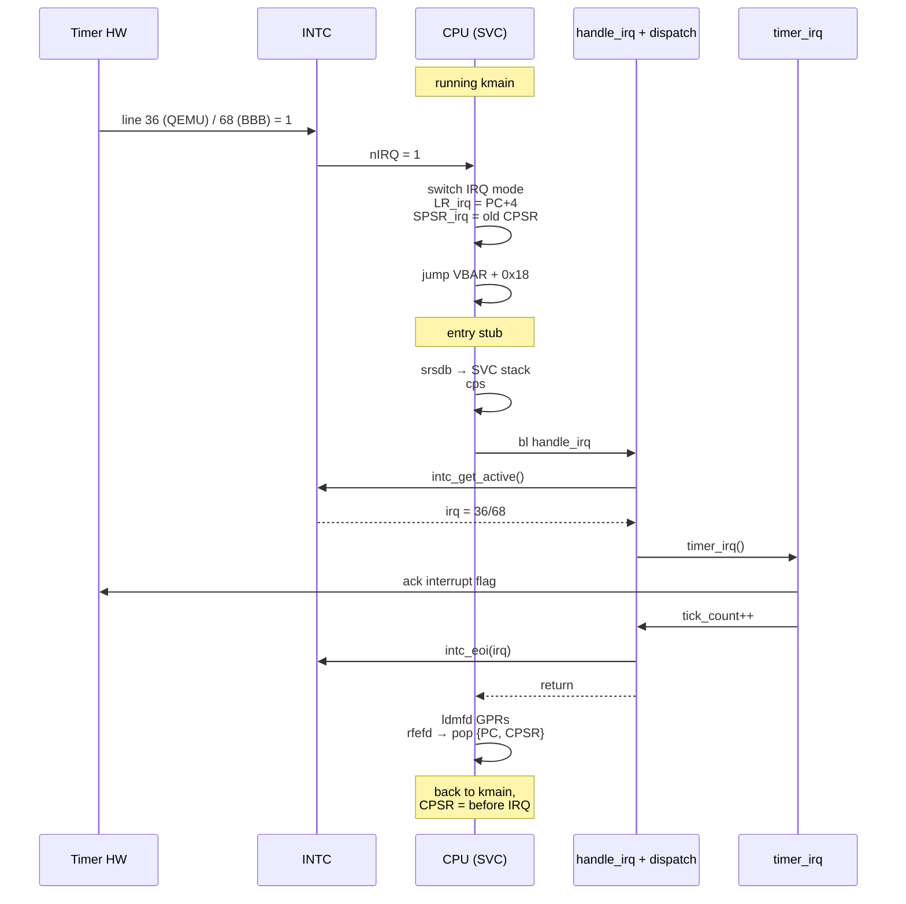
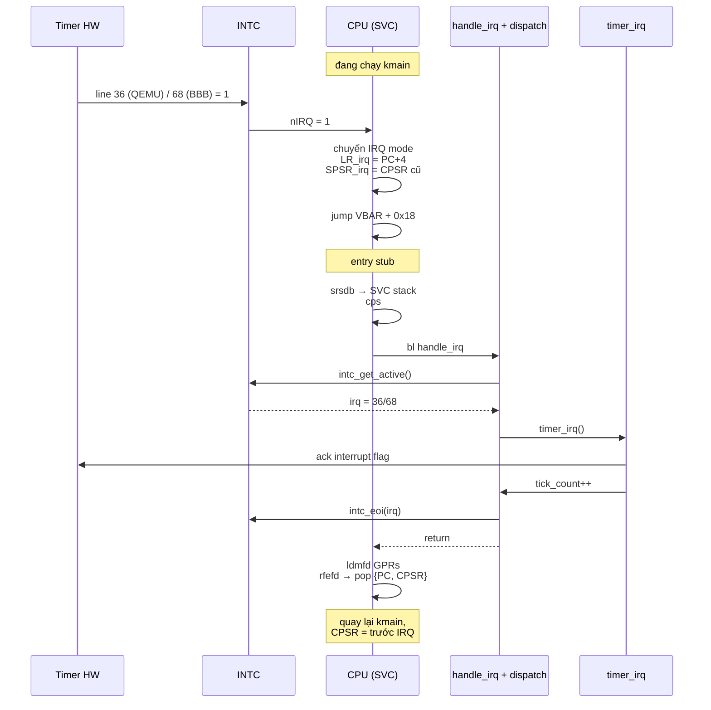

# Chapter 04 — Interrupts: Hardware knocking on the kernel's door

<a id="english"></a>

**English** · [Tiếng Việt](#tiếng-việt)

> The MMU is on, exception handlers catch faults. But the kernel is still "deaf" — the timer
> ticks every 10 ms and the kernel doesn't know, the UART has a character and the kernel doesn't
> hear it. The CPU only reads instructions sequentially; if nothing actively interrupts it, it
> runs the same loop forever. This chapter gives the kernel the ability to "listen": hardware
> knocks → CPU stops what it's doing → kernel handles it → returns CPU to the previous code.

---

## What has been built so far

Modules marked with ★ are **new in this chapter**.

```
┌──────────────────────────────────────────────────────┐
│                    User space                        │
│                    (not yet)                         │
└──────────────────────────────────────────────────────┘
━━━━━━━━━━━━━━━━━━━━━━━━━━━━━━━━━━━━━━━━━━━━━━━━━━━━━━━
┌──────────────────────────────────────────────────────┐
│                   Kernel (SVC mode)                  │
│                                                      │
│   ┌────────────┐   ┌─────────────────────────┐       │
│   │   kmain    │──▶│   Exception Handler     │       │
│   │            │   │   vector · stubs · C    │       │
│   └────────────┘   └─────────────┬───────────┘       │
│          │                       │                   │
│          │                       ▼                   │
│          │       ┌──────────────────────────┐        │
│          │       │  ★ IRQ dispatch          │        │
│          │       │    irq_table[128]        │        │
│          │       │    irq_dispatch()        │        │
│          │       └────────────┬─────────────┘        │
│          │                    │                      │
│          │   ┌────────────────┴────────────────┐     │
│          ▼   ▼                                 ▼     │
│   ┌──────────────────┐          ┌──────────────────┐ │
│   │  ★ INTC driver   │          │  ★ Timer driver  │ │
│   │    GIC v1 (QEMU) │          │   SP804  (QEMU)  │ │
│   │    INTC  (BBB)   │          │   DMT2   (BBB)   │ │
│   └──────────────────┘          └──────────────────┘ │
│                                                      │
│   ┌────────────┐   ┌─────────────────────────┐       │
│   │    MMU     │   │   UART · Boot · start.S │       │
│   └────────────┘   └─────────────────────────┘       │
│                                                      │
│        MMU: ON   ·   IRQ: ★ ON (CPSR.I=0)            │
└──────────────────────────────────────────────────────┘
━━━━━━━━━━━━━━━━━━━━━━━━━━━━━━━━━━━━━━━━━━━━━━━━━━━━━━━
                      Hardware
         CPU · RAM · UART · ★ INTC · ★ Timer (firing)
```

**Current boot flow — kernel linked at high VA `0xC0000000`:**

```mermaid
flowchart LR
    A[Reset] --> B[start.S<br/>stacks+BSS@PA]
    B --> E[mmu_init<br/>@PA — silent]
    E --> T["ldr pc, =_start_va<br/>trampoline"]
    T --> C[kmain<br/>@VA]
    C --> D[uart_init]
    D --> MP[mmu_print_status]
    MP --> F[exception_init]
    F --> G["★ irq_init<br/>(INTC reset,<br/>mask all)"]
    G --> H["★ timer_init<br/>(10 ms period)"]
    H --> I["★ irq_register<br/>+ irq_enable<br/>(per-line INTC unmask)"]
    I --> PI[process_init_all]
    PI --> DI[mmu_drop_identity]
    DI --> PFR["process_first_run<br/>(rfefd → USR,<br/>CPSR.I=0 atomic)"]

    style G fill:#ffe699,stroke:#e8a700,color:#000
    style H fill:#ffe699,stroke:#e8a700,color:#000
    style I fill:#ffe699,stroke:#e8a700,color:#000
```

What's new in this chapter: the INTC chip is configured (mask all → per-line enable via
`irq_register + irq_enable`), the timer driver is started, the vector table installs VBAR. The CPU-level
`CPSR.I` remains masked throughout kmain — prevents timer IRQ from preempting kmain and corrupting
the PCB being built. When `process_first_run` swaps to the first user mode via `rfefd`, CPSR.I=0 is
restored atomically; from then on each exception entry automatically masks I=1 and rfefd restores it —
the kernel never runs with IRQ enabled on a stack that could be yanked.

**Note on ordering:** `mmu_init` runs from `start.S` (before `kmain`), not from `kmain` —
because `uart_printf` uses VA string literals, which don't work pre-MMU. MMU logs are replayed
by `kmain` after UART is ready, via `mmu_print_status()`. See Chapter 03 for details.

---

## Principle

### Without an interrupt mechanism, the CPU runs one program forever

The CPU is a sequential execution machine: read instruction at PC, decode, execute, increment PC.
No concept of "external events". If it's running `while (1) { x++; }` it runs forever — never
checks "has the timer fired?" or "does the UART have new data?". The CPU has no senses.

Consequence: if the kernel wants to know about anything outside the region the CPU is executing,
it must actively go ask. The naive approach is **polling**:

```c
while (1) {
    if (timer_expired()) handle_tick();
    if (uart_has_data())  handle_char();
    if (gpio_changed())   handle_button();
    /* ... */
}
```

Polling is correct but wasteful: 99.99% of the time the CPU just reads registers to confirm "nothing yet".
And worse: if the polling loop is blocked by a slow task, other events are missed.

### Solution: let hardware knock on its own

Instead of the CPU going to ask, let **hardware notify on its own** when an event occurs. Each device
has a physical signal line connected back to the CPU. When the device has something to report, it
activates that line. The CPU receives the signal → stops the current instruction → jumps into a handler
→ when done, returns.

That signal line is called an **interrupt line**. The CPU action of stopping to handle it is called an
**interrupt request (IRQ)**. This is still the same exception mechanism from Chapter 02 — the only
difference is the source: instead of bad code (Data Abort, Undefined), the source is a **physical pin** being pulled.

### One CPU, many devices — need a multiplexer

Cortex-A8 has only **1 physical nIRQ pin**. But the system has many sources that need to report: timer,
UART, GPIO, DMA, Ethernet, ... You can't connect 10 pins to 1 pin. Solution: place an intermediate chip —
an **interrupt controller** (INTC or PIC) — that collects all lines and multiplexes them into a single
line into the CPU.

```
┌───────┐ line 4                                    nIRQ
│ Timer │─────────┐                                  │
└───────┘         │                                  ▼
┌───────┐ line 44 │    ┌──────────────────┐       ┌─────┐
│ UART  │─────────┼───▶│   INTC / PIC     │──────▶│ CPU │
└───────┘         │    │  ┌────────────┐  │       └─────┘
┌───────┐ line 27 │    │  │ mask bits  │  │
│ GPIO  │─────────┘    │  └────────────┘  │
└───────┘              │  ┌────────────┐  │
                       │  │ active id  │  │ ◀── CPU reads to know who called
                       │  └────────────┘  │
                       └──────────────────┘
```

INTC roles:
1. **Multiplex**: collect many lines into a single nIRQ line
2. **Mask**: allow the kernel to enable/disable each line individually
3. **Identify**: after signaling, INTC holds the number of the active line for the CPU to read
4. **Priority**: when multiple lines fire simultaneously, INTC picks the highest priority (not used here,
   disabled by setting threshold = max)
5. **Acknowledge (EOI)**: after the handler finishes, the kernel must tell the INTC "done" to unlatch
   the line, ready for the next call

### Timer — the kernel's heartbeat

Among all interrupt sources, **the timer is the most special**. It doesn't react to external events —
it **creates events** on a fixed schedule. Program `timer_init(10000)` and every 10 ms the timer fires
once, without anyone triggering it.

Why the timer is so important:

- **Time**: kernel counts ticks → knows how much time has passed, for `sleep()`, `timeout`, `uptime`
- **Preemption** (Chapter 06): each timer tick is an opportunity for the scheduler to **forcibly** take
  the CPU back from the running process. No timer → if a process doesn't yield, the kernel is powerless
- **Watchdog**: if an action doesn't complete within N ticks, consider it dead

No timer interrupt = no real kernel, just a library running in a user process.

---

## Context

```
CPU state entering Chapter 04:
- MMU       : ON — peripheral addresses mapped strongly-ordered + XN
- IRQ/FIQ   : masked (CPSR.I = 1) since reset
- VBAR      : installed, 8 vector entries with full handlers
- IRQ stub  : exception_entry_irq saves context → handle_irq → panic + halt
              (kernel doesn't want to receive IRQ yet, if it does it's a bug)
- INTC      : untouched — registers in hardware reset state
- Timer     : untouched — not firing
```

Hardware peripherals are already in the VA map (Chapter 03), registers can be read/written. The vector
table already has a slot for IRQ (Chapter 02). Everything is ready for the kernel to "learn to listen".

---

## Problem

1. **Kernel has no way to measure time** — busy loop `for (i=0; i<N; i++)` depends on CPU speed,
   compiler optimization, cache state. No independent tick source → no concept of "10 ms has passed".

2. **Cannot preempt** — suppose we have 3 processes, process 0 falls into an infinite loop.
   Only a timer interrupt can cut it off. No timer → Chapter 06 scheduler doesn't exist.

3. **I/O must poll** — the shell (Chapter 10) needs blocking reads from UART. No UART RX
   interrupt → must poll `LSR & RXDA` continuously → burns 100% CPU.

4. **Current IRQ stub panics** — if any hardware (e.g. misconfigured) activates an IRQ line,
   the kernel halts instead of handling it. Blocks any possibility of running with real hardware.

---

## Design

### Two platforms, two different INTCs — same interface

QEMU `realview-pb-a8` and BeagleBone Black use two completely different interrupt controllers:

| Platform | Controller | Base | Lines | Notes |
|----------|-----------|------|-------|-------|
| QEMU | ARM GIC v1 | CPU @ `0x1E000000`, Dist @ `0x1E001000` | 96 | Distributor + CPU interface split; IAR/EOIR protocol |
| BBB  | AM335x INTC | `0x48200000` | 128 | 4 banks × 32 bits; NEWIRQAGR single-write EOI |

**Note on QEMU**: machine `realview-pb-a8` wires up **GIC v1** (not PL190 VIC
like the `realview-eb` variant). SP804 TIMER0_1 corresponds to **SPI #4**; on GIC the SPI offset
is 32 → IRQ ID = **36**. On BBB, DMTIMER2 is IRQ **68**.

Because the two backends differ, the driver hides behind a unified API:

```c
void     intc_init(void);
void     intc_enable_line(uint32_t irq);
void     intc_disable_line(uint32_t irq);
uint32_t intc_get_active(void);
void     intc_eoi(uint32_t irq);
```

Kernel code (dispatch layer, tests) only sees this API. Swap platform → swap backend,
no changes to the layer above.

### Timer similarly — DMTimer2 is much more complex than SP804

| Platform | Timer | Clock | Setup requires |
|----------|-------|-------|----------------|
| QEMU | SP804 Dual (Timer0) | 1 MHz | Load + ctrl register, 3 lines of code |
| BBB  | DMTIMER2 | 24 MHz | CM_PER clock gate → soft reset → posted mode → TLDR/TCRR → IRQENABLE → TCLR |

DMTIMER2 on AM335x requires **the clock module (CM_PER) to be enabled first**. Without it,
the module dies silently — registers read as all 0, writes have no effect. Mandatory order:

```
CM_PER_L4LS_CLKSTCTRL = SW_WKUP
CM_PER_TIMER2_CLKCTRL = MODULEMODE_ENABLE
poll IDLEST == FUNC  ← wait for clock domain to actually wake
... only then touch TIMER2_BASE
```

Additionally DMTIMER2 uses **posted writes** (`TSICR.POSTED = 1`): writes return to the CPU
immediately, but the actual register is updated one clock later. If the CPU writes then reads back
immediately → may read the old value. Must poll `TWPS` before the next write. SP804 on QEMU has no such issue.

Both drivers expose the same API:

```c
void     timer_init(uint32_t period_us);
void     timer_set_handler(timer_handler_t fn);
void     timer_irq(void);              /* register with irq_register */
uint32_t timer_get_ticks(void);
```

### Dispatch layer — one table, one function

The kernel doesn't ask the INTC who's calling — the INTC answers. The dispatcher only needs:

```c
irq_handler_t irq_table[MAX_IRQS];

void irq_dispatch(void) {
    uint32_t n = intc_get_active();       /* ask INTC: who called? */
    if (n < MAX_IRQS && irq_table[n])
        irq_table[n]();                    /* call registered handler */
    intc_eoi(n);                           /* tell INTC: done */
}
```

Each driver that needs to receive IRQs calls `irq_register(IRQ_X, my_handler)` at init. At runtime
no switch-case is needed, no knowledge of which driver — just a table lookup.

### EOI AFTER handler, not before

If EOI is sent before the handler finishes, the INTC considers the line free. If the same line fires
again in the middle, the CPU may receive a new IRQ on top of the old handler → nested → stack corrupt
(RingNova doesn't support nested IRQ). Correct order: **handler finishes → EOI → return to interrupted code**.

Exception: spurious IRQ (INTC reports "nobody called" — usually a race). The dispatcher **must still
call EOI** for the spurious ID, otherwise the INTC holds the pending state and won't accept new lines.

### IRQ entry — SVC stack from the start, IRQ stack is just a trampoline

ARMv7 when receiving IRQ:
- Switches to IRQ mode
- `LR_irq = interrupted_PC + 4`
- `SPSR_irq = CPSR` (of the interrupted mode)
- Jumps to VBAR + 0x18

Problem: IRQ mode has its own SP (banked), very small stack (1 KB). Can't run full C logic there.
Solution:

```asm
exception_entry_irq:
    sub     lr, lr, #4              /* LR = interrupted instruction          */
    srsdb   sp!, #0x13              /* push {LR_irq, SPSR_irq} onto SVC stk */
    cps     #0x13                   /* switch to SVC mode                    */
    stmfd   sp!, {r0-r12, lr}       /* save GPRs on SVC stack                */
    bl      handle_irq
    ldmfd   sp!, {r0-r12, lr}       /* restore GPRs                          */
    rfefd   sp!                     /* pop {PC, CPSR} → return + unmask      */
```

Two key instructions:

- **`srsdb sp!, #0x13`** (Store Return State): pushes `{LR_irq, SPSR_irq}` onto the stack of
  **mode 0x13 (SVC)**, not the current stack (IRQ). This is the key point — context is saved
  directly onto the SVC stack before switching mode, no copy needed.
- **`rfefd sp!`** (Return From Exception): pops `{PC, CPSR}` — restores both the return address
  and the processor status register (including mode bits). Atomic, no need to manage SPSR manually.

Result: the IRQ stack is only used as a "landing pad" for 1 cycle before srsdb/cps moves away.
All C handler code runs on the SVC stack — 8 KB, enough for nested calls.

### No re-enabling IRQ in the handler

ARMv7 automatically sets `CPSR.I=1` when entering IRQ mode. The kernel doesn't call `cpsie i` inside
the handler. Reasons:
- Single-core, 1 IRQ stack per CPU — nested IRQ overwrites the stack
- Handler must be brief, 10 ms is the deadline — don't let them pile up

If a handler needs to run long (e.g. filesystem), defer to a bottom-half (deferred work). RingNova
has no such need — the timer handler only bumps a counter.

---

## How it works

### One interrupt cycle from hardware to CPU return



### Why spurious must still EOI

```
                       ┌─────────────────────────┐
                       │  INTC state machine      │
                       │                          │
  Timer pulse ────▶    │   line latched           │
                       │        │                 │
                       │        ▼                 │
                       │   signal nIRQ to CPU     │
                       │        │                 │
                       │        ▼                 │
                       │   CPU reads IAR/SIR_IRQ  │◀── active ID returned
                       │        │                 │
                       │        ▼                 │
         (waiting EOI) │   line → "in-service"    │  ← if no EOI, stuck here
                       │        │                 │       no new lines get through
                       │        ▼ (when EOI received) │
                       │   line unlatched         │
                       │        │                 │
                       └────────┴─────────────────┘
```

Spurious = CPU reads IAR and sees "nobody" (ID=1023 on GIC, spurious bit=1 on AM335x).
The "in-service" state may have been claimed → must EOI to unlatch → otherwise all subsequent
lines are blocked.

---

## Implementation

### Files

| File | Contents |
|------|----------|
| [kernel/include/drivers/intc.h](../../kernel/include/drivers/intc.h) | `struct intc_ops` contract + `irq_*` dispatch API |
| [kernel/include/drivers/timer.h](../../kernel/include/drivers/timer.h) | `struct timer_ops` contract + `timer_*` API |
| [kernel/drivers/intc/intc_core.c](../../kernel/drivers/intc/intc_core.c) | Generic IRQ table + dispatch + `intc_*` thin wrappers |
| [kernel/drivers/intc/gicv1.c](../../kernel/drivers/intc/gicv1.c) | `struct intc_ops gicv1_ops` — QEMU realview-pb-a8 |
| [kernel/drivers/intc/am335x_intc.c](../../kernel/drivers/intc/am335x_intc.c) | `struct intc_ops am335x_intc_ops` — BBB |
| [kernel/drivers/timer/timer_core.c](../../kernel/drivers/timer/timer_core.c) | tick_count + user_handler + dispatch |
| [kernel/drivers/timer/sp804.c](../../kernel/drivers/timer/sp804.c) | `struct timer_ops sp804_ops` — QEMU |
| [kernel/drivers/timer/dmtimer.c](../../kernel/drivers/timer/dmtimer.c) | `struct timer_ops dmtimer_ops` — BBB |
| [kernel/arch/arm/exception/exception_entry.S](../../kernel/arch/arm/exception/exception_entry.S) | `exception_entry_irq` (srsdb/rfefd → SVC stack) |
| [kernel/arch/arm/exception/exception_handlers.c](../../kernel/arch/arm/exception/exception_handlers.c) | `handle_irq` → `irq_dispatch()` |
| [kernel/platform/qemu/board.c](../../kernel/platform/qemu/board.c) / [bbb/board.c](../../kernel/platform/bbb/board.c) | Declare `intc_device` / `timer_device` and bind ops + addresses |
| [kernel/platform/qemu/board.h](../../kernel/platform/qemu/board.h) / [bbb/board.h](../../kernel/platform/bbb/board.h) | `GIC_*_BASE` / `INTC_BASE`, `TIMER*_BASE`, `IRQ_TIMER`, `TIMER_CLK_HZ` |

### Key points

**Backend selected at link time** — `kernel/platform/<board>/platform.mk` lists the specific drivers. For QEMU: `gicv1.c + sp804.c`; for BBB: `am335x_intc.c + dmtimer.c`. The Makefile only compiles drivers for the current board, zero `#ifdef` left in the kernel.

Kernel core calls `irq_register(IRQ_TIMER, timer_irq)` through the subsystem layer — `intc_core` dispatches down to `active_intc->ops->enable_line()`. The PL011 driver doesn't know whether it's running on QEMU or RPi; knowing the base address is enough, taken from `dev->base` set by `board.c`.

**GIC init on QEMU** — the easy mistake is the order of enabling distributor vs CPU interface:

```c
REG32(GIC_DIST_BASE + GICD_CTLR) = 0;           /* disable while configuring */
/* ... mask + priority + target ... */
REG32(GIC_DIST_BASE + GICD_CTLR) = 1;           /* enable distributor        */

REG32(GIC_CPU_BASE + GICC_PMR)   = 0xF0U;       /* accept priority ≤ 0xF0   */
REG32(GIC_CPU_BASE + GICC_CTLR)  = 1;           /* enable CPU interface      */
```

PMR=0xF0 (not 0xFF) — GIC v1 only uses the top 4 bits of priority, needs a mask larger than
every priority the driver uses (0xA0 in `intc_init`).

**DMTIMER2 reload formula** — the timer counts down from TLDR to 0xFFFFFFFF (wrap), so the reload
is not the period but `0 - period_count`:

```c
uint32_t count  = period_us * (TIMER_CLK_HZ / 1000000U);  /* BBB: * 24 */
uint32_t reload = (uint32_t)(0U - count);                  /* = -count  */
```

For 10 ms @ 24 MHz: count = 240000, reload = 0xFFFB15A1.

**IRQ entry rewrite** — replaces old logic (halt after handler) with srsdb/rfefd. Short diff
but changes the entire flow: before, context was on the IRQ stack; now it's on the SVC stack.

**Wire in kmain** (after `exception_init`):

```c
irq_init();                              /* INTC reset, mask all       */
timer_init(10000);                       /* 10 ms period               */
irq_register(IRQ_TIMER, timer_irq);      /* register callback          */
irq_enable(IRQ_TIMER);                   /* unmask line in INTC        */
irq_register(IRQ_UART0, uart_rx_irq);
irq_enable(IRQ_UART0);
```

CPU-level unmask is not called here — `rfefd` in `ret_from_first_entry` restores
USR CPSR with I=0 atomically when the first process enters user mode. Enabling IRQs earlier
races with kmain: timer preempts → schedule() saves kmain's SVC state into
`processes[0].ctx`, overwrites the initial frame → next context_switch loads wrong SP.

---

## Testing

6 boot self-tests run automatically (T6 is new):

| Test | Checks | Fail means |
|------|--------|------------|
| T1–T5 | (Chapter 03) MMU + exception | — |
| **T6** | Spin reading `timer_get_ticks()`, break when ≥ 5 | Timer not firing / INTC not routing / dispatch error |

T6 spins until it sees ≥ 5 ticks instead of a fixed busy-wait, to avoid sensitivity to QEMU speed
(QEMU TCG runs the guest faster/slower depending on the host). Cap at 200 million iterations — if
still 0 ticks → fail early instead of hanging.

**Results on QEMU:**

```
[INTC]  GIC v1 dist=0x1e001000 cpu=0x1e000000 lines=96
[TIMER] SP804 @ 0x10011000 period=10000us reload=10000
[IRQ]   CPU IRQ enabled (CPSR.I=0)
...
[TEST] [PASS] T6 timer ticks: 5 observed
[TEST] ========== 6 passed, 0 failed ==========
```

**Not yet tested:**
- BBB hardware (only builds clean, SD card not flashed)
- Nested IRQ — RingNova doesn't support it, CLAUDE.md forbids re-enabling IRQ in handler
- Long-running handler — scheduler (Chapter 06) will need to measure latency

---

## Links

### Files in the codebase

| File | Role |
|------|---------|
| [kernel/drivers/intc/](../../kernel/drivers/intc/) | INTC driver + dispatch |
| [kernel/drivers/timer/](../../kernel/drivers/timer/) | Timer driver |
| [kernel/include/drivers/intc.h](../../kernel/include/drivers/intc.h) | Subsystem contract + IRQ dispatch API |
| [kernel/arch/arm/exception/exception_entry.S](../../kernel/arch/arm/exception/exception_entry.S) | IRQ entry (srsdb/rfefd) |
| [kernel/arch/arm/exception/exception_handlers.c](../../kernel/arch/arm/exception/exception_handlers.c) | `handle_irq` dispatch |
| [kernel/main.c](../../kernel/main.c) | Wire + T6 |

### Dependencies

- **Chapter 02 — Exceptions**: VBAR + IRQ vector slot already in place
- **Chapter 03 — MMU**: peripheral addresses mapped strongly-ordered, accessible
- **CLAUDE.md**: "Exception stacks are only used as trampolines" + "No re-enabling IRQ in IRQ handler"

### Next up

**Chapter 05 — Process →** the kernel can now hear the timer. Now we need a structure to save
the state of multiple programs: PCB (Process Control Block), context switch assembly, User mode entry.
The current timer handler only bumps a counter — Chapter 06 will turn it into the first `scheduler_tick`.

---

<a id="tiếng-việt"></a>

**Tiếng Việt** · [English](#english)

> MMU đã bật, exception handler đã bắt được fault. Nhưng kernel vẫn "điếc" — timer đếm
> mỗi 10 ms mà kernel không biết, UART có ký tự mà kernel không nghe thấy. CPU chỉ đọc
> instruction tuần tự, nếu không ai chủ động cắt ngang thì nó chạy mãi một vòng.
> Chapter này trang bị cho kernel khả năng "nghe": hardware gõ cửa → CPU dừng việc hiện
> tại → kernel xử lý → trả lại CPU cho code trước đó.

---

## Đã xây dựng đến đâu

Module có dấu ★ là **mới trong chapter này**.

```
┌──────────────────────────────────────────────────────┐
│                    User space                       │
│                                                      │
│                    (chưa có)                         │
└──────────────────────────────────────────────────────┘
━━━━━━━━━━━━━━━━━━━━━━━━━━━━━━━━━━━━━━━━━━━━━━━━━━━━━━━
┌──────────────────────────────────────────────────────┐
│                   Kernel (SVC mode)                  │
│                                                      │
│   ┌────────────┐   ┌─────────────────────────┐       │
│   │   kmain    │──▶│   Exception Handler     │       │
│   │            │   │   vector · stubs · C    │       │
│   └────────────┘   └─────────────┬───────────┘       │
│          │                       │                   │
│          │                       ▼                   │
│          │       ┌──────────────────────────┐        │
│          │       │  ★ IRQ dispatch          │        │
│          │       │    irq_table[128]        │        │
│          │       │    irq_dispatch()        │        │
│          │       └────────────┬─────────────┘        │
│          │                    │                      │
│          │   ┌────────────────┴────────────────┐     │
│          ▼   ▼                                 ▼     │
│   ┌──────────────────┐          ┌──────────────────┐ │
│   │  ★ INTC driver   │          │  ★ Timer driver  │ │
│   │    GIC v1 (QEMU) │          │   SP804  (QEMU)  │ │
│   │    INTC  (BBB)   │          │   DMT2   (BBB)   │ │
│   └──────────────────┘          └──────────────────┘ │
│                                                      │
│   ┌────────────┐   ┌─────────────────────────┐       │
│   │    MMU     │   │   UART · Boot · start.S │       │
│   └────────────┘   └─────────────────────────┘       │
│                                                      │
│        MMU: ON   ·   IRQ: ★ ON (CPSR.I=0)            │
└──────────────────────────────────────────────────────┘
━━━━━━━━━━━━━━━━━━━━━━━━━━━━━━━━━━━━━━━━━━━━━━━━━━━━━━━
                      Hardware
         CPU · RAM · UART · ★ INTC · ★ Timer (firing)
```

**Flow khởi động hiện tại — kernel linked ở VA cao `0xC0000000`:**

```mermaid
flowchart LR
    A[Reset] --> B[start.S<br/>stacks+BSS@PA]
    B --> E[mmu_init<br/>@PA — câm]
    E --> T["ldr pc, =_start_va<br/>trampoline"]
    T --> C[kmain<br/>@VA]
    C --> D[uart_init]
    D --> MP[mmu_print_status]
    MP --> F[exception_init]
    F --> G["★ irq_init<br/>(INTC reset,<br/>mask all)"]
    G --> H["★ timer_init<br/>(10 ms period)"]
    H --> I["★ irq_register<br/>+ irq_enable<br/>(per-line INTC unmask)"]
    I --> PI[process_init_all]
    PI --> DI[mmu_drop_identity]
    DI --> PFR["process_first_run<br/>(rfefd → USR,<br/>CPSR.I=0 atomic)"]

    style G fill:#ffe699,stroke:#e8a700,color:#000
    style H fill:#ffe699,stroke:#e8a700,color:#000
    style I fill:#ffe699,stroke:#e8a700,color:#000
```

Điểm mới của chapter này: INTC chip được cấu hình (mask all → per-line enable qua
`irq_register + irq_enable`), timer driver được start, vector table cài VBAR. CPU-level
`CPSR.I` vẫn mask trong suốt kmain — tránh timer IRQ preempt kmain và corrupt PCB đang
build. Khi `process_first_run` swap sang user mode đầu tiên qua `rfefd`, CPSR.I=0 được
restore atomic; từ đó mỗi exception entry tự động mask I=1 và rfefd restore lại — kernel
không bao giờ chạy với IRQ enabled trên stack có thể bị yank.

**Lưu ý về thứ tự:** `mmu_init` chạy từ `start.S` (trước `kmain`), không phải từ `kmain` —
vì `uart_printf` dùng VA string literal, không hoạt động pre-MMU. Log MMU được `kmain`
phát lại sau khi UART sẵn sàng, qua `mmu_print_status()`. Xem Chapter 03 cho chi tiết.

---

## Nguyên lý

### Nếu không có cơ chế cắt ngang, CPU chạy một chương trình mãi mãi

CPU là máy thực thi tuần tự: đọc instruction tại PC, decode, execute, tăng PC. Không có
khái niệm "ngoại cảnh". Nếu đang chạy vòng lặp `while (1) { x++; }` thì nó chạy mãi — không
bao giờ tự kiểm tra "timer đã đến chưa" hay "UART có data mới chưa". CPU không có giác quan.

Hệ quả: nếu kernel muốn biết có chuyện gì ngoài vùng CPU đang execute, nó phải chủ động
đi hỏi. Cách ngây thơ là **polling**:

```c
while (1) {
    if (timer_expired()) handle_tick();
    if (uart_has_data())  handle_char();
    if (gpio_changed())   handle_button();
    /* ... */
}
```

Polling đúng nhưng lãng phí: 99.99% thời gian CPU chỉ đọc register để xác nhận "chưa có gì".
Và tệ hơn: nếu vòng lặp polling bị một tác vụ chậm chặn lại, các sự kiện khác bị bỏ lỡ.

### Giải pháp: để hardware tự gõ cửa

Thay vì CPU đi hỏi, để **hardware tự thông báo** khi có sự kiện. Mỗi thiết bị có một đường
tín hiệu vật lý nối về CPU. Khi thiết bị có chuyện cần báo, nó kích hoạt đường đó. CPU nhận
được tín hiệu → dừng instruction hiện tại → nhảy vào handler → xong thì quay lại.

Đường tín hiệu đó gọi là **interrupt line**. Hành động CPU dừng để xử lý gọi là **interrupt
request (IRQ)**. Đây vẫn là cùng một cơ chế exception của Chapter 02 — chỉ khác ở nguồn
kích hoạt: thay vì code sai (Data Abort, Undefined), nguồn là **chân vật lý** kéo lên.

### Một CPU, nhiều thiết bị — cần bộ ghép

Cortex-A8 chỉ có **1 chân nIRQ** vật lý. Nhưng hệ thống có nhiều nguồn cần báo: timer,
UART, GPIO, DMA, Ethernet, ... Không thể nối 10 chân vào 1 chân. Giải pháp: đặt một chip
trung gian — **interrupt controller** (INTC hay PIC) — gom tất cả line lại, multiplex
thành 1 đường duy nhất vào CPU.

```
┌───────┐ line 4                                    nIRQ
│ Timer │─────────┐                                  │
└───────┘         │                                  ▼
┌───────┐ line 44 │    ┌──────────────────┐       ┌─────┐
│ UART  │─────────┼───▶│   INTC / PIC     │──────▶│ CPU │
└───────┘         │    │  ┌────────────┐  │       └─────┘
┌───────┐ line 27 │    │  │ mask bits  │  │
│ GPIO  │─────────┘    │  └────────────┘  │
└───────┘              │  ┌────────────┐  │
                       │  │ active id  │  │ ◀── CPU đọc để biết ai gọi
                       │  └────────────┘  │
                       └──────────────────┘
```

Vai trò của INTC:
1. **Multiplex**: gom nhiều line thành 1 đường nIRQ duy nhất
2. **Mask**: cho phép kernel enable/disable từng line riêng biệt
3. **Identify**: sau khi báo, INTC giữ số hiệu của line đang kích hoạt để CPU đọc
4. **Priority**: khi nhiều line cùng gọi, INTC chọn line ưu tiên cao nhất (ta chưa dùng,
   disable priority bằng threshold = max)
5. **Acknowledge (EOI)**: sau khi handler xong, kernel phải báo INTC "đã xong" để line
   này được unlatch, sẵn sàng gọi lần sau

### Timer — đồng hồ kernel nghe nhịp

Trong tất cả nguồn interrupt, **timer là đặc biệt nhất**. Nó không phải phản ứng với sự kiện
bên ngoài — nó **tự tạo sự kiện** theo chu kỳ cố định. Lập trình `timer_init(10000)` thì cứ
10 ms timer fire một lần, không cần ai kích hoạt.

Vì sao timer quan trọng đến vậy:

- **Thời gian**: kernel đếm tick → biết đã qua bao lâu, cho `sleep()`, `timeout`, `uptime`
- **Preemption** (Chapter 06): mỗi tick timer là cơ hội để scheduler **cưỡng chế** lấy CPU
  lại từ process đang chạy. Không có timer → process không yield thì kernel bất lực
- **Watchdog**: nếu một action không xong trong N tick, coi như chết

Không có timer interrupt = không có kernel thực sự, chỉ có thư viện chạy trong process user.

---

## Bối cảnh

```
Trạng thái CPU lúc vào Chapter 04:
- MMU       : ON — peripheral addresses mapped strongly-ordered + XN
- IRQ/FIQ   : masked (CPSR.I = 1) từ lúc reset
- VBAR      : đã cài, 8 vector entry đầy đủ handler
- IRQ stub  : exception_entry_irq lưu context → handle_irq → panic + halt
              (kernel chưa muốn nhận IRQ, nếu có thì coi là bug)
- INTC      : chưa chạm — register ở trạng thái reset hardware
- Timer     : chưa chạm — không fire
```

Hardware peripheral đã nằm trong bản đồ VA (Chapter 03), có thể đọc/ghi register. Vector
table đã có slot cho IRQ (Chapter 02). Mọi thứ sẵn sàng để kernel "học nghe".

---

## Vấn đề

1. **Kernel không có cách đo thời gian** — busy loop `for (i=0; i<N; i++)` phụ thuộc tốc độ
   CPU, compiler optimization, cache state. Không có nguồn tick độc lập → không có khái niệm
   "10 ms đã qua".

2. **Không preempt được** — giả sử đã có 3 process, process 0 rơi vào vòng lặp vô hạn.
   Chỉ có timer interrupt mới cắt ngang được nó. Không có timer → Chapter 06 scheduler
   không tồn tại.

3. **I/O phải polling** — shell (Chapter 10) cần blocking read từ UART. Không có UART RX
   interrupt → phải polling `LSR & RXDA` liên tục → burn 100% CPU.

4. **IRQ stub hiện tại panic** — nếu có hardware nào đó (ví dụ lỗi config) kích hoạt IRQ
   line, kernel halt thay vì xử lý. Chặn mọi khả năng chạy thật với hardware.

---

## Thiết kế

### Hai platform, hai INTC khác nhau — cùng một interface

QEMU `realview-pb-a8` và BeagleBone Black dùng hai bộ interrupt controller khác biệt:

| Platform | Controller | Base | Số line | Đặc điểm |
|----------|-----------|------|---------|-----------|
| QEMU | ARM GIC v1 | CPU @ `0x1E000000`, Dist @ `0x1E001000` | 96 | Distributor + CPU interface tách đôi; IAR/EOIR protocol |
| BBB  | AM335x INTC | `0x48200000` | 128 | 4 bank × 32 bit; NEWIRQAGR single-write EOI |

**Lưu ý về QEMU**: machine `realview-pb-a8` wire up **GIC v1** (không phải PL190 VIC
như variant `realview-eb`). SP804 TIMER0_1 tương ứng với **SPI #4**; trên GIC SPI offset
là 32 → IRQ ID = **36**. Trên BBB, DMTIMER2 là IRQ **68**.

Vì hai backend khác nhau, driver che giấu phía sau một API thống nhất:

```c
void     intc_init(void);
void     intc_enable_line(uint32_t irq);
void     intc_disable_line(uint32_t irq);
uint32_t intc_get_active(void);
void     intc_eoi(uint32_t irq);
```

Code kernel (dispatch layer, tests) chỉ nhìn thấy API này. Thay platform → thay backend,
không động vào phần trên.

### Timer tương tự — DMTimer2 phức tạp hơn SP804 nhiều

| Platform | Timer | Clock | Setup cần |
|----------|-------|-------|-----------|
| QEMU | SP804 Dual (Timer0) | 1 MHz | Load + ctrl register, 3 dòng code |
| BBB  | DMTIMER2 | 24 MHz | CM_PER clock gate → soft reset → posted mode → TLDR/TCRR → IRQENABLE → TCLR |

DMTIMER2 trên AM335x yêu cầu **clock module (CM_PER) phải enable trước**. Nếu không,
module chết im lặng — register đọc ra toàn 0, write không có tác dụng. Thứ tự bắt buộc:

```
CM_PER_L4LS_CLKSTCTRL = SW_WKUP
CM_PER_TIMER2_CLKCTRL = MODULEMODE_ENABLE
poll IDLEST == FUNC  ← chờ clock domain thật sự awake
... rồi mới chạm TIMER2_BASE
```

Ngoài ra DMTIMER2 dùng **posted write** (`TSICR.POSTED = 1`): writes return về CPU ngay, nhưng
register thật được cập nhật một clock sau. Nếu CPU write rồi read lại ngay → có thể đọc giá
trị cũ. Phải poll `TWPS` trước write kế tiếp. SP804 trên QEMU không có chuyện này.

Cả hai driver expose cùng API:

```c
void     timer_init(uint32_t period_us);
void     timer_set_handler(timer_handler_t fn);
void     timer_irq(void);              /* đăng ký với irq_register */
uint32_t timer_get_ticks(void);
```

### Dispatch layer — một bảng, một hàm

Kernel không hỏi INTC về ai đang gọi — INTC trả lời. Dispatcher chỉ cần:

```c
irq_handler_t irq_table[MAX_IRQS];

void irq_dispatch(void) {
    uint32_t n = intc_get_active();       /* hỏi INTC: ai gọi? */
    if (n < MAX_IRQS && irq_table[n])
        irq_table[n]();                    /* gọi handler đã đăng ký */
    intc_eoi(n);                           /* báo INTC: xong */
}
```

Mỗi driver cần nhận IRQ gọi `irq_register(IRQ_X, my_handler)` lúc init. Runtime không cần
switch-case, không cần biết về driver nào — chỉ lookup bảng.

### EOI AFTER handler, không trước

Nếu EOI trước khi handler chạy xong, INTC coi line đã rảnh. Nếu cùng line fire thêm lần nữa
giữa chừng, CPU có thể nhận IRQ mới đè lên handler cũ → nested → stack corrupt (RingNova
không hỗ trợ nested IRQ). Thứ tự đúng: **handler chạy xong → EOI → quay về code bị ngắt**.

Ngoại lệ: spurious IRQ (INTC báo "không có ai gọi" — thường do race). Dispatcher **vẫn phải
gọi EOI** cho ID spurious, nếu không INTC giữ trạng thái pending và không nhận line mới.

### IRQ entry — SVC stack từ đầu, IRQ stack chỉ là trampoline

ARMv7 khi nhận IRQ:
- Chuyển sang IRQ mode
- `LR_irq = interrupted_PC + 4`
- `SPSR_irq = CPSR` (của mode bị ngắt)
- Nhảy đến VBAR + 0x18

Vấn đề: IRQ mode có SP riêng (banked), stack rất nhỏ (1 KB). Không thể chạy logic C đầy đủ
trên đó. Solution:

```asm
exception_entry_irq:
    sub     lr, lr, #4              /* LR = instruction bị ngắt          */
    srsdb   sp!, #0x13              /* push {LR_irq, SPSR_irq} lên SVC stk */
    cps     #0x13                   /* switch sang SVC mode               */
    stmfd   sp!, {r0-r12, lr}       /* save GPRs trên SVC stack           */
    bl      handle_irq
    ldmfd   sp!, {r0-r12, lr}       /* restore GPRs                        */
    rfefd   sp!                     /* pop {PC, CPSR} → return + unmask    */
```

Hai instruction quan trọng:

- **`srsdb sp!, #0x13`** (Store Return State): push `{LR_irq, SPSR_irq}` xuống stack của
  **mode 0x13 (SVC)**, không phải stack hiện tại (IRQ). Đây là điểm mấu chốt — context
  lưu ngay vào SVC stack trước khi switch mode, không cần copy.
- **`rfefd sp!`** (Return From Exception): pop `{PC, CPSR}` — restore cả return address
  lẫn processor status register (bao gồm mode bit). Atomic, không cần manage SPSR bằng tay.

Kết quả: IRQ stack chỉ dùng làm chỗ CPU "đặt chân" trong 1 chu kỳ trước khi srsdb/cps
chuyển đi. Toàn bộ handler C chạy trên SVC stack — stack lớn 8 KB, đủ chỗ cho nested call.

### Không re-enable IRQ trong handler

ARMv7 tự động set `CPSR.I=1` khi vào IRQ mode. Kernel không gọi `cpsie i` lại trong handler.
Lý do:
- Single-core, 1 IRQ stack per CPU — nested IRQ đè stack
- Handler phải ngắn gọn, 10 ms là deadline — không để dồn

Nếu handler cần chạy lâu (ví dụ filesystem), hoãn lại bottom-half (deferred work). RingNova
chưa có nhu cầu — handler timer chỉ bump counter.

---

## Cách hoạt động

### Một chu kỳ interrupt từ hardware đến trả CPU



### Vì sao spurious vẫn phải EOI

```
                       ┌─────────────────────────┐
                       │  INTC state machine      │
                       │                          │
  Timer pulse ────▶    │   line latched           │
                       │        │                 │
                       │        ▼                 │
                       │   signal nIRQ to CPU     │
                       │        │                 │
                       │        ▼                 │
                       │   CPU reads IAR/SIR_IRQ  │◀── active ID returned
                       │        │                 │
                       │        ▼                 │
         (chờ EOI)     │   line → "in-service"    │  ← nếu không EOI, stuck ở đây
                       │        │                 │       không line nào qua được
                       │        ▼ (khi nhận EOI)  │
                       │   line unlatched         │
                       │        │                 │
                       └────────┴─────────────────┘
```

Spurious = CPU đọc IAR thấy "không có ai" (ID=1023 trên GIC, bit spurious=1 trên AM335x).
Trạng thái "in-service" có thể đã được claim → phải EOI để unlatch → không thì mọi line
tiếp theo đều bị block.

---

## Implementation

### Files

| File | Nội dung |
|------|----------|
| [kernel/include/drivers/intc.h](../../kernel/include/drivers/intc.h) | `struct intc_ops` contract + `irq_*` dispatch API |
| [kernel/include/drivers/timer.h](../../kernel/include/drivers/timer.h) | `struct timer_ops` contract + `timer_*` API |
| [kernel/drivers/intc/intc_core.c](../../kernel/drivers/intc/intc_core.c) | Generic IRQ table + dispatch + `intc_*` thin wrappers |
| [kernel/drivers/intc/gicv1.c](../../kernel/drivers/intc/gicv1.c) | `struct intc_ops gicv1_ops` — QEMU realview-pb-a8 |
| [kernel/drivers/intc/am335x_intc.c](../../kernel/drivers/intc/am335x_intc.c) | `struct intc_ops am335x_intc_ops` — BBB |
| [kernel/drivers/timer/timer_core.c](../../kernel/drivers/timer/timer_core.c) | tick_count + user_handler + dispatch |
| [kernel/drivers/timer/sp804.c](../../kernel/drivers/timer/sp804.c) | `struct timer_ops sp804_ops` — QEMU |
| [kernel/drivers/timer/dmtimer.c](../../kernel/drivers/timer/dmtimer.c) | `struct timer_ops dmtimer_ops` — BBB |
| [kernel/arch/arm/exception/exception_entry.S](../../kernel/arch/arm/exception/exception_entry.S) | `exception_entry_irq` (srsdb/rfefd → SVC stack) |
| [kernel/arch/arm/exception/exception_handlers.c](../../kernel/arch/arm/exception/exception_handlers.c) | `handle_irq` → `irq_dispatch()` |
| [kernel/platform/qemu/board.c](../../kernel/platform/qemu/board.c) / [bbb/board.c](../../kernel/platform/bbb/board.c) | Khai báo `intc_device` / `timer_device` và bind ops + địa chỉ |
| [kernel/platform/qemu/board.h](../../kernel/platform/qemu/board.h) / [bbb/board.h](../../kernel/platform/bbb/board.h) | `GIC_*_BASE` / `INTC_BASE`, `TIMER*_BASE`, `IRQ_TIMER`, `TIMER_CLK_HZ` |

### Điểm chính

**Backend chọn tại link time** — `kernel/platform/<board>/platform.mk` liệt kê driver cụ thể. Cho QEMU: `gicv1.c + sp804.c`; cho BBB: `am335x_intc.c + dmtimer.c`. Makefile chỉ compile driver board đang dùng, zero `#ifdef` còn sót trong kernel.

Kernel core gọi `irq_register(IRQ_TIMER, timer_irq)` xuyên qua subsystem layer — `intc_core` dispatch xuống `active_intc->ops->enable_line()`. Driver PL011 không biết mình đang chạy trên QEMU hay RPi; biết base address là đủ, lấy từ `dev->base` do `board.c` set.

**GIC init trên QEMU** — điểm dễ sai là thứ tự bật distributor vs CPU interface:

```c
REG32(GIC_DIST_BASE + GICD_CTLR) = 0;           /* disable khi đang config */
/* ... mask + priority + target ... */
REG32(GIC_DIST_BASE + GICD_CTLR) = 1;           /* enable distributor       */

REG32(GIC_CPU_BASE + GICC_PMR)   = 0xF0U;       /* accept priority ≤ 0xF0  */
REG32(GIC_CPU_BASE + GICC_CTLR)  = 1;           /* enable CPU interface     */
```

PMR=0xF0 (không phải 0xFF) — GIC v1 chỉ xài 4 bit cao của priority, cần mask lớn hơn mọi
priority driver dùng (0xA0 trong `intc_init`).

**DMTIMER2 reload formula** — timer đếm ngược từ TLDR đến 0xFFFFFFFF (wrap), nên reload
không phải period mà là `0 - period_count`:

```c
uint32_t count  = period_us * (TIMER_CLK_HZ / 1000000U);  /* BBB: * 24 */
uint32_t reload = (uint32_t)(0U - count);                  /* = -count  */
```

Với 10 ms @ 24 MHz: count = 240000, reload = 0xFFFB15A1.

**IRQ entry rewrite** — thay thế logic cũ (halt sau handler) bằng srsdb/rfefd. Diff ngắn
nhưng thay đổi toàn bộ luồng: trước đây context ở IRQ stack, giờ ở SVC stack.

**Wire trong kmain** (sau `exception_init`):

```c
irq_init();                              /* INTC reset, mask all       */
timer_init(10000);                       /* 10 ms period               */
irq_register(IRQ_TIMER, timer_irq);      /* đăng ký callback           */
irq_enable(IRQ_TIMER);                   /* unmask line trong INTC     */
irq_register(IRQ_UART0, uart_rx_irq);
irq_enable(IRQ_UART0);
```

CPU-level unmask không gọi ở đây — `rfefd` trong `ret_from_first_entry` restore
USR CPSR với I=0 atomic khi process đầu tiên vào user mode. Enabling IRQs sớm
hơn race với kmain: timer preempt → schedule() save kmain's SVC state vào
`processes[0].ctx`, đè initial frame → context_switch kế tiếp load SP sai.

---

## Testing

6 boot self-tests chạy tự động (T6 là mới):

| Test | Kiểm tra | Fail nghĩa là |
|------|----------|----------------|
| T1–T5 | (Chapter 03) MMU + exception | — |
| **T6** | Spin đọc `timer_get_ticks()`, break khi ≥ 5 | Timer không fire / INTC không route / dispatch lỗi |

T6 spin đến khi thấy ≥ 5 tick thay vì busy-wait cố định, để khỏi nhạy với tốc độ QEMU
(QEMU TCG chạy guest nhanh hơn/chậm hơn tùy host). Cap 200 triệu vòng — nếu quá mà vẫn 0
tick → fail sớm thay vì treo.

**Kết quả trên QEMU:**

```
[INTC]  GIC v1 dist=0x1e001000 cpu=0x1e000000 lines=96
[TIMER] SP804 @ 0x10011000 period=10000us reload=10000
[IRQ]   CPU IRQ enabled (CPSR.I=0)
...
[TEST] [PASS] T6 timer ticks: 5 observed
[TEST] ========== 6 passed, 0 failed ==========
```

**Chưa test:**
- BBB hardware (chỉ build clean, chưa flash SD card)
- Nested IRQ — RingNova không hỗ trợ, CLAUDE.md cấm re-enable IRQ trong handler
- Long-running handler — scheduler (Chapter 06) mới cần đo latency

---

## Liên kết

### Files trong code

| File | Vai trò |
|------|---------|
| [kernel/drivers/intc/](../../kernel/drivers/intc/) | INTC driver + dispatch |
| [kernel/drivers/timer/](../../kernel/drivers/timer/) | Timer driver |
| [kernel/include/drivers/intc.h](../../kernel/include/drivers/intc.h) | Subsystem contract + IRQ dispatch API |
| [kernel/arch/arm/exception/exception_entry.S](../../kernel/arch/arm/exception/exception_entry.S) | IRQ entry (srsdb/rfefd) |
| [kernel/arch/arm/exception/exception_handlers.c](../../kernel/arch/arm/exception/exception_handlers.c) | `handle_irq` dispatch |
| [kernel/main.c](../../kernel/main.c) | Wire + T6 |

### Dependencies

- **Chapter 02 — Exceptions**: VBAR + IRQ vector slot đã có
- **Chapter 03 — MMU**: peripheral addresses mapped strongly-ordered, access được
- **CLAUDE.md**: "Exception stacks chỉ dùng làm trampoline" + "Không re-enable IRQ trong IRQ handler"

### Tiếp theo

**Chapter 05 — Process →** kernel đã nghe được timer. Giờ cần cấu trúc để lưu trạng thái
nhiều chương trình: PCB (Process Control Block), context switch assembly, User mode entry.
Handler timer hiện tại chỉ bump counter — Chapter 06 sẽ biến nó thành `scheduler_tick` đầu
tiên.
