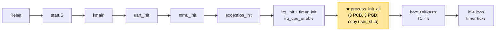
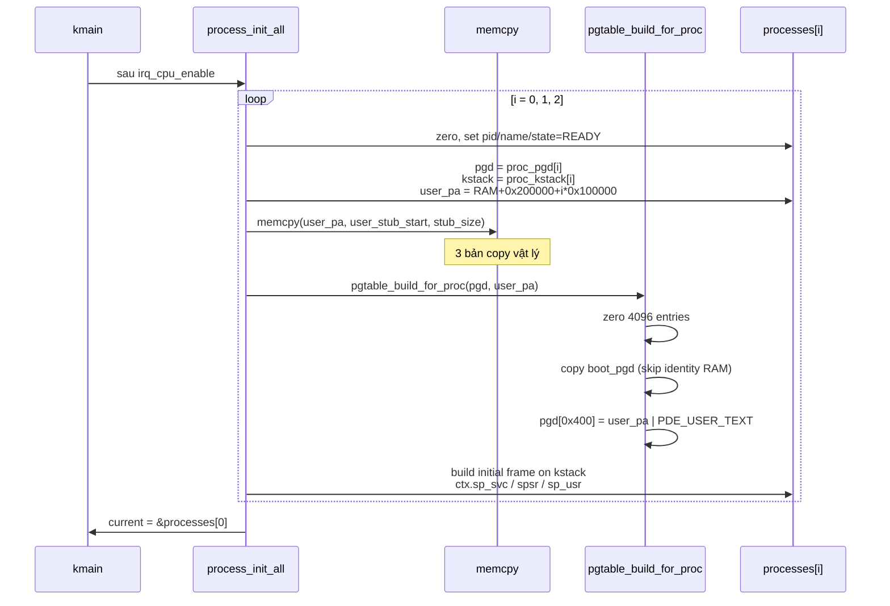

# Chapter 04 — Process: Dựng khung cho nhiều chương trình

> Timer interrupt đã fire mỗi 10 ms, kernel đã nghe được nhịp. Nhưng nghe mà chưa có ai
> để "chọn chạy tiếp" — vì chưa có khái niệm *chương trình*. Chapter này không làm cho
> process chạy — nó **dựng khung**: struct mô tả một process, bộ page table riêng cho
> mỗi process, và stack sẵn sàng cho lần context switch đầu tiên. Khi xong, kernel sẽ
> biết về 3 process, đã cấp đủ tài nguyên cho chúng, nhưng CPU vẫn chưa giao cho ai —
> chapter sau (Context Switch + Scheduler) mới bấm công tắc.

---

## Đã xây dựng đến đâu

Module có dấu ★ là **mới trong chapter này**.

```
┌──────────────────────────────────────────────────────┐
│                    User space                        │
│                                                      │
│   ┌──────────┐   ┌──────────┐   ┌──────────┐         │
│   │ Proc 0   │   │ Proc 1   │   │ Proc 2   │         │
│   │ counter  │   │ runaway  │   │ shell    │  ← stub │
│   │ VA 0x40M │   │ VA 0x40M │   │ VA 0x40M │         │
│   │ PA+0x200k│   │ PA+0x300k│   │ PA+0x400k│         │
│   └──────────┘   └──────────┘   └──────────┘         │
│     (dữ liệu đã ở RAM, chưa ai chạy)                 │
└──────────────────────────────────────────────────────┘
━━━━━━━━━━━━━━━━━━━━━━━━━━━━━━━━━━━━━━━━━━━━━━━━━━━━━━━
┌──────────────────────────────────────────────────────┐
│                   Kernel (SVC mode)                  │
│                                                      │
│   ┌──────────────────────────────────────┐           │
│   │  ★ processes[3]  (PCB table)         │           │
│   │    pid · state · ctx · pgd · kstack  │           │
│   └───────┬─────────────┬────────────────┘           │
│           │             │                             │
│   ┌───────▼────┐  ┌─────▼──────┐                     │
│   │ ★ proc_pgd │  │ ★ proc_    │                     │
│   │ [3][4096]  │  │   kstack   │                     │
│   │ 3 × 16 KB  │  │ [3][8 KB]  │                     │
│   └────────────┘  └────────────┘                     │
│                                                      │
│   ┌────────────┐   ┌───────────────────────┐         │
│   │ IRQ · Timer│   │  Exception · MMU · UART│        │
│   └────────────┘   └───────────────────────┘         │
│                                                      │
│   TTBR0 vẫn = boot_pgd · CPU vẫn chạy kmain trực tiếp│
└──────────────────────────────────────────────────────┘
━━━━━━━━━━━━━━━━━━━━━━━━━━━━━━━━━━━━━━━━━━━━━━━━━━━━━━━
                      Hardware
              CPU · RAM · UART · INTC · Timer
```

**Flow khởi động cập nhật:**



Điểm mới: sau khi IRQ hoạt động, kernel build 3 PCB tĩnh — mỗi PCB có L1 table riêng,
kernel stack riêng, 1 MB user memory riêng (chứa bản sao của user_stub). TTBR0 **không**
bị swap — boot_pgd vẫn đang active, `current` chỉ là một pointer debug. Chapter sau mới
thực sự chuyển CPU vào process.

---

## Nguyên lý

### CPU không biết "process" là gì

Với CPU, tại một thời điểm chỉ có một tập register + một PC. Nó không biết "chương trình"
— chỉ biết đọc instruction tại PC, decode, execute. "Process" là khái niệm do **phần mềm
đặt ra**. Muốn tạo ảo giác nhiều chương trình chạy cùng lúc, kernel lưu trạng thái CPU
của mỗi chương trình vào struct riêng, rồi hoán đổi: save register hiện tại vào struct
A, load register từ struct B → từ đây CPU chạy như thể nó luôn là B.

Struct lưu trạng thái đó gọi là **PCB (Process Control Block)**. Hành động hoán đổi gọi
là **context switch**. Chapter này dựng PCB; context switch nằm ở chapter kế tiếp.

### Một process cần những gì

Để CPU thật sự có thể "là" process A, kernel phải chuẩn bị đủ 4 thứ:

1. **Snapshot CPU state** — r0–r12, SP, PC, CPSR, SPSR. Khi swap vào, load nguyên vẹn
   các register này.
2. **Address space** — page table riêng. User memory của A ≠ của B; cả hai nhìn chung
   vào kernel memory. Đây là nền tảng isolation.
3. **Kernel stack** — khi A vào kernel (qua syscall hoặc IRQ), kernel chạy hàm C trên
   stack. Stack này phải thuộc về A, không chung với process khác — xem lý do ở phần
   Thiết kế.
4. **User memory** — nơi chứa code + data + stack của A khi nó chạy ở user mode.

Khi một trong 4 thứ này thiếu, process không chạy được — hoặc chạy được nhưng không an
toàn (corrupt stack, leak kernel data).

### Vì sao "per-process" thay vì dùng chung

**Per-process page table** nghĩa là mỗi process có bảng dịch VA→PA riêng. Kernel thay đổi
bảng khi switch → process A không thấy được memory của process B, không phải vì "bị cấm"
mà vì trong bản đồ của A đơn giản **không có entry nào** trỏ đến vùng của B. Đây là cách
Linux/Windows isolate process.

Ngược lại, một số kernel nhỏ dùng **page table duy nhất**: mỗi process ở VA khác nhau
nhưng cùng một bảng. Tiện — không cần swap TTBR0, không cần flush TLB. Nhưng mất
isolation: process A vẫn có entry VA cho vùng của B trong cùng bảng, chỉ "không nên"
truy cập. Lỗi code = corrupt nhau.

RingNova chọn **per-process page table** — đi theo spec dự án: "MMU isolation là thật".
Cost: mỗi switch phải ghi TTBR0 và flush TLB.

---

## Bối cảnh

```
Trạng thái kernel lúc vào Chapter 04:
- MMU       : ON, boot_pgd active (identity RAM + high-VA + peripherals)
- IRQ       : ON, CPSR.I = 0, timer tick mỗi 10 ms (tick_count tăng)
- SVC stack : chung cho toàn kernel, _svc_stack_top (8 KB)
- "current" : chưa tồn tại — kmain chạy trực tiếp
- PCB       : chưa có struct, chưa có khái niệm pid
```

Kernel đã có đủ mảnh "phía dưới": đọc hardware được, bắt fault được, nghe interrupt được.
Chưa có gì ở tầng trên cả — kernel vẫn là một chương trình đơn tuyến.

---

## Vấn đề

1. **Không có cấu trúc lưu trạng thái nhiều chương trình** — CPU chỉ có 1 bộ register, 1
   PC. Muốn nhớ "3 chương trình" thì phải có 3 bản snapshot. Chưa có struct nào.

2. **Không có address space riêng** — tất cả code đang dùng chung boot_pgd. Không có
   nghĩa nào để nói "process A ở đâu" ngoài VA do code của nó chọn.

3. **Không có kernel stack riêng** — nếu sau này A gọi syscall và trong khi đang trên
   kernel stack thì timer fire, kernel switch sang B, B cũng gọi syscall → cả hai ghi
   lên cùng stack → corrupt nhau. Cần stack per-process ngay từ đầu.

4. **Không có user memory** — stub code, user stack của process phải được cấp sẵn trước
   khi process chạy. Kernel phải biết PA nào chứa code của A, ánh xạ vào VA user nào.

5. **"Chưa chạy" không phải "không cần dựng"** — một quan niệm sai là "khi nào cần chạy
   mới setup". Thực tế: tất cả infrastructure phải sẵn sàng trước khi bấm công tắc. Nếu
   không, chapter context switch sẽ đồng thời phải: viết assembly khó + dựng data +
   debug cả hai cùng lúc. Rủi ro rất cao.

Chapter này giải quyết 1-4, để chapter context switch chỉ còn việc viết assembly đã có
đủ data bên dưới.

---

## Thiết kế

### 3 process tĩnh, không dynamic

RingNova cố định `NUM_PROCESSES = 3` từ compile time. Không có `process_create()`, không
có fork, không có allocator. PCB nằm trong mảng tĩnh `processes[3]`, page table nằm
trong `proc_pgd[3][4096]` tĩnh, kernel stack trong `proc_kstack[3][8192]` tĩnh. Toàn bộ
trong `.bss`.

Lợi ích:
- Không cần implement bất kỳ allocator nào
- Memory footprint biết chính xác lúc compile
- Debug dễ: địa chỉ PCB/PGD/stack không đổi giữa các lần boot

Hạn chế (chấp nhận): không load binary từ ngoài, không spawn process mới. Đủ cho demo
3 process cố định — đó cũng là scope dự án.

### Layout PCB: `ctx` đứng đầu

```c
typedef struct {
    uint32_t r0, r1, r2, r3, r4, r5, r6, r7;
    uint32_t r8, r9, r10, r11, r12;
    uint32_t sp_svc;    /* kernel SP — trỏ vào initial frame */
    uint32_t lr_svc;
    uint32_t spsr;      /* CPSR snapshot để restore khi về user */
    uint32_t sp_usr;    /* banked USR mode SP                    */
    uint32_t lr_usr;
} proc_context_t;

typedef struct process {
    proc_context_t ctx;                   /* offset 0 — asm-friendly */
    uint32_t       pid;
    task_state_t   state;
    const char    *name;
    uint32_t      *pgd;                   /* VA của L1 table  */
    uint32_t       pgd_pa;                /* PA — cho TTBR0   */
    void          *kstack_base;
    uint32_t       kstack_size;
    uint32_t       user_entry;
    uint32_t       user_stack_top;
    uint32_t       user_phys_base;
} process_t;
```

Quan trọng: `ctx` ở **offset 0**. Context switch assembly sau này chỉ cần pointer vào PCB
(đã có sẵn trong `current`) là truy cập được context ngay, không phải `+offset`. Chi tiết
nhỏ nhưng cắt giảm 1 instruction mỗi lần switch.

`sp_svc` và `sp_usr` tách rời vì ARMv7-A có **banked SP** — mỗi mode có SP vật lý khác
nhau. Lúc ở kernel, CPU dùng `sp_svc`; khi trả về user mode, CPU đổi sang `sp_usr`. PCB
phải nhớ cả hai.

### Layout memory physical — mỗi process một ô riêng

```
RAM_BASE + 0x000000  ┌──────────────────────────────┐
                     │  Kernel image (text+bss)     │
RAM_BASE + 0x104000  ├──────────────────────────────┤
                     │  boot_pgd          (16 KB)   │
RAM_BASE + 0x108000  ├──────────────────────────────┤
                     │  ★ proc_pgd[0]     (16 KB)   │
RAM_BASE + 0x10C000  │  ★ proc_pgd[1]     (16 KB)   │
RAM_BASE + 0x110000  │  ★ proc_pgd[2]     (16 KB)   │
                     ├──────────────────────────────┤
                     │  Exception stacks + other BSS │
                     │  ★ proc_kstack[0..2] (3×8 KB) │
                     │  ★ processes[3]               │
                     │  SVC/IRQ/ABT/UND/FIQ stacks  │
RAM_BASE + 0x200000  ├──────────────────────────────┤
                     │  ★ Process 0 user memory 1MB │  ← user_stub copy
RAM_BASE + 0x300000  ├──────────────────────────────┤
                     │  ★ Process 1 user memory 1MB │
RAM_BASE + 0x400000  ├──────────────────────────────┤
                     │  ★ Process 2 user memory 1MB │
RAM_BASE + 0x500000  └──────────────────────────────┘
```

Mỗi process có **1 MB PA riêng** cho user memory. Ba ô tách biệt — lỗi process A không
chạm được vào ô của B ngay ở tầng physical, chưa kể MMU. Đây là lý do diagram project
chú ý phân biệt PA-level isolation vs VA-level isolation.

Kernel stack per-process được linker đặt trong BSS — PA chính xác tùy layout, không cố
định `+0x117000` như doc memory-architecture đề xuất. Điều gì quan trọng là stack nằm
trong kernel region (cao), 8 KB mỗi stack, align 8-byte — đều thỏa. Symbol `kstack_base`
trong PCB trỏ đến địa chỉ cụ thể được linker tính.

### Mỗi process, một page table — nhưng giống nhau ở chỗ nào?

Cả 3 process dùng chung cùng một kernel (cùng code, cùng data tĩnh, cùng peripheral
register). Chỉ khác ở vùng user. Do đó `proc_pgd[i]` được xây bằng cách **copy** các
entry của boot_pgd, trừ phần identity RAM, rồi thêm đúng một entry user:

```
boot_pgd               proc_pgd[0]            proc_pgd[1]            proc_pgd[2]
─────────              ─────────              ─────────              ─────────
[0x000] FAULT    →     [0x000] FAULT          [0x000] FAULT          [0x000] FAULT
                                            (NULL guard cho cả 3)
[0x400] none     →     [0x400] → PA+0x200k   [0x400] → PA+0x300k    [0x400] → PA+0x400k
                                            (user VA, KHÁC NHAU)
[0x700] → RAM          [0x700] bỏ            [0x700] bỏ             [0x700] bỏ
(identity RAM, skip)                        (xóa identity: không ai
                                             trong proc cần access PA
                                             của kernel bằng cách trừ)
[0xC00] → RAM    →     [0xC00] → RAM         [0xC00] → RAM          [0xC00] → RAM
(kernel high-VA)                            (kernel mirror, GIỐNG)
[0x100] peripheral →   [0x100] peripheral    [0x100] peripheral     [0x100] peripheral
(QEMU peri) hoặc                            (GIỐNG)
[0x44E] (BBB peri)
```

Kết quả:

- **NULL guard** giữ nguyên → tất cả process deref NULL đều Data Abort
- **User section** (`0x40000000`): 3 process trỏ 3 PA khác nhau → isolation thật
- **Kernel high-VA** (`0xC0000000`): cùng PA, cùng permission → kernel luôn access được
- **Peripherals**: cùng — tất cả process gọi syscall đều thấy UART/timer
- **Identity RAM**: xoá → khi context switch swap TTBR0 sang `proc_pgd[i]`, CPU mất
  quyền truy cập PA của kernel qua identity. Điều này không phải vấn đề: kernel đã
  trampoline PC vào high-VA từ lúc boot (`ldr pc, =_start_va` trong `start.S` ngay
  sau `mmu_enable` — xem chapter 03), nên PC nằm trong `0xC0...` — entry này tồn
  tại trong cả `boot_pgd` lẫn mọi `proc_pgd[i]`. Swap TTBR0 không cần trampoline thêm.

### Inline user stub — 3 bản sao vật lý

Code mà process sẽ chạy được **nhúng trong kernel image** như một section `.user_stub`:

```asm
.section .user_stub, "ax"
user_stub_start:
    mov     r0, #1
1:  b       1b
user_stub_end:
```

Một chuỗi instruction ngắn (không cần làm gì thật — process chưa chạy). `process_init_all`
dùng `memcpy` ghi các byte này vào 3 PA khác nhau (PA+0x200000, PA+0x300000, PA+0x400000).

Tại sao copy thay vì share cùng một bản? Nếu cả 3 process trỏ `pgd[0x400]` về cùng một
PA, thì ở góc độ physical, **không có isolation** — 1 địa chỉ RAM duy nhất chứa code,
một process patch ghi vào nó sẽ ảnh hưởng 2 process kia. Copy riêng mỗi bản = isolation
thật từ tầng vật lý. Mỗi byte code đều có địa chỉ RAM riêng biệt.

Lần chap sau khi có syscall, 3 process sẽ thực thi đúng cùng logic (vì bản copy byte-by-
byte), nhưng có thể **modify code** của chính mình mà không ảnh hưởng process khác — đây
là mô hình đúng với OS thật.

### Initial kernel stack frame — dựng trước, dùng sau

Khi chapter context switch viết xong, logic resume một process sẽ là:

```
msr   spsr_cxsf, <ctx.spsr>          @ load SPSR
mov   sp, <ctx.sp_svc>               @ trỏ SP vào initial frame
ldmfd sp!, {r0-r12, pc}^             @ atomic pop 14 words, SPSR → CPSR
```

Lệnh `ldmfd` với cờ `^` ở cuối: pop r0–r12 + PC **đồng thời** copy SPSR sang CPSR. Đây
là cách ARM return từ exception nguyên tử — thay đổi cả PC và mode bit trong 1 lệnh.

Để lệnh đó hoạt động, phải có sẵn 14 word trên kernel stack đúng thứ tự pop ascending:

```
low addr  ┌──────────────┐ ← ctx.sp_svc (SP để pop)
          │ r0  = 0      │ [+0x00]
          │ r1  = 0      │ [+0x04]
          │ ...          │
          │ r12 = 0      │ [+0x30]
          │ pc  = 0x40M  │ [+0x34]  ← user_entry
high addr └──────────────┘ ← kstack_base + 8 KB (đỉnh stack)
```

`process_init_all` xây frame này ngay lúc setup. Giá trị r0–r12 = 0 (process bắt đầu
với register sạch), pc = `USER_VIRT_BASE = 0x40000000` (điểm vào user stub), spsr =
`0x10` (USR mode, IRQ+FIQ unmasked, ARM state), sp_usr = `0x40100000` (đỉnh user stack).

Chapter kế tiếp chỉ cần 3 instruction để chuyển CPU thành process đang chạy ở user mode.
Đây là lý do frame được dựng sẵn: giảm rủi ro cho phần khó (context switch assembly).

---

## Cách hoạt động

### Luồng `process_init_all`



Kết thúc hàm: 3 PCB hoàn chỉnh, 3 PGD populated, 3 bản user_stub trong RAM, `current`
trỏ vào PCB 0. **TTBR0 vẫn chưa đổi** — boot_pgd đang dịch địa chỉ.

### Hai bản đồ song song — boot_pgd vs proc_pgd[i]

```
       boot_pgd (ACTIVE — TTBR0 trỏ đây, identity đã drop sau self-tests)
       ┌────────────────────────────────────┐
       │ 0x000: FAULT      (NULL guard)     │
       │ 0x400: FAULT      (chưa có user)   │
       │ 0x700-0x77F: FAULT (dropped)       │  ← mmu_drop_identity xoá
       │ 0xC00-0xC7F: high-VA alias RAM     │  ← kernel đang chạy ở đây
       │ 0x100/0x1E0: peripherals           │
       └────────────────────────────────────┘

       proc_pgd[0]  (READY — chưa active)
       ┌────────────────────────────────────┐
       │ 0x000: FAULT                       │
       │ 0x400: → RAM_BASE+0x200000 (user)  │  ★
       │ 0x700-0x77F: FAULT (no identity)   │
       │ 0xC00-0xC7F: high-VA (giống)       │
       │ 0x100/0x1E0: peripherals (giống)   │
       └────────────────────────────────────┘
```

Sau khi `mmu_drop_identity()` chạy, `boot_pgd` và `proc_pgd[i]` giờ **rất giống nhau**
ngoại trừ entry `0x400` (user section riêng của mỗi process). Đó chính là bất biến cần
để context switch gọn: swap TTBR0 sang `proc_pgd[i]`, kernel vẫn chạy qua `0xC0...`,
user code ở `0x40000000` giờ trỏ đúng PA của process mới.

---

## Implementation

### Files

| File | Nội dung |
|------|----------|
| [kernel/include/proc.h](../../kernel/include/proc.h) | `process_t`, `proc_context_t`, `task_state_t`, API |
| [kernel/proc/process.c](../../kernel/proc/process.c) | `processes[3]`, `proc_pgd[3]`, `proc_kstack[3]`, init logic |
| [kernel/arch/arm/proc/user_stub.S](../../kernel/arch/arm/proc/user_stub.S) | Inline user stub (section `.user_stub`) |
| [kernel/arch/arm/mm/pgtable.c](../../kernel/arch/arm/mm/pgtable.c) | Thêm `pgtable_build_for_proc` |
| [kernel/include/mmu.h](../../kernel/include/mmu.h) | Thêm `PDE_USER_TEXT`, prototype mới |
| [kernel/include/board.h](../../kernel/include/board.h) | `USER_VIRT_BASE`, `NUM_PROCESSES`, `KSTACK_SIZE`, v.v. |
| [kernel/linker/kernel_qemu.ld](../../kernel/linker/kernel_qemu.ld) | Section `.user_stub`, input pattern `.bss.proc_pgd` aligned 16 KB |
| [kernel/linker/kernel_bbb.ld](../../kernel/linker/kernel_bbb.ld) | Tương tự kernel_qemu.ld |
| [kernel/main.c](../../kernel/main.c) | Gọi `process_init_all()`, tests T7/T8/T9 |

### Điểm chính

**Linker giữ alignment 16 KB cho mỗi L1 table**:

```ld
.bss (NOLOAD) :
{
    . = ALIGN(16384);       /* boot_pgd */
    *(.bss.pgd)
    . = ALIGN(16384);       /* 3 × proc_pgd, aligned contiguous */
    *(.bss.proc_pgd)
    *(.bss*)
    ...
}
```

L1 table phải 16 KB aligned vì TTBR0 register yêu cầu. Với mảng `proc_pgd[3][4096]`,
mỗi row đúng 16 KB, nên chỉ cần align một lần ở đầu — các row sau tự động align.

**`pgtable_build_for_proc` — chiến thuật copy-from-boot**:

```c
for (uint32_t i = 0; i < PGD_ENTRIES; i++) {
    if (boot_pgd[i] == 0) continue;
    if (i >= ident_lo && i < ident_hi) continue;  /* skip identity RAM */
    pgd[i] = boot_pgd[i];
}
pgd[USER_VIRT_BASE >> 20] = (user_pa & 0xFFF00000U) | PDE_USER_TEXT;
```

Không hard-code danh sách peripheral theo platform — iterate boot_pgd và copy tất cả
entry non-zero (trừ identity RAM). Kết quả: peripherals, kernel high-VA alias, high
vectors (nếu sau này có) tự động được mirror. Thay platform → thay `board.h` + `mmu.c`;
file process.c và pgtable.c không cần động.

**`PDE_USER_TEXT` — attribute đúng cho user code**:

```c
#define PDE_USER_TEXT  (PDE_TYPE_SECTION | PDE_C | PDE_B \
                        | PDE_AP_KERN_USER_RW | PDE_DOMAIN(0))
```

Cacheable, bufferable, kernel+user RW, **không** XN (execute never) — user section phải
executable. Domain 0, như mọi entry khác (DACR = client cho domain 0, AP bits quyết định
quyền thực).

**Wire vào kmain** (sau IRQ setup):

```c
irq_cpu_enable();

process_init_all();            /* ★ dựng 3 PCB */

run_boot_tests();              /* T7/T8/T9 verify ngay */
```

Thứ tự không đảo được: `process_init_all` đọc `boot_pgd` (đã có từ `mmu_init`) và dùng
`uart_printf` (đã có từ `uart_init`). Nếu gọi trước những dependency đó, kernel crash
hoặc silent fail.

---

## Testing

Thêm 3 test vào `run_boot_tests`:

| Test | Kiểm tra | Fail nghĩa là |
|------|----------|----------------|
| **T7** | PCB array: `pid == i`, `state == READY`, `pgd != NULL`, align 16 KB, `user_phys_base` đúng offset | Init không chạy / field sai |
| **T8** | Per-process L1 entry: `pgd[0]==0` (NULL guard), `pgd[0x400]` là section với user-RW + PA đúng, `pgd[0xC00] == boot_pgd[0xC00]` (kernel mirror), 3 user PDE khác nhau | PGD build sai / PA trùng |
| **T9** | Initial frame: r0–r12 = 0, pc ở frame = `USER_VIRT_BASE`, `ctx.spsr == 0x10`, `ctx.sp_usr == USER_STACK_TOP` | Stack frame không đúng format cho ldmfd |

**Kết quả trên QEMU:**

```
[PROC] pid=0 name=counter pgd=0xc0108000 kstack=0xc0114210 user_pa=0x70200000
[PROC] pid=1 name=runaway pgd=0xc010c000 kstack=0xc0116210 user_pa=0x70300000
[PROC] pid=2 name=shell   pgd=0xc0110000 kstack=0xc0118210 user_pa=0x70400000
...
[TEST] [PASS] T7 PCB array (3 processes)
[TEST] [PASS] T8 L1 mappings (null+user+kern OK, 3 distinct user PAs)
[TEST] [PASS] T9 initial stack frames (pc=USER_VIRT_BASE, spsr=0x10)
[TEST] ========== 9 passed, 0 failed ==========
```

- `pgd` in ở **VA cao** (`0xc0108000`, `0xc010c000`, `0xc0110000`) vì linker emit symbol
  ở VA. 16 KB-aligned vẫn giữ (offset giữa VA và PA là bội 16 KB).
- `pgd_pa` (không in trong boot log, nhưng lưu trong PCB) = `pgd - PHYS_OFFSET` — đó là
  giá trị TTBR0 sẽ nhận khi context switch.
- `user_pa` vẫn in ở PA: user region dùng PA cho isolation, không lệ thuộc linker.

**Chưa test (thuộc chapter sau):**
- Process thực sự chạy — chưa có context switch
- TTBR0 swap có việc không — chưa swap
- Interrupt xảy ra khi đang ở user mode có restore context đúng không — user mode chưa
  tồn tại trong scope này

---

## Liên kết

### Files trong code

| File | Vai trò |
|------|---------|
| [kernel/include/proc.h](../../kernel/include/proc.h) | Public types + API |
| [kernel/proc/process.c](../../kernel/proc/process.c) | Static init logic |
| [kernel/arch/arm/proc/user_stub.S](../../kernel/arch/arm/proc/user_stub.S) | User stub source |
| [kernel/arch/arm/mm/pgtable.c](../../kernel/arch/arm/mm/pgtable.c) | `pgtable_build_for_proc` |
| [kernel/main.c](../../kernel/main.c) | Wire + tests |

### Dependencies

- **Chapter 03 — MMU**: `boot_pgd` phải hoàn chỉnh trước khi `pgtable_build_for_proc`
  copy entry từ đó; `PDE_*` attribute macros đã định nghĩa
- **Chapter 04 — Interrupts**: không phụ thuộc trực tiếp, nhưng chapter tiếp theo
  (Context Switch) sẽ hook vào IRQ return path — nền cần sẵn
- **CLAUDE.md**: "Không dùng dynamic allocation — static only"; "Exception stack chỉ là
  trampoline, kernel logic chạy trên kernel stack per-process"

### Tiếp theo

**Chapter 06 — Scheduler + Context Switch →** PCB đã dựng xong, nhưng CPU vẫn chưa chạm
vào chúng. Chapter sau viết assembly `context_switch.S`: save register của prev vào
`prev->ctx`, swap TTBR0 sang `next->pgd_pa`, flush TLB, restore register từ `next->ctx`,
atomic pop về user mode. Vì kernel chạy ở VA cao từ boot, swap TTBR0 không cần trampoline
— PC trong `0xC0...` chia sẻ giữa mọi PGD. Kèm scheduler round-robin gọi từ timer IRQ —
lần đầu tiên 3 process thực sự interleave trên terminal.
