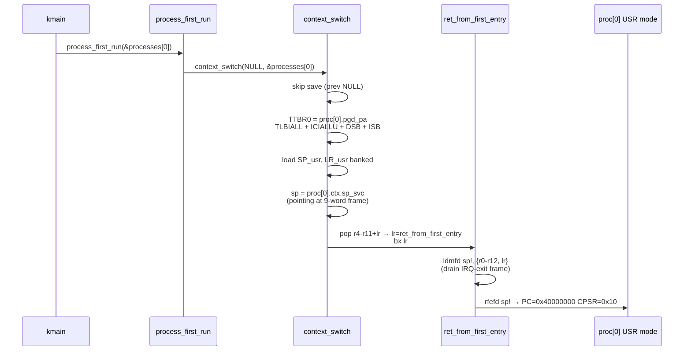
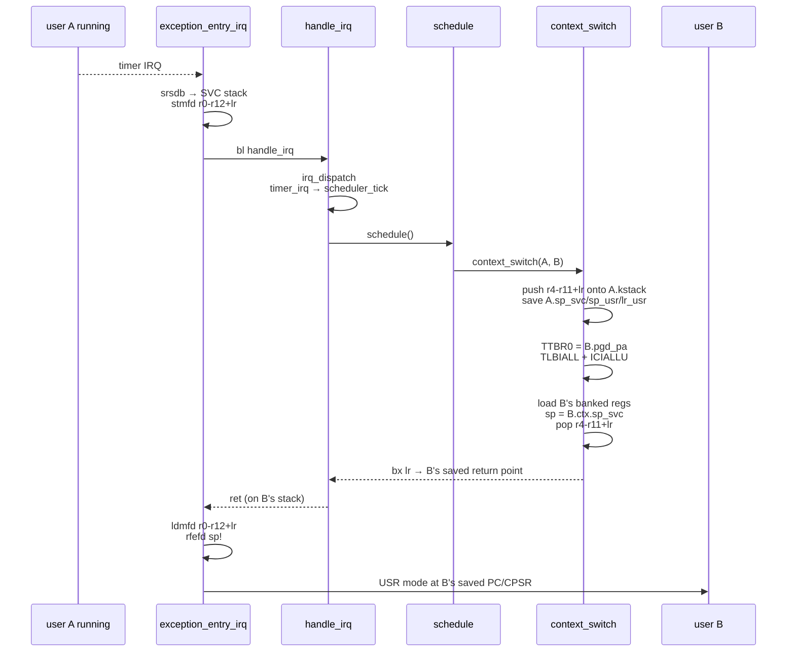
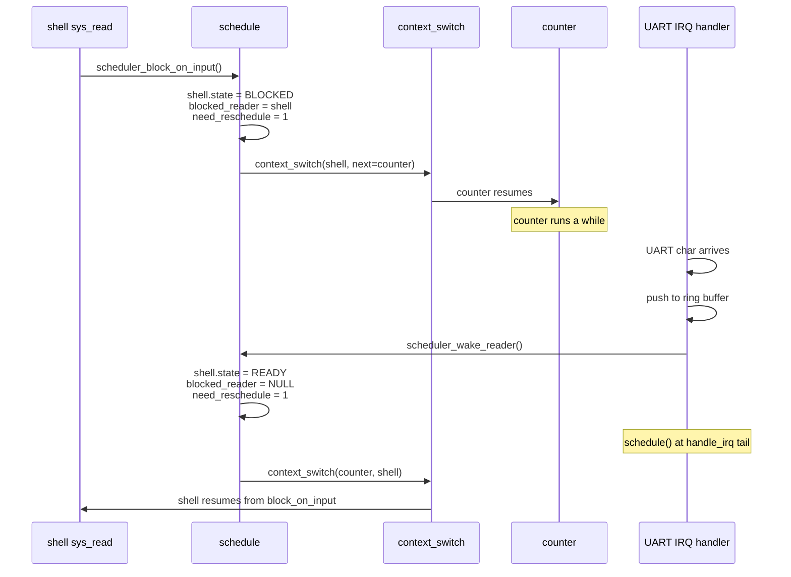

# Chapter 06 — Scheduler + Context Switch: Three processes interleaving

<a id="english"></a>

**English** · [Tiếng Việt](#tiếng-việt)

> The PCBs are built in chapter 05, but the CPU still hasn't touched any process —
> the kernel is stuck in `kmain` and would sit at `wfi` forever if nothing told it to
> hand over control. This chapter writes the two missing pieces: an assembly routine
> that swaps CPU state between two PCBs, and a round-robin scheduler that decides who
> runs next. End result: counter, runaway, and shell take turns every 10 ms and no
> process can force another out of the ring.

---

## What we have so far

Modules marked ★ are **new in this chapter**.

```
┌──────────────────────────────────────────────────────┐
│                     User space                       │
│                                                      │
│   ┌──────────┐  ┌──────────┐  ┌──────────┐           │
│   │ counter  │  │ runaway  │  │ shell    │  ← stub  │
│   └──────────┘  └──────────┘  └──────────┘           │
└──────────────────────────────────────────────────────┘
━━━━━━━━━━━━━━━━━━━━━━━━━━━━━━━━━━━━━━━━━━━━━━━━━━━━━━━
┌──────────────────────────────────────────────────────┐
│                    Kernel (SVC mode)                 │
│                                                      │
│   ┌──────────────────────────────────────────┐       │
│   │ ★ Scheduler                               │       │
│   │    schedule()  — round-robin              │       │
│   │    need_reschedule flag                   │       │
│   │    BLOCKED state + wake hook              │       │
│   └────────────┬─────────────────────────────┘       │
│                │                                     │
│   ┌────────────┴──────────────┐                     │
│   │ ★ context_switch(prev,next) (asm)            │   │
│   │    save r4-r11+lr → prev.kstack             │   │
│   │    save/restore banked SP_usr/LR_usr        │   │
│   │    swap TTBR0 + TLBIALL + ICIALLU           │   │
│   │    load next.kstack → pop r4-r11 + bx lr    │   │
│   └────────────┬──────────────────────────────┘      │
│                │                                     │
│   ┌────────────┴──────────────┐                     │
│   │ ★ ret_from_first_entry (asm trampoline)      │   │
│   │    drain IRQ-exit frame on first use         │   │
│   └───────────────────────────────────────────┘      │
│                                                      │
│   Exception Handler · IRQ dispatch · MMU · UART     │
└──────────────────────────────────────────────────────┘
━━━━━━━━━━━━━━━━━━━━━━━━━━━━━━━━━━━━━━━━━━━━━━━━━━━━━━━
                      Hardware
                  CPU · RAM · Timer (IRQ fires)
```

**Boot flow:**

```mermaid
flowchart LR
    A[kmain boot] --> B[process_init_all<br/>3 PCB + initial frames]
    B --> C[run_boot_tests]
    C --> D[mmu_drop_identity]
    D --> E["★ timer_set_handler<br/>(scheduler_tick)"]
    E --> F["★ process_first_run<br/>context_switch(NULL, proc[0])"]
    F --> G["ret_from_first_entry<br/>→ rfefd → USR mode"]
    G --> H[counter runs]
    H -.timer IRQ.-> I["handle_irq → schedule()"]
    I --> J[context_switch → next]

    style E fill:#ffe699,stroke:#e8a700,color:#000
    style F fill:#ffe699,stroke:#e8a700,color:#000
```



What's new: for the first time PC leaves the kernel and jumps into USR mode at
`0x40000000`. From there, each timer tick pulls the kernel back, `schedule()` picks
the next process, `context_switch()` swaps kernel stack + banked registers + TTBR0,
then `rfefd` drops into the next process's USR state.

---

## Principles

### Context switch = swapping exactly the right state

The CPU has no concept of a "process". As far as the CPU is concerned, a "process"
is just a set of registers + page table + kernel stack currently in use. Swapping
processes means saving A's set into PCB A, loading B's set from PCB B, and
continuing as if nothing had been interrupted.

On ARMv7-A with a User/Kernel split, the state to swap is:

- **GPRs r0–r12**: shared across all modes → already pushed onto the kernel stack
  by the exception entry path when the IRQ fires. Context switch doesn't need to
  touch r0–r12.
- **Callee-saved (r4–r11) + LR** of the kernel code calling `context_switch`: must
  be pushed onto prev's kernel stack so that a later resume continues at the right
  point.
- **Banked SP_usr, LR_usr**: banked per-mode, not on the kernel stack — must be
  saved to the PCB and restored on switch-in.
- **SP_svc** (kernel stack pointer): one per process; swapping SP = swapping this
  process's kernel "view" to the next one's.
- **TTBR0**: address-space base. Different process, different page table.
- **TLB**: caches translations that depend on TTBR0. After changing TTBR0 you
  must invalidate.
- **I-cache**: also depends on VA. Changing TTBR0 without flushing the I-cache
  leaves stale instructions behind.

### Scheduler = who runs next?

Context switch only knows how to swap, not who to swap to. That's the scheduler's
job.

**Round-robin** is the simplest policy: walk the PCB array in order, pick the next
`READY` process, switch to it. Good enough for 3 static processes — fair, no
starvation.

**Preemptive** means a process has no choice. A timer IRQ fires → the kernel takes
the CPU → the scheduler decides → switch. A process stuck in an infinite loop
(runaway) still loses the CPU every 10 ms.

### The BLOCKED state — not running but not dead

`READY / RUNNING / BLOCKED / DEAD`. The scheduler skips `BLOCKED` and `DEAD`.
`BLOCKED` is transient — the process is waiting for an event (e.g. UART RX in
chapter 09). When the event arrives, a hook from the kernel (the UART IRQ handler)
flips it back to `READY` and the next schedule pass picks it up again.

---

## Context

```
State before chapter 06:
- MMU       : ON, 3 processes each with their own proc_pgd (chapter 05)
- PCB       : 3 of them, initial kernel stack frames pre-built
- Timer IRQ : working, tick_count counting up (chapter 04)
- current   : = &processes[0]
- PC        : in kmain, parked at for(;;) wfi
```

No scheduler yet. No context switch yet. No way to move PC to `0x40000000`
(user_entry). The kernel just idles.

---

## The problem

1. **No way to enter user mode the first time.** `kmain` runs in SVC mode. To
   enter USR mode we need `rfefd` or `ldmfd sp!, {..., pc}^` — but that requires
   a correctly-formatted stack frame pushed in advance. The PCB already has an
   initial frame (chapter 05), but no assembly exists yet to perform the jump.

2. **No way to switch between two processes.** Each process has its own kernel
   stack, its own banked SP_usr, its own TTBR0. Swapping all of those in the
   right order isn't something plain C can do (you have to touch banked registers).

3. **The first-entry frame has a different layout from the IRQ-exit frame.** The
   initial frame has 14 words `{r0-r12, user_pc}` matching `msr spsr; ldmfd {..., pc}^`.
   IRQ exit uses srsdb + rfefd with a 16-word layout `{r0-r12, svc_lr, lr_irq,
   spsr_irq}`. Two different exit paths → complex code, easy to get wrong.

4. **The scheduler needs a hook into the timer IRQ.** The timer handler only
   bumps a counter (chapter 04). We need a `need_reschedule` flag so the tail of
   `handle_irq` can call `schedule()` at the right moment — not inside the IRQ
   handler itself (IRQ stack is small, not enough context saved yet).

---

## Design

### A single frame format

Instead of two exit paths (first-entry vs IRQ-exit), we **build the initial frame
using the same layout as the IRQ-exit frame**. 25 words total on the process's
kernel stack:

```
Top (low addr)  ┌─────────────────────┐
                │ r4  = 0             │ \
                │ r5  = 0             │  |
                │ r6  = 0             │  |  9-word kernel-resume frame.
                │ r7  = 0             │  |  context_switch epilogue:
                │ r8  = 0             │  |    ldmfd sp!, {r4-r11, lr}
                │ r9  = 0             │  |    bx lr
                │ r10 = 0             │  |
                │ r11 = 0             │  |
                │ lr  = ret_from_     │ /   first-entry trampoline
                │       first_entry   │
                ├─────────────────────┤
                │ r0  = 0             │ \
                │ r1  = 0             │  |
                │ ...                 │  |  16-word IRQ-exit frame.
                │ r12 = 0             │  |  ret_from_first_entry:
                │ svc_lr = 0          │  |    ldmfd sp!, {r0-r12, lr}
                │ user_pc  = 0x40000000│  |    rfefd sp!
                │ user_cpsr = 0x10    │ /
                └─────────────────────┘
Bottom (high)   ← kstack_base + kstack_size
                ← ctx.sp_svc points at r4 slot
```

When a process resumes:

- **First time**: context_switch pops the 9-word kernel-resume → lr = `ret_from_first_entry`
  → bx lr → the trampoline runs ldmfd + rfefd → USR mode.
- **Previously preempted by an IRQ**: the kernel-resume frame was pushed by
  context_switch itself last time around → pop → bx lr → returns into `handle_irq`
  after the `bl schedule` → exception_entry_irq tail performs ldmfd + rfefd.

The same `ldmfd + rfefd` pair handles both cases. The `ret_from_first_entry`
trampoline only adds 2 instructions.

### `context_switch(prev, next)` — bidirectional, load-only if `prev == NULL`

One function for every case:

```asm
context_switch:
    cmp     r0, #0                @ prev NULL → skip save
    beq     .Lload

    push    {r4-r11, lr}          @ 9 words onto prev's kernel stack
    str     sp, [r0, #CTX_SP_SVC_OFFSET]

    cps     #0x1F                 @ SYS mode shares USR bank
    str     sp, [r0, #CTX_SP_USR_OFFSET]
    str     lr, [r0, #CTX_LR_USR_OFFSET]
    cps     #0x13

.Lload:
    ldr     r2, [r1, #PROC_PGD_PA_OFFSET]
    orr     r2, r2, #0x4A         @ TTBR0 walk attrs
    mcr     p15, 0, r2, c2, c0, 0
    mov     r2, #0
    mcr     p15, 0, r2, c8, c7, 0 @ TLBIALL
    mcr     p15, 0, r2, c7, c5, 0 @ ICIALLU (I-cache is VA-tagged)
    dsb
    isb

    cps     #0x1F
    ldr     sp, [r1, #CTX_SP_USR_OFFSET]
    ldr     lr, [r1, #CTX_LR_USR_OFFSET]
    cps     #0x13

    ldr     sp, [r1, #CTX_SP_SVC_OFFSET]
    pop     {r4-r11, lr}
    bx      lr
```

**`prev == NULL` = bootstrap from kmain**: nothing to save (kmain never resumes);
just load the next process. `kmain` calls this through the wrapper
`process_first_run(&processes[0])`.

The offsets `CTX_SP_SVC_OFFSET` etc. must match the struct layout. The header
[kernel/include/proc.h](../../kernel/include/proc.h) defines the macros **and**
uses `_Static_assert` + `offsetof()` so the compiler catches drift at build time.

### `schedule()` — look at the flag, switch if set

```c
void schedule(void) {
    if (!need_reschedule || !current)
        return;
    need_reschedule = 0;

    process_t *prev = current;
    for (walk the ring starting at prev->pid + 1) {
        process_t *cand = ...;
        if (cand == prev) skip;
        if (cand->state != READY && cand->state != RUNNING) skip;

        if (prev->state == TASK_RUNNING)   /* only demote RUNNING */
            prev->state = TASK_READY;
        cand->state = TASK_RUNNING;
        current = cand;
        context_switch(prev, cand);
        return;
    }
    /* no other runnable process — keep the current one */
}
```

Two details worth calling out:

- **Only demote `RUNNING`** — don't overwrite `DEAD` or `BLOCKED` on switch-out.
  Without this check the scheduler would "resurrect" a dead process and re-run
  crashing code.
- **Skip BLOCKED inside the pick loop** — a BLOCKED process is not in the run
  queue until it's woken.

### Hook into the IRQ and SVC tail

`scheduler_tick()` is registered as the timer callback:

```c
timer_set_handler(scheduler_tick);   /* set need_reschedule = 1 */
```

And both `handle_irq` and `handle_svc` call `schedule()` at their tail:

```c
void handle_irq(void)  { irq_dispatch(); schedule(); }
void handle_svc(ctx)   { syscall_dispatch(ctx); schedule(); }
```

Calling from the tail — **after** the full IRQ/SVC frame has settled on the SVC
stack — lets context_switch swap SP safely.

---

## How it operates

### Bootstrap — process_first_run



### Preemption loop



When user A later gets picked again: load A.sp_svc → pop kernel-resume → lr
points back to the right place (after `bl schedule` in A's `handle_irq`) →
handle_irq returns → exception_entry_irq tail drains A's IRQ frame → A resumes.

### BLOCKED / wake



The shell resumes right after the `schedule();` line in
`scheduler_block_on_input`. It retries the `uart_rx_pop()` loop, this time sees
data, copies it into the user buffer, and returns.

---

## Implementation

### Files

| File | Role |
|---|---|
| [kernel/arch/arm/proc/context_switch.S](../../kernel/arch/arm/proc/context_switch.S) | Bidirectional `context_switch(prev, next)` with `.equ` offsets matching the struct |
| [kernel/arch/arm/exception/exception_entry.S](../../kernel/arch/arm/exception/exception_entry.S) | `ret_from_first_entry` trampoline at the end of the file |
| [kernel/sched/scheduler.c](../../kernel/sched/scheduler.c) | `schedule()`, `scheduler_tick`, `scheduler_block_on_input`, `scheduler_wake_reader` |
| [kernel/include/scheduler.h](../../kernel/include/scheduler.h) | Public API |
| [kernel/include/proc.h](../../kernel/include/proc.h) | `process_t` + offset macros + `_Static_assert` guard |
| [kernel/proc/process.c](../../kernel/proc/process.c) | `process_build_initial_frame` lays down the 25-word stack |
| [kernel/arch/arm/exception/exception_handlers.c](../../kernel/arch/arm/exception/exception_handlers.c) | `handle_irq`/`handle_svc` tail calls into `schedule()` |
| [kernel/main.c](../../kernel/main.c) | `process_first_run(&processes[0])` replaces the idle loop |

### Key points

**Struct offsets must match the asm.** `proc.h` contains:

```c
#define CTX_SP_SVC_OFFSET       52
#define CTX_SP_USR_OFFSET       64
#define CTX_LR_USR_OFFSET       68
#define PROC_PGD_PA_OFFSET      88

_Static_assert(offsetof(proc_context_t, sp_svc) == CTX_SP_SVC_OFFSET,
               "ctx.sp_svc offset drifted");
/* ... */
```

Add a field to the struct → offsets drift → compiler fails the build → you
can't ship broken asm.

**ICIALLU after TTBR0 swap.** On Cortex-A8 the I-cache is VIPT, tagged by PA but
indexed by VA. Once TTBR0 changes, the same VA can map to a new PA; without an
invalidate the CPU may fetch instructions from the stale cache. Forgetting this
line the first time made the first user process silently run code from the
previous process as soon as the first context switch happened — bytes at the new
PA hadn't been flushed out of the D-cache either (see chapter 08).

**D-cache clean inside process_init_all.** The kernel writes the user image
through the high-VA alias → the bytes sit in the D-cache. The user-mode I-fetch
reads through that same VA but goes to the L1 I-cache, which doesn't see the
dirty D-cache line. `process_init_all` calls `icache_sync()` for each image
after `kmemcpy`: DCCMVAU per cache line + DSB + ICIALLU + DSB + ISB.

**The linker `.text` must ALIGN(16) at the end.** The `.user_binaries` section
requires 16-byte alignment. If `.text` ends on a 4-byte boundary, the
`.user_binaries` VMA bumps up to a 16-byte boundary (auto ALIGN) but the LMA
doesn't follow — bytes land 4 bytes off from where the kernel expects. The
symbol `_counter_img_start` points to the right VMA but reads bytes from offset
`+4` of the image. The user runs a shifted instruction → `bl main` lands in
`bl sys_exit`. Fix: force `.text` to end on `ALIGN(16)`.

---

## Testing

The headline observation: 3 processes take turns. The boot log prints `[SCHED]`
for every swap (rate-limited to 6 lines to avoid flooding), then user output
interleaves.

**Smoke test — bootstrap:** counter prints `[pid 0] count=N` periodically,
proving user mode works. If it doesn't print, the frame layout is wrong or
ICIALLU was skipped.

**Smoke test — preemption:** runaway is an infinite loop with no `sys_yield`.
If counter keeps incrementing, the timer IRQ is preempting runaway — that's
real preemption.

**Smoke test — resume:** run long enough to cycle pid 2 → 0 → 1 → 2 at least
once. The second switch TO pid 0 is a resume (no more first-entry path). A
crash at this step means pid 0's kernel-resume frame is broken or the
save-side of context_switch is wrong.

All three are verifiable in a single 5-10 second boot.

---

## Links

### Dependencies

- **Chapter 03 — MMU**: `proc_pgd[i]` + TTBR0 swap are the foundation of
  context_switch.
- **Chapter 04 — Interrupts**: the timer IRQ is the source of preemption.
- **Chapter 05 — Process**: PCB + initial kernel stack frame.
- **CLAUDE.md**: "Exception stacks are only used as a trampoline" + "Don't
  re-enable IRQ inside an IRQ handler" — both rules are reflected in the design
  above.

### Next

**Chapter 07 — Syscall →** Processes now run in USR mode but can't actually do
anything useful: no I/O, no way to talk back to the kernel. The next chapter
opens the `svc #0` door: the user places the syscall number in `r7`, arguments
in `r0-r3`, SVC traps into SVC mode, the kernel dispatches through a function
pointer table, the result comes back in `r0`.

---

<a id="tiếng-việt"></a>

**Tiếng Việt** · [English](#english)

> PCB đã dựng xong ở chapter 05, nhưng CPU vẫn chưa chạm vào process nào — kernel đang
> chạy trong `kmain` và sẽ đứng mãi ở `wfi` nếu không có ai ra lệnh cho nó đổi ngôi.
> Chapter này viết hai mảnh còn thiếu: một đoạn assembly biết tráo trạng thái CPU giữa
> hai PCB, và một scheduler round-robin quyết định ai được chạy tiếp. Kết quả cuối:
> counter, runaway, shell luân phiên mỗi 10 ms mà không process nào "ép" được cái khác.

---

## Đã xây dựng đến đâu

Module có dấu ★ là **mới trong chapter này**.

```
┌──────────────────────────────────────────────────────┐
│                     User space                       │
│                                                      │
│   ┌──────────┐  ┌──────────┐  ┌──────────┐           │
│   │ counter  │  │ runaway  │  │ shell    │  ← stub  │
│   └──────────┘  └──────────┘  └──────────┘           │
└──────────────────────────────────────────────────────┘
━━━━━━━━━━━━━━━━━━━━━━━━━━━━━━━━━━━━━━━━━━━━━━━━━━━━━━━
┌──────────────────────────────────────────────────────┐
│                    Kernel (SVC mode)                 │
│                                                      │
│   ┌──────────────────────────────────────────┐       │
│   │ ★ Scheduler                               │       │
│   │    schedule()  — round-robin              │       │
│   │    need_reschedule flag                   │       │
│   │    BLOCKED state + wake hook              │       │
│   └────────────┬─────────────────────────────┘       │
│                │                                     │
│   ┌────────────┴──────────────┐                     │
│   │ ★ context_switch(prev,next) (asm)            │   │
│   │    save r4-r11+lr → prev.kstack             │   │
│   │    save/restore banked SP_usr/LR_usr        │   │
│   │    swap TTBR0 + TLBIALL + ICIALLU           │   │
│   │    load next.kstack → pop r4-r11 + bx lr    │   │
│   └────────────┬──────────────────────────────┘      │
│                │                                     │
│   ┌────────────┴──────────────┐                     │
│   │ ★ ret_from_first_entry (asm trampoline)      │   │
│   │    drain IRQ-exit frame on first use         │   │
│   └───────────────────────────────────────────┘      │
│                                                      │
│   Exception Handler · IRQ dispatch · MMU · UART     │
└──────────────────────────────────────────────────────┘
━━━━━━━━━━━━━━━━━━━━━━━━━━━━━━━━━━━━━━━━━━━━━━━━━━━━━━━
                      Hardware
                  CPU · RAM · Timer (IRQ fires)
```

**Flow khởi động:**


Điểm mới: lần đầu tiên PC rời kernel, nhảy vào USR mode tại `0x40000000`. Từ đó mỗi
timer tick kéo kernel trở lại, `schedule()` chọn process kế, `context_switch()` tráo
kernel stack + banked registers + TTBR0 rồi `rfefd` vào USR của process kế.

---

## Nguyên lý

### Context switch = đổi đúng đủ trạng thái

CPU không có khái niệm "process". Với CPU, "process" chỉ là một bộ registers + page
table + kernel stack đang dùng. Tráo process = lưu bộ đó của A vào PCB A, nạp bộ của B
từ PCB B, rồi tiếp tục như thể chưa gián đoạn.

Trên ARMv7-A với User/Kernel split, bộ trạng thái cần tráo gồm:

- **GPRs r0–r12**: shared giữa mọi mode → đã được exception entry push lên kernel stack
  khi IRQ fire. Context switch không cần đụng r0–r12.
- **Callee-saved (r4–r11) + LR** của kernel code gọi `context_switch`: phải đẩy xuống
  prev's kernel stack để khi resume sau này, kernel chạy tiếp đúng chỗ.
- **Banked SP_usr, LR_usr**: banked theo mode, không nằm trên kernel stack — phải lưu
  vào PCB và restore khi switch vào.
- **SP_svc** (kernel stack pointer): mỗi process một cái; tráo SP = tráo "góc nhìn"
  kernel của process này sang process kế.
- **TTBR0**: address space base. Process khác page table khác.
- **TLB**: cache translations phụ thuộc TTBR0. Sau khi đổi TTBR0 phải invalidate.
- **I-cache**: cũng phụ thuộc VA. Đổi TTBR0 mà không flush I-cache → instruction cũ
  bám lại.

### Scheduler = ai chạy tiếp?

Context switch chỉ biết cách đổi, không biết đổi sang ai. Đó là việc của scheduler.

**Round-robin** là policy đơn giản nhất: duyệt PCB array theo thứ tự, chọn process
`READY` kế tiếp, switch sang nó. Đủ dùng cho 3 process tĩnh — công bằng, không starvation.

**Preemptive** nghĩa là process không có quyền từ chối. Timer IRQ fire → kernel lấy
CPU → scheduler quyết → switch. Process đang chạy vòng lặp vô hạn (runaway) vẫn bị
tước CPU mỗi 10 ms.

### BLOCKED state — không chạy nhưng chưa chết

`READY / RUNNING / BLOCKED / DEAD`. Scheduler skip `BLOCKED` và `DEAD`. `BLOCKED` là
trạng thái tạm — process đang đợi sự kiện (ví dụ UART RX trong chapter 09). Khi sự
kiện đến, một hook từ kernel (UART IRQ handler) chuyển nó về `READY`, lần schedule
kế tiếp pick lên lại.

---

## Bối cảnh

```
Trạng thái trước chapter 06:
- MMU       : ON, 3 process có proc_pgd riêng (chapter 05)
- PCB       : 3 cái, initial kernel stack frame đã prebuild
- Timer IRQ : hoạt động, tick_count tăng đều (chapter 04)
- current   : = &processes[0]
- PC        : trong kmain, đứng ở for(;;) wfi
```

Scheduler chưa có. Context switch chưa có. Không có cách nào chuyển PC sang
`0x40000000` (user_entry). Kernel chỉ idle.

---

## Vấn đề

1. **Không có cách vào user mode lần đầu.** `kmain` chạy ở SVC mode. Để vào USR mode
   cần `rfefd` hoặc `ldmfd sp!, {..., pc}^` — nhưng phải có stack frame đúng định
   dạng đã push sẵn. PCB đã có initial frame (chapter 05), nhưng chưa có đoạn code
   assembly thực hiện cú nhảy.

2. **Không có cách switch giữa 2 process.** Mỗi process có kernel stack riêng,
   banked SP_usr riêng, TTBR0 riêng. Tráo đồng bộ tất cả trong đúng thứ tự không
   thể viết bằng C thuần (phải chạm banked registers).

3. **Format frame cho first entry khác format IRQ-exit.** Initial frame có 14 words
   `{r0-r12, user_pc}` khớp với `msr spsr; ldmfd {..., pc}^`. IRQ exit dùng srsdb +
   rfefd với format 16 words `{r0-r12, svc_lr, lr_irq, spsr_irq}`. Hai đường thoát
   khác nhau → code phức tạp, dễ lệch.

4. **Scheduler cần hook vào timer IRQ.** Handler timer chỉ bump counter (chapter 04).
   Cần flag `need_reschedule` để tail của `handle_irq` gọi `schedule()` đúng lúc —
   không phải trong IRQ handler (IRQ stack nhỏ, chưa save đủ context).

---

## Thiết kế

### Một định dạng frame duy nhất

Thay vì 2 đường thoát (first entry vs IRQ exit), làm **initial frame theo cùng
format IRQ-exit**. 25 words tổng trên kernel stack của process:

```
Top (low addr)  ┌─────────────────────┐
                │ r4  = 0             │ \
                │ r5  = 0             │  |
                │ r6  = 0             │  |  9-word kernel-resume frame.
                │ r7  = 0             │  |  context_switch epilogue:
                │ r8  = 0             │  |    ldmfd sp!, {r4-r11, lr}
                │ r9  = 0             │  |    bx lr
                │ r10 = 0             │  |
                │ r11 = 0             │  |
                │ lr  = ret_from_     │ /   first-entry trampoline
                │       first_entry   │
                ├─────────────────────┤
                │ r0  = 0             │ \
                │ r1  = 0             │  |
                │ ...                 │  |  16-word IRQ-exit frame.
                │ r12 = 0             │  |  ret_from_first_entry:
                │ svc_lr = 0          │  |    ldmfd sp!, {r0-r12, lr}
                │ user_pc  = 0x40000000│  |    rfefd sp!
                │ user_cpsr = 0x10    │ /
                └─────────────────────┘
Bottom (high)   ← kstack_base + kstack_size
                ← ctx.sp_svc points at r4 slot
```

Khi resume process:
- **First time**: context_switch pops 9-word kernel-resume → lr = `ret_from_first_entry`
  → bx lr → trampoline chạy ldmfd + rfefd → USR mode.
- **Preempted trước đó bởi IRQ**: kernel-resume đã được push bởi chính context_switch
  lần trước → pop → bx lr → trả về `handle_irq` post-bl-schedule → exception_entry_irq
  tail làm ldmfd + rfefd.

Cùng bộ đôi `ldmfd + rfefd` cho cả hai trường hợp. Trampoline
`ret_from_first_entry` chỉ thêm 2 instruction.

### `context_switch(prev, next)` — bidirectional, load-only nếu `prev == NULL`

Một function duy nhất cho mọi trường hợp:

```asm
context_switch:
    cmp     r0, #0                @ prev NULL → skip save
    beq     .Lload

    push    {r4-r11, lr}          @ 9 words onto prev's kernel stack
    str     sp, [r0, #CTX_SP_SVC_OFFSET]

    cps     #0x1F                 @ SYS mode shares USR bank
    str     sp, [r0, #CTX_SP_USR_OFFSET]
    str     lr, [r0, #CTX_LR_USR_OFFSET]
    cps     #0x13

.Lload:
    ldr     r2, [r1, #PROC_PGD_PA_OFFSET]
    orr     r2, r2, #0x4A         @ TTBR0 walk attrs
    mcr     p15, 0, r2, c2, c0, 0
    mov     r2, #0
    mcr     p15, 0, r2, c8, c7, 0 @ TLBIALL
    mcr     p15, 0, r2, c7, c5, 0 @ ICIALLU (I-cache is VA-tagged)
    dsb
    isb

    cps     #0x1F
    ldr     sp, [r1, #CTX_SP_USR_OFFSET]
    ldr     lr, [r1, #CTX_LR_USR_OFFSET]
    cps     #0x13

    ldr     sp, [r1, #CTX_SP_SVC_OFFSET]
    pop     {r4-r11, lr}
    bx      lr
```

**`prev == NULL` = bootstrap từ kmain**: không có gì để save (kmain sẽ không
resume); chỉ load next. `kmain` gọi qua wrapper `process_first_run(&processes[0])`.

Offset của `CTX_SP_SVC_OFFSET` v.v. bắt buộc phải match struct layout. Header
[kernel/include/proc.h](../../kernel/include/proc.h) định nghĩa cả macro **và**
dùng `_Static_assert` + `offsetof()` để compiler bắt lệch tại build time.

### `schedule()` — nhìn flag, switch nếu cần

```c
void schedule(void) {
    if (!need_reschedule || !current)
        return;
    need_reschedule = 0;

    process_t *prev = current;
    for (vòng quanh ring bắt đầu từ prev->pid + 1) {
        process_t *cand = ...;
        if (cand == prev) skip;
        if (cand->state != READY && cand->state != RUNNING) skip;

        if (prev->state == TASK_RUNNING)   /* chỉ demote RUNNING */
            prev->state = TASK_READY;
        cand->state = TASK_RUNNING;
        current = cand;
        context_switch(prev, cand);
        return;
    }
    /* không có process nào khác — giữ current */
}
```

Hai chi tiết:

- **Chỉ demote `RUNNING`** — không overwrite `DEAD` hay `BLOCKED` khi switch-out.
  Thiếu điều kiện này, scheduler sẽ "hồi sinh" process đã chết, chạy lại code crash.
- **Skip BLOCKED ngay trong vòng chọn** — BLOCKED process không thuộc run queue
  đến khi được wake.

### Hook vào IRQ và SVC tail

`scheduler_tick()` gắn vào timer callback:

```c
timer_set_handler(scheduler_tick);   /* set need_reschedule = 1 */
```

Và `handle_irq` + `handle_svc` đều gọi `schedule()` ở tail:

```c
void handle_irq(void)  { irq_dispatch(); schedule(); }
void handle_svc(ctx)   { syscall_dispatch(ctx); schedule(); }
```

Gọi trong tail, **sau khi** toàn bộ IRQ/SVC frame đã settle trên SVC stack. Tại điểm
đó context_switch tráo được SP an toàn.

---

## Cách hoạt động

### Bootstrap — process_first_run


### Preemption loop


Khi user A sau này được chọn lại: load A.sp_svc → pop kernel-resume → lr trỏ về
đúng chỗ (sau `bl schedule` trong A's `handle_irq`) → handle_irq return →
exception_entry_irq tail drain A's IRQ frame → A resume.

### BLOCKED / wake


Shell resume ngay sau dòng `schedule();` trong `scheduler_block_on_input`. Nó retry
loop `uart_rx_pop()`, giờ có data, copy vào user buf, return.

---

## Implementation

### Files

| File | Vai trò |
|---|---|
| [kernel/arch/arm/proc/context_switch.S](../../kernel/arch/arm/proc/context_switch.S) | Bidirectional `context_switch(prev, next)` với offset `.equ` khớp struct |
| [kernel/arch/arm/exception/exception_entry.S](../../kernel/arch/arm/exception/exception_entry.S) | `ret_from_first_entry` trampoline ở cuối file |
| [kernel/sched/scheduler.c](../../kernel/sched/scheduler.c) | `schedule()`, `scheduler_tick`, `scheduler_block_on_input`, `scheduler_wake_reader` |
| [kernel/include/scheduler.h](../../kernel/include/scheduler.h) | Public API |
| [kernel/include/proc.h](../../kernel/include/proc.h) | `process_t` + offset macros + `_Static_assert` guard |
| [kernel/proc/process.c](../../kernel/proc/process.c) | `process_build_initial_frame` dựng 25-word stack |
| [kernel/arch/arm/exception/exception_handlers.c](../../kernel/arch/arm/exception/exception_handlers.c) | `handle_irq`/`handle_svc` tail gọi `schedule()` |
| [kernel/main.c](../../kernel/main.c) | `process_first_run(&processes[0])` thay cho idle loop |

### Điểm chính

**Struct offsets phải khớp asm.** `proc.h` có:

```c
#define CTX_SP_SVC_OFFSET       52
#define CTX_SP_USR_OFFSET       64
#define CTX_LR_USR_OFFSET       68
#define PROC_PGD_PA_OFFSET      88

_Static_assert(offsetof(proc_context_t, sp_svc) == CTX_SP_SVC_OFFSET,
               "ctx.sp_svc offset drifted");
/* ... */
```

Thêm field vào struct → offset lệch → compiler fail build → không thể ship asm sai.

**ICIALLU sau TTBR0 swap.** I-cache trên Cortex-A8 là VIPT với tag theo PA, nhưng
index theo VA. Sau khi TTBR0 đổi, VA cũ có thể ánh xạ sang PA mới; nếu không
invalidate, CPU có thể fetch instruction từ cache cũ. Lần đầu bỏ quên dòng này,
user process đầu tiên chạy code từ process mới ngay lần tráo đầu tiên, crash âm
thầm vì bytes ở PA mới chưa ra memory (D-cache cũng chưa clean — xem chapter 08).

**D-cache clean trong process_init_all.** Kernel ghi user image qua high-VA alias
→ bytes nằm trong D-cache. User I-fetch đọc qua chính VA đó nhưng đi L1 I-cache,
không thấy được D-cache chưa flush. `process_init_all` gọi `icache_sync()` cho
mỗi image sau `kmemcpy`: DCCMVAU từng cache line + DSB + ICIALLU + DSB + ISB.

**Linker `.text` phải ALIGN(16) cuối.** `.user_binaries` section có yêu cầu
alignment 16 byte. Nếu `.text` kết ở biên 4 byte, VMA của `.user_binaries` nhảy
lên biên 16 (tự ALIGN) nhưng LMA không đồng bộ → bytes load vào RAM lệch 4 byte
so với chỗ kernel nghĩ. Symbol `_counter_img_start` trỏ đúng VMA nhưng đọc ra
bytes của offset `+4` trong image. User chạy instruction lệch → `bl main` rơi
vào `bl sys_exit`. Fix: ép `.text` kết ở `ALIGN(16)`.

---

## Testing

Quan sát chính: 3 process luân phiên. Boot log in `[SCHED]` từng lần tráo (rate
limit 6 dòng để không flood), sau đó user code output xen kẽ.

**Smoke test bootstrap:** counter in `[pid 0] count=N` định kỳ chứng minh user
mode hoạt động. Thiếu → có thể là frame layout sai hoặc ICIALLU sót.

**Smoke test preemption:** runaway là vòng lặp vô hạn không `sys_yield`. Nếu
counter vẫn tăng → timer IRQ cắt được runaway → preemption thật.

**Smoke test resume:** chạy đủ lâu để cycle pid 2 → 0 → 1 → 2 ít nhất một lần.
Lần thứ 2 switch TO pid 0 là resume (không còn first entry). Nếu crash ở bước
này thì kernel-resume frame của pid 0 hỏng hoặc save-side của context_switch sai.

Tất cả verify được qua một lần boot 5-10 giây.

---

## Liên kết

### Dependencies

- **Chapter 03 — MMU**: `proc_pgd[i]` + TTBR0 swap nền tảng của context_switch.
- **Chapter 04 — Interrupts**: timer IRQ là nguồn preemption.
- **Chapter 05 — Process**: PCB + initial kernel stack frame.
- **CLAUDE.md**: "Exception stacks chỉ dùng làm trampoline" + "Không re-enable IRQ
  trong IRQ handler" — cả hai đều phản ánh trong thiết kế trên.

### Tiếp theo

**Chapter 07 — Syscall →** Process giờ chạy ở USR mode nhưng không làm được gì có
ích: không I/O, không cách trả lời kernel. Chapter sau mở cửa `svc #0`: user đặt
số syscall vào `r7`, args vào `r0-r3`, SVC trap vào SVC mode, kernel dispatch qua
bảng function pointer, kết quả trả qua `r0`.
