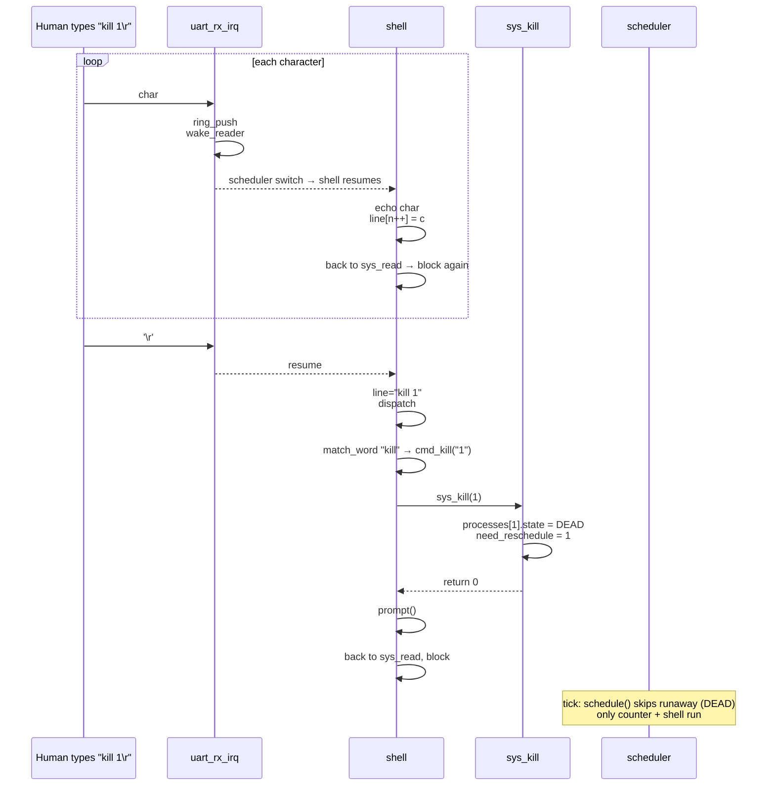
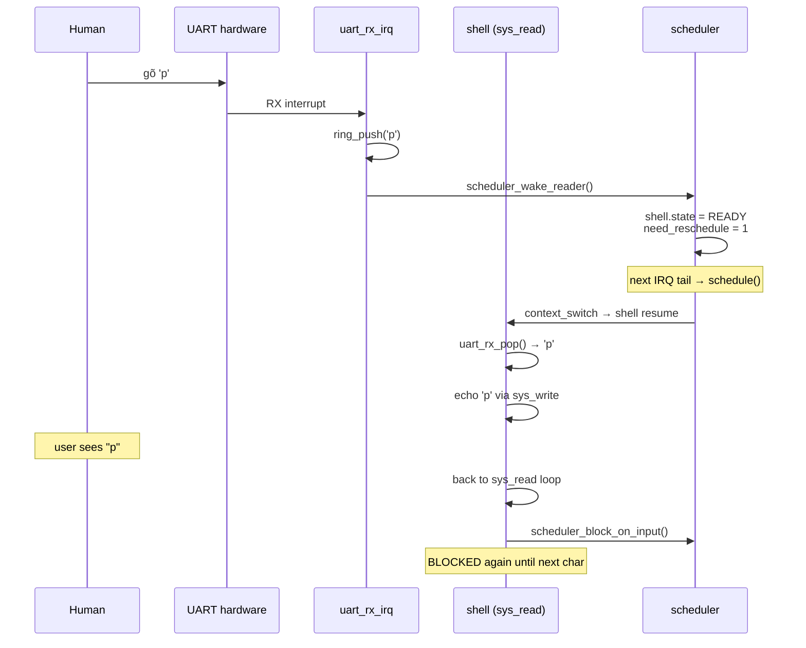
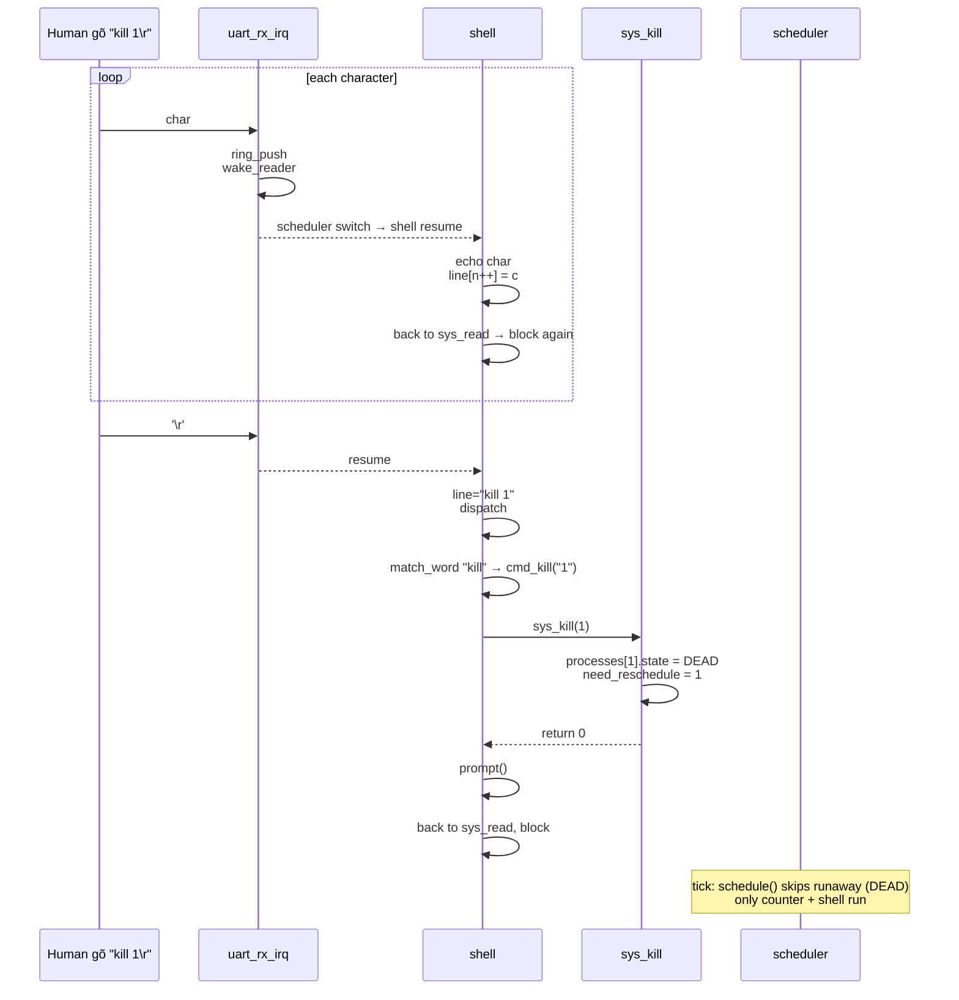

# Chapter 09 — Shell: Building an interactive system from primitives

<a id="english"></a>

**English** · [Tiếng Việt](#tiếng-việt)

> After 8 chapters, RingNova has the full foundation: MMU, preemptive
> scheduler, context switch, syscalls, 3 real user programs. But no one can
> actually talk to the OS yet — stdin can't reach the kernel. This chapter
> adds the last three pieces: a UART RX interrupt that pushes characters
> into a ring buffer, a blocking `sys_read` so the shell can sleep while
> waiting for input, and a user program that parses command lines. Result:
> a `shell>` prompt; type `ps` and see who's running; type `kill 1` and
> runaway disappears from the list. The system now has a complete
> interactive loop.

---

## What we have so far

Modules marked ★ are **new in this chapter**.

```
┌──────────────────────────────────────────────────────┐
│                     User space                       │
│                                                      │
│   counter     runaway     ★ shell (6 commands)       │
│                               help ps kill           │
│                               echo clear crash       │
└──────────────────────────────────────────────────────┘
━━━━━━━━━━━━━━━━━━━━━━━━━━━━━━━━━━━━━━━━━━━━━━━━━━━━━━━
┌──────────────────────────────────────────────────────┐
│                    Kernel                            │
│                                                      │
│   ┌──────────────────────────────────────────────┐  │
│   │ ★ Tier-2 syscalls                            │  │
│   │      sys_read  (blocking via BLOCKED state)   │  │
│   │      sys_ps    (format process list)          │  │
│   │      sys_kill  (mark DEAD by pid)             │  │
│   └──────────────────────────────────────────────┘  │
│                                                      │
│   ┌──────────────────────────────────────────────┐  │
│   │ ★ UART RX path                               │  │
│   │      PL011 RXIM + RTIM enabled               │  │
│   │      128-byte ring buffer (SPSC)             │  │
│   │      uart_rx_irq → drain FIFO + wake reader  │  │
│   └──────────────────────────────────────────────┘  │
│                                                      │
│   ┌──────────────────────────────────────────────┐  │
│   │ ★ BLOCKED state wiring                        │  │
│   │      scheduler_block_on_input (park + sched) │  │
│   │      scheduler_wake_reader    (READY + req)  │  │
│   └──────────────────────────────────────────────┘  │
│                                                      │
│   Scheduler · Syscall · Fault isolation · MMU · IRQ │
└──────────────────────────────────────────────────────┘
```

**The full interactive loop:**


---

## Principles

### Interrupt-driven I/O ≠ polling

Polling:

```c
while (!(UART_FR & RX_READY)) ;    /* spin */
c = UART_DR;
```

Eats 100% CPU, other processes starve. Unacceptable once a scheduler
exists.

Interrupt-driven:

```c
/* Hardware interrupt */
on_rx_irq() { ring_push(UART_DR); wake(reader); }

/* Consumer side */
read_char() {
    while (ring_empty()) { block(); }   /* BLOCKED state */
    return ring_pop();
}
```

The process sleeps while waiting. The CPU goes to other processes. When
data arrives, the hardware wakes it up. That's the standard Unix I/O model.

### Ring buffer: lock-free SPSC

One producer (the UART RX IRQ), one consumer (`sys_read` in SVC mode). One
CPU, no SMP. The structure:

```c
static char              rx_buf[128];
static volatile uint32_t rx_head;   /* written by IRQ */
static volatile uint32_t rx_tail;   /* written by syscall */

int uart_rx_empty(void)  { return rx_head == rx_tail; }
int uart_rx_pop(void)    { ... rx_tail++; return c; }
/* push: rx_buf[rx_head & MASK] = c; rx_head++ */
```

Race analysis:

- Producer (IRQ) writes `rx_head`, reads `rx_tail`. Consumer writes
  `rx_tail`, reads `rx_head`.
- Different indices → no race.
- `volatile` ensures each side reads the most recent value of the other's
  index.

When an IRQ fires right in the middle of the `sys_read` loop:

1. `sys_read` sees `uart_rx_empty() == true` (head==tail).
2. Prepares to block.
3. IRQ fires, pushes, `head++`, wakes.
4. The block path finds shell already READY (the IRQ promoted it from
   BLOCKED → READY immediately) — but `scheduler_block_on_input` was
   already committing to block. Theoretical race.

Fix: the `sys_read` loop retries `uart_rx_pop` after every wake before
blocking again. If there's data → read it, return. If the buffer is empty
(consumed) → block again. The logic self-heals.

### BLOCKED = skipped, not dead

The scheduler already skips non-RUNNING/READY (chapter 06). `BLOCKED` is
the third legal state: not in the run queue, but still alive — it still
owns its kernel stack and a pre-built state ready for resume.

**One blocked slot** — only the shell reads UART, so we use a single
pointer `blocked_reader`:

```c
static process_t *blocked_reader;

void scheduler_block_on_input(void) {
    current->state = TASK_BLOCKED;
    blocked_reader = current;
    need_reschedule = 1;
    schedule();                 /* doesn't return until woken */
}

void scheduler_wake_reader(void) {
    if (blocked_reader && blocked_reader->state == TASK_BLOCKED) {
        blocked_reader->state = TASK_READY;
        blocked_reader = NULL;
        need_reschedule = 1;
    }
}
```

Multiple readers would need a wait-queue (a list of processes waiting on
the same event). One reader → one pointer is enough.

---

## Context

```
State before chapter 09:
- 3 real user programs running (counter, runaway, shell placeholder)
- 4 Tier-1 syscalls: write, getpid, yield, exit
- Fault isolation: user crash → kill process, kernel survives
- UART: TX polling works, RX has no interrupt yet
```

Taking keyboard input is the last missing piece.

---

## The problem

1. **No input I/O.** The shell can't read a command line. Polling burns
   CPU and doesn't fit the scheduler.
2. **BLOCKED state unused.** The `TASK_BLOCKED` enum is defined but no
   code sets it.
3. **No way to list processes from user mode.** No way to verify who's
   running or dead.
4. **No way to kill a process from user mode.** Only `sys_exit` on the
   current one.
5. **Shell bytecode.** Today `shell.c` is just a heartbeat loop. No
   parsing, dispatch, or command handlers.

---

## Design

### UART RX IRQ on PL011

Enable 2 bits in IMSC:

```c
#define PL011_INT_RX    (1U << 4)   /* RX level (FIFO full enough) */
#define PL011_INT_RT    (1U << 6)   /* RX timeout (FIFO idle w/ data) */

REG32(UART0_BASE + PL011_IMSC) = PL011_INT_RX | PL011_INT_RT;
```

- `RXIM`: fires when the RX FIFO crosses a threshold (default 1/8).
- `RTIM`: fires when the FIFO has data but nothing new has arrived for a
  while — guarantees that "typing slowly, a few characters at a time"
  still gets delivered instead of waiting for a full FIFO.

Clear the pending flags via ICR at the end of the handler.

### IRQ wire

The GIC SPI for UART0 on realview-pb-a8 is SPI #12 → ID = 32+12 = **44**.

```c
#define IRQ_UART0    44U
```

In `kmain`:

```c
irq_register(IRQ_UART0, uart_rx_irq);
irq_enable(IRQ_UART0);
```

The IRQ takes the same chapter-04 GIC path as the timer.

### uart_rx_irq handler

```c
void uart_rx_irq(void) {
    while (!(REG32(UART0_BASE + PL011_FR) & PL011_FR_RXFE)) {
        char c = REG32(UART0_BASE + PL011_DR);
        uint32_t next = (rx_head + 1);
        if ((next & MASK) != (rx_tail & MASK)) {
            rx_buf[rx_head & MASK] = c;
            rx_head = next;
        }
        /* else ring full — drop rather than block inside an IRQ */
    }
    REG32(UART0_BASE + PL011_ICR) = PL011_INT_RX | PL011_INT_RT;
    scheduler_wake_reader();
}
```

Drain the whole FIFO (not just one character) so the IRQ doesn't refire
continuously when the user types fast. `schedule()` is called at the tail
of `handle_irq`, so the wake takes effect immediately.

### sys_read: retry loop with block

```c
static long sys_read(uint32_t fd, uint32_t buf_addr, uint32_t len, uint32_t _) {
    if (len == 0)                         return 0;
    if (!valid_user_ptr((void *)buf_addr, len))  return E_FAULT;

    char *buf = (char *)buf_addr;
    uint32_t n = 0;
    while (n < len) {
        int c = uart_rx_pop();
        if (c < 0) {
            if (n > 0) break;                /* return partial */
            scheduler_block_on_input();       /* BLOCKED → wake → retry */
            continue;
        }
        buf[n++] = (char)c;
    }
    return n;
}
```

Semantics:

- **No data** → block.
- **Woken up** → loop retries → reads the new character.
- **Already have >0 bytes** → don't block, return what we have. Lets the
  shell process characters one at a time (no need to wait for a full
  buffer).

### sys_ps: snapshot the process table

```c
static long sys_ps(uint32_t buf_addr, uint32_t size, uint32_t _, uint32_t __) {
    if (!valid_user_ptr((void *)buf_addr, size)) return E_FAULT;

    char *out = (char *)buf_addr;
    uint32_t n = 0;
    for (uint32_t i = 0; i < NUM_PROCESSES; i++) {
        /* compose "<pid> <name> <state>\n" into out[n..] */
    }
    return n;
}
```

There's no `snprintf`; the kernel composes by hand — writing one byte at
a time and checking `n+1 >= size` each step to avoid overflowing the user
buffer.

### sys_kill: mark DEAD, idempotent

```c
static long sys_kill(uint32_t pid, ...) {
    if (pid >= NUM_PROCESSES)                 return E_BADCALL;
    process_t *p = &processes[pid];
    if (p->state == TASK_DEAD)                return 0;  /* already gone */
    uart_printf("[KILL] pid=%u ...\n", p->pid);
    p->state = TASK_DEAD;
    scheduler_request_resched();
    return 0;
}
```

Killing self: `pid == current->pid` → mark DEAD; `schedule()` at the
`handle_svc` tail will context_switch to another process.

### Shell: prompt → read → parse → dispatch

```c
int main(void) {
    ulib_puts("RingNova shell — type 'help' for commands\n");
    char line[64];
    unsigned int n = 0;
    prompt();

    for (;;) {
        char c;
        if (sys_read(0, &c, 1) <= 0) continue;

        if (c == '\r' || c == '\n') {
            ulib_puts("\r\n");
            line[n] = '\0';
            dispatch(line);
            n = 0;
            prompt();
        } else if (c == 0x08 || c == 0x7F) {          /* BS / DEL */
            if (n > 0) { n--; ulib_puts("\b \b"); }
        } else if (n + 1 < sizeof(line)) {
            line[n++] = c;
            sys_write(1, &c, 1);                       /* echo */
        }
    }
}
```

Minimal line editing: backspace deletes the last character (`\b \b` = back
up, write a space over it, back up again). Enter dispatches. Other
characters echo + store. 64-byte buffer — more than enough for a simple
shell.

### 6-command dispatch

```c
static void dispatch(char *line) {
    const char *p = skip_spaces(line);
    const char *rest;
    if (*p == '\0')                          return;
    if ((rest = match_word(p, "help")))   { cmd_help();     return; }
    if ((rest = match_word(p, "ps")))     { cmd_ps();       return; }
    if ((rest = match_word(p, "kill")))   { cmd_kill(rest); return; }
    if ((rest = match_word(p, "echo")))   { cmd_echo(rest); return; }
    if ((rest = match_word(p, "clear")))  { cmd_clear();    return; }
    if ((rest = match_word(p, "crash")))  { cmd_crash();    return; }
    ulib_puts("unknown command — try 'help'\n");
}
```

`match_word(s, "kill")` returns a pointer to the first character after
"kill " if it matches and is followed by a space/EOL, NULL otherwise. The
arguments to `kill` / `echo` are passed into `cmd_*` as a `const char *`.

---

## How it operates

### `kill 1` — from keypress to result



### Fault isolation with `crash`

The `crash` command is `*(int *)0 = 0xDEADBEEF` in user code. The Data
Abort handler (chapter 07) checks the SPSR mode → USR → kills the shell,
calls `schedule()`. Counter + runaway keep running. A complete demo of the
three pillars:

- **MMU**: the NULL guard catches a deref of address 0.
- **Exception**: the abort vector routes into the C handler.
- **Scheduler**: picks the next process when current is DEAD.

All of this happens in a few tens of nanoseconds before the user sees the
`[KILL]` log line and the prompt disappears.

---

## Implementation

### Files

| File | Role |
|---|---|
| [kernel/drivers/uart/uart_core.c](../../kernel/drivers/uart/uart_core.c) | RX ring buffer + `uart_rx_irq` subsystem dispatch |
| [kernel/drivers/uart/pl011.c](../../kernel/drivers/uart/pl011.c) / [ns16550.c](../../kernel/drivers/uart/ns16550.c) | Chip `rx_irq` op: drain FIFO → `uart_rx_push` |
| [kernel/include/drivers/uart.h](../../kernel/include/drivers/uart.h) | Contract `struct uart_ops` + `uart_rx_push/pop/empty` |
| [kernel/platform/qemu/board.h](../../kernel/platform/qemu/board.h) / [bbb/board.h](../../kernel/platform/bbb/board.h) | `IRQ_UART0 = 44` (QEMU) / `72` (BBB) |
| [kernel/sched/scheduler.c](../../kernel/sched/scheduler.c) | `scheduler_block_on_input`, `scheduler_wake_reader` |
| [kernel/syscall/syscall.c](../../kernel/syscall/syscall.c) | `sys_read`, `sys_ps`, `sys_kill` handlers |
| [kernel/include/syscall.h](../../kernel/include/syscall.h) | `SYS_READ=4`, `SYS_PS=5`, `SYS_KILL=6` |
| [kernel/main.c](../../kernel/main.c) | `irq_register(IRQ_UART0, uart_rx_irq)` + enable |
| [user/libc/syscall.h](../../user/libc/syscall.h) | Inline wrappers for the 3 new syscalls |
| [user/libc/ulib.c](../../user/libc/ulib.c) | `ulib_strcmp`, `ulib_strncmp`, `ulib_atoi` |
| [user/apps/shell/shell.c](../../user/apps/shell/shell.c) | The real shell with 6 commands + line editing |

### Key points

**`sys_read` hardcodes fd=0 to UART** — the fd argument is accepted but
ignored. No filesystem, no pipe, just UART. Simpler than real Linux, but
the ABI shape is ready to be extended.

**`echo 'hi there'` echoes via stdin**: user-typed characters traverse
UART RX into the kernel ring; the shell reads one character at a time,
echoes it back (sys_write) and stores it in the line buffer. Two kernel
round-trips per character: RX IRQ pushes into the buffer, `sys_read`
pulls it out + `sys_write` echoes.

**The inline-asm wrapper for sys_ps previously had a bug**: it used
`"=r"(ret)` instead of `"+r"(r0)` — GCC was free to place `ret` in any
register, so the return value from the kernel (which lands in r0 via the
context) didn't reach the caller. Fix: explicit `"+r"(r0)` making r0 both
input (buf) and output (return). Same pattern for every other wrapper
with a return value. Debuggable thanks to the kernel log
`[DBG] shell syscall #5 r0=... r1=... r2=...`: a later `sys_write`
received `r2 = buf_addr` (equal to old r0) instead of length → exposing
that sys_ps's return was landing in the wrong register.

---

## Testing

**Scripted end-to-end** (pipe input + timeout):

```bash
(sleep 2; printf 'ps\r'; sleep 1; printf 'kill 1\r'; sleep 1; printf 'ps\r';
 sleep 1; printf 'crash\r'; sleep 2) | \
    timeout 10 qemu-system-arm ... -nographic -monitor none \
    -kernel build/qemu/kernel.elf > /tmp/uart.txt
```

Expected in the log:

- First `ps` → 3 processes READY/RUNNING.
- `kill 1` → `[KILL] pid=1 name=runaway killed by pid=2 via sys_kill`.
- Second `ps` → `1 runaway DEAD`.
- `crash` → `[FAULT] data abort ... [KILL] pid=2 ... killed by data abort`.
- Counter keeps printing even after the shell dies → isolation.

**Interactive** (user types directly into the QEMU serial window):

```bash
bash scripts/qemu/run.sh
# type: help, ps, echo hi, kill 1, clear, crash
# Ctrl+A x to quit QEMU
```

---

## Links

### Dependencies

- **Chapter 04 — Interrupts**: IRQ dispatch, `irq_register` + `irq_enable`.
- **Chapter 06 — Scheduler**: BLOCKED is already skipped in the run queue;
  the `schedule()` tail hook is what `sys_read` uses to block + wake.
- **Chapter 07 — Syscall**: ABI + dispatch + user-pointer validation +
  fault isolation.
- **Chapter 08 — Userspace**: ulib, crt0, build infrastructure.

### The complete RingNova

This is the final chapter. Adding up all 9:

| Layer | Chapter |
|---|---|
| Foundation | 00 |
| Boot sequence | 01 |
| Exception handling | 02 |
| MMU + VA layout | 03 |
| IRQ + timer | 04 |
| Process (PCB) | 05 |
| Scheduler + context switch | 06 |
| Syscall ABI + fault isolation | 07 |
| Userspace (libc, build, load) | 08 |
| Shell (interactive I/O) | 09 |

All hand-written. About 5000 lines of C + asm + linker + build scripts.
Runs on QEMU realview-pb-a8 and BeagleBone Black.

### Future extensions (out of current scope)

- `fork` + dynamic process creation (needs a physical frame allocator).
- `sys_read` with a bounded timeout.
- FS syscalls (`open`/`close`/`stat`) — needs a filesystem.
- Demand paging (page-fault handler + allocate on demand).
- SMP (multi-CPU) — needs locks.

Those would be a different OS, not RingNova.

---

<a id="tiếng-việt"></a>

**Tiếng Việt** · [English](#english)

> Sau 8 chapter, RingNova có đủ móng: MMU, preemptive scheduler, context switch,
> syscall, 3 user program thật. Nhưng vẫn không ai nói chuyện được với OS — stdin
> chưa vào được kernel. Chapter này thêm 3 miếng cuối: UART RX interrupt đẩy ký tự
> lên ring buffer, `sys_read` blocking để shell ngủ chờ input, và một user program
> parse dòng lệnh. Kết quả: `shell>` prompt, gõ `ps`, thấy ai đang chạy; gõ `kill 1`,
> runaway biến mất khỏi danh sách. Hệ thống đã có vòng tương tác đầy đủ.

---

## Đã xây dựng đến đâu

Module có dấu ★ là **mới trong chapter này**.

```
┌──────────────────────────────────────────────────────┐
│                     User space                       │
│                                                      │
│   counter     runaway     ★ shell (6 commands)       │
│                               help ps kill           │
│                               echo clear crash       │
└──────────────────────────────────────────────────────┘
━━━━━━━━━━━━━━━━━━━━━━━━━━━━━━━━━━━━━━━━━━━━━━━━━━━━━━━
┌──────────────────────────────────────────────────────┐
│                    Kernel                            │
│                                                      │
│   ┌──────────────────────────────────────────────┐  │
│   │ ★ Tier-2 syscalls                            │  │
│   │      sys_read  (blocking via BLOCKED state)   │  │
│   │      sys_ps    (format process list)          │  │
│   │      sys_kill  (mark DEAD by pid)             │  │
│   └──────────────────────────────────────────────┘  │
│                                                      │
│   ┌──────────────────────────────────────────────┐  │
│   │ ★ UART RX path                               │  │
│   │      PL011 RXIM + RTIM enabled               │  │
│   │      128-byte ring buffer (SPSC)             │  │
│   │      uart_rx_irq → drain FIFO + wake reader  │  │
│   └──────────────────────────────────────────────┘  │
│                                                      │
│   ┌──────────────────────────────────────────────┐  │
│   │ ★ BLOCKED state wiring                        │  │
│   │      scheduler_block_on_input (park + sched) │  │
│   │      scheduler_wake_reader    (READY + req)  │  │
│   └──────────────────────────────────────────────┘  │
│                                                      │
│   Scheduler · Syscall · Fault isolation · MMU · IRQ │
└──────────────────────────────────────────────────────┘
```

**Vòng tương tác hoàn chỉnh:**



---

## Nguyên lý

### Interrupt-driven I/O ≠ polling

Polling:
```c
while (!(UART_FR & RX_READY)) ;    /* spin */
c = UART_DR;
```
Ngốn 100% CPU, các process khác đói. Không chấp nhận được khi scheduler đã có.

Interrupt-driven:
```c
/* Hardware interrupts */
on_rx_irq() { ring_push(UART_DR); wake(reader); }

/* Consumer side */
read_char() {
    while (ring_empty()) { block(); }   /* BLOCKED state */
    return ring_pop();
}
```

Process ngủ khi chờ. CPU dành cho process khác. Khi có dữ liệu, hardware đánh
thức. Đó là model I/O chuẩn Unix.

### Ring buffer: SPSC race-free không cần lock

Một producer (UART RX IRQ), một consumer (`sys_read` trong SVC mode). Một CPU,
không SMP. Cấu trúc:

```c
static char              rx_buf[128];
static volatile uint32_t rx_head;   /* ghi bởi IRQ */
static volatile uint32_t rx_tail;   /* ghi bởi syscall */

int uart_rx_empty(void)  { return rx_head == rx_tail; }
int uart_rx_pop(void)    { ... rx_tail++; return c; }
/* push: rx_buf[rx_head & MASK] = c; rx_head++ */
```

Race analysis:
- Producer (IRQ) write `rx_head`, read `rx_tail`. Consumer write `rx_tail`, read
  `rx_head`.
- Không cùng index → không race.
- `volatile` đảm bảo mỗi bên đọc giá trị mới nhất của chỉ số bên kia.

Khi IRQ fire trúng vào `sys_read` loop:
1. `sys_read` thấy `uart_rx_empty() == true` (head==tail).
2. Chuẩn bị block.
3. IRQ fire, push, `head++`, wake.
4. Block thấy shell đã READY (vì IRQ mode promotes từ BLOCKED → READY ngay) —
   nhưng `scheduler_block_on_input` đã chuẩn bị block. Race lý thuyết.

Giải pháp: `sys_read` loop — sau mỗi lần wake, retry `uart_rx_pop` trước khi block
lần nữa. Nếu tab còn data → đọc, return. Nếu đã rỗng (consume xong) → block tiếp.
Logic tự phục hồi.

### BLOCKED = bỏ qua, chưa chết

Scheduler đã có logic skip non-RUNNING/READY (chapter 06). `BLOCKED` là một state
thứ ba hợp lệ: không trong run queue, nhưng còn sống, còn có kernel stack, còn có
pre-built state chờ resume.

**One blocked slot** — chỉ shell đọc UART, nên dùng một pointer duy nhất
`blocked_reader`:
```c
static process_t *blocked_reader;

void scheduler_block_on_input(void) {
    current->state = TASK_BLOCKED;
    blocked_reader = current;
    need_reschedule = 1;
    schedule();                 /* never returns until woken */
}

void scheduler_wake_reader(void) {
    if (blocked_reader && blocked_reader->state == TASK_BLOCKED) {
        blocked_reader->state = TASK_READY;
        blocked_reader = NULL;
        need_reschedule = 1;
    }
}
```

Nhiều reader sẽ cần wait-queue (danh sách process đang chờ cùng event). Một
reader → một pointer đủ.

---

## Bối cảnh

```
Trạng thái trước chapter 09:
- 3 user program chạy thật (counter, runaway, shell placeholder)
- 4 Tier-1 syscall: write, getpid, yield, exit
- Fault isolation: user crash → kill process, kernel sống
- UART: TX polling OK, RX chưa có interrupt
```

Nhận input từ bàn phím là thứ cuối cùng còn thiếu.

---

## Vấn đề

1. **Không có I/O input.** Shell không thể đọc dòng lệnh. Polling burn CPU, không
   phù hợp với scheduler.
2. **BLOCKED state chưa dùng.** Enum `TASK_BLOCKED` đã định nghĩa nhưng không có
   code nào set state đó.
3. **Không có cách list process từ user mode.** Không có cách xác minh process nào
   đang chạy, đang chết.
4. **Không có cách kill process từ user mode.** Chỉ tự `sys_exit` được.
5. **Shell bytecode.** Hiện `shell.c` chỉ là heartbeat loop. Chưa có parse,
   dispatch, command handler.

---

## Thiết kế

### UART RX IRQ on PL011

Enable 2 bit trong IMSC:

```c
#define PL011_INT_RX    (1U << 4)   /* RX level (FIFO full enough) */
#define PL011_INT_RT    (1U << 6)   /* RX timeout (FIFO idle w/ data) */

REG32(UART0_BASE + PL011_IMSC) = PL011_INT_RX | PL011_INT_RT;
```

- `RXIM`: fire khi RX FIFO vượt threshold (mặc định 1/8).
- `RTIM`: fire khi FIFO có data nhưng không nhận thêm một lúc — đảm bảo "đang gõ
  chậm, ít ký tự" vẫn được deliver thay vì chờ đầy FIFO.

Clear pending qua ICR ở cuối handler.

### IRQ wire

GIC SPI cho UART0 trên realview-pb-a8: SPI #12 → ID = 32+12 = **44**.

```c
#define IRQ_UART0    44U
```

Trong `kmain`:
```c
irq_register(IRQ_UART0, uart_rx_irq);
irq_enable(IRQ_UART0);
```

IRQ nhánh qua chapter-04 GIC path giống timer.

### uart_rx_irq handler

```c
void uart_rx_irq(void) {
    while (!(REG32(UART0_BASE + PL011_FR) & PL011_FR_RXFE)) {
        char c = REG32(UART0_BASE + PL011_DR);
        uint32_t next = (rx_head + 1);
        if ((next & MASK) != (rx_tail & MASK)) {
            rx_buf[rx_head & MASK] = c;
            rx_head = next;
        }
        /* else ring full — drop rather than block in IRQ */
    }
    REG32(UART0_BASE + PL011_ICR) = PL011_INT_RX | PL011_INT_RT;
    scheduler_wake_reader();
}
```

Drain FIFO hết (không chỉ 1 ký tự) để khỏi fire IRQ lặp liên tục khi user gõ nhanh.
`schedule()` được gọi ngay ở tail `handle_irq` nên wake có hiệu lực tức thời.

### sys_read: retry loop với block

```c
static long sys_read(uint32_t fd, uint32_t buf_addr, uint32_t len, uint32_t _) {
    if (len == 0)                         return 0;
    if (!valid_user_ptr((void *)buf_addr, len))  return E_FAULT;

    char *buf = (char *)buf_addr;
    uint32_t n = 0;
    while (n < len) {
        int c = uart_rx_pop();
        if (c < 0) {
            if (n > 0) break;                /* return partial */
            scheduler_block_on_input();       /* BLOCKED → wake → retry */
            continue;
        }
        buf[n++] = (char)c;
    }
    return n;
}
```

Semantics:
- **Không có data** → block.
- **Wake up** → retry loop → đọc ký tự mới.
- **Đã có >0 byte** → không block, return số đã đọc. Cho phép shell xử lý từng ký
  tự một (không đợi đầy buffer).

### sys_ps: snapshot process table

```c
static long sys_ps(uint32_t buf_addr, uint32_t size, uint32_t _, uint32_t __) {
    if (!valid_user_ptr((void *)buf_addr, size)) return E_FAULT;

    char *out = (char *)buf_addr;
    uint32_t n = 0;
    for (uint32_t i = 0; i < NUM_PROCESSES; i++) {
        /* compose "<pid> <name> <state>\n" into out[n..] */
    }
    return n;
}
```

Không có `snprintf`, kernel compose bằng tay — ghi từng byte, kiểm tra `n+1 >= size`
mỗi bước để không tràn user buf.

### sys_kill: mark DEAD idempotent

```c
static long sys_kill(uint32_t pid, ...) {
    if (pid >= NUM_PROCESSES)                 return E_BADCALL;
    process_t *p = &processes[pid];
    if (p->state == TASK_DEAD)                return 0;  /* already gone */
    uart_printf("[KILL] pid=%u ...\n", p->pid);
    p->state = TASK_DEAD;
    scheduler_request_resched();
    return 0;
}
```

Kill self: `pid == current->pid` → mark DEAD, `schedule()` tại `handle_svc` tail
sẽ context_switch sang process khác.

### Shell: prompt → read → parse → dispatch

```c
int main(void) {
    ulib_puts("RingNova shell — type 'help' for commands\n");
    char line[64];
    unsigned int n = 0;
    prompt();

    for (;;) {
        char c;
        if (sys_read(0, &c, 1) <= 0) continue;

        if (c == '\r' || c == '\n') {
            ulib_puts("\r\n");
            line[n] = '\0';
            dispatch(line);
            n = 0;
            prompt();
        } else if (c == 0x08 || c == 0x7F) {          /* BS / DEL */
            if (n > 0) { n--; ulib_puts("\b \b"); }
        } else if (n + 1 < sizeof(line)) {
            line[n++] = c;
            sys_write(1, &c, 1);                       /* echo */
        }
    }
}
```

Line editing tối thiểu: backspace xoá ký tự cuối (`\b \b` = lùi, ghi khoảng trắng
đè, lùi lại). Enter dispatch. Các ký tự khác echo + lưu. Buffer 64 — không cần dài
hơn cho shell đơn giản.

### Dispatch 6 lệnh

```c
static void dispatch(char *line) {
    const char *p = skip_spaces(line);
    const char *rest;
    if (*p == '\0')                          return;
    if ((rest = match_word(p, "help")))   { cmd_help();     return; }
    if ((rest = match_word(p, "ps")))     { cmd_ps();       return; }
    if ((rest = match_word(p, "kill")))   { cmd_kill(rest); return; }
    if ((rest = match_word(p, "echo")))   { cmd_echo(rest); return; }
    if ((rest = match_word(p, "clear")))  { cmd_clear();    return; }
    if ((rest = match_word(p, "crash")))  { cmd_crash();    return; }
    ulib_puts("unknown command — try 'help'\n");
}
```

`match_word(s, "kill")` trả con trỏ đến ký tự đầu sau "kill " nếu match và theo
sau bởi space/EOL, NULL ngược lại. Argument cho `kill` / `echo` truyền vào
`cmd_*` dưới dạng `const char *`.

---

## Cách hoạt động

### `kill 1` — từ gõ đến kết quả



### Fault isolation với `crash`

`crash` command là `*(int *)0 = 0xDEADBEEF` trong user code. Data Abort handler
(chapter 07) check SPSR mode → USR → kill shell, `schedule()`. Counter + runaway
tiếp tục. Demo hoàn chỉnh của 3 trụ cột:

- **MMU**: NULL guard bắt được deref address 0.
- **Exception**: abort vector route vào handler C.
- **Scheduler**: pick next process khi current DEAD.

Tất cả xảy ra trong khoảng vài chục nanosecond trước khi user thấy `[KILL]` log
và prompt biến mất.

---

## Implementation

### Files

| File | Vai trò |
|---|---|
| [kernel/drivers/uart/uart_core.c](../../kernel/drivers/uart/uart_core.c) | RX ring buffer + `uart_rx_irq` subsystem dispatch |
| [kernel/drivers/uart/pl011.c](../../kernel/drivers/uart/pl011.c) / [ns16550.c](../../kernel/drivers/uart/ns16550.c) | Chip `rx_irq` op: drain FIFO → `uart_rx_push` |
| [kernel/include/drivers/uart.h](../../kernel/include/drivers/uart.h) | Contract `struct uart_ops` + `uart_rx_push/pop/empty` |
| [kernel/platform/qemu/board.h](../../kernel/platform/qemu/board.h) / [bbb/board.h](../../kernel/platform/bbb/board.h) | `IRQ_UART0 = 44` (QEMU) / `72` (BBB) |
| [kernel/sched/scheduler.c](../../kernel/sched/scheduler.c) | `scheduler_block_on_input`, `scheduler_wake_reader` |
| [kernel/syscall/syscall.c](../../kernel/syscall/syscall.c) | `sys_read`, `sys_ps`, `sys_kill` handlers |
| [kernel/include/syscall.h](../../kernel/include/syscall.h) | `SYS_READ=4`, `SYS_PS=5`, `SYS_KILL=6` |
| [kernel/main.c](../../kernel/main.c) | `irq_register(IRQ_UART0, uart_rx_irq)` + enable |
| [user/libc/syscall.h](../../user/libc/syscall.h) | Inline wrappers cho 3 syscall mới |
| [user/libc/ulib.c](../../user/libc/ulib.c) | `ulib_strcmp`, `ulib_strncmp`, `ulib_atoi` |
| [user/apps/shell/shell.c](../../user/apps/shell/shell.c) | Shell thật với 6 lệnh + line editing |

### Điểm chính

**`sys_read` fd=0 hardcode UART** — fd arg nhận nhưng bỏ qua. Không có filesystem,
không có pipe, chỉ UART. Đơn giản hơn thực tế Linux, nhưng khuôn ABI sẵn sàng mở
rộng.

**`echo 'hi there'` echo qua stdin**: ký tự user gõ đi qua UART RX vào kernel ring;
shell đọc từng ký tự, echo lại (sys_write) + lưu line buffer. Có 2 vòng "trip"
vào kernel cho mỗi ký tự: RX IRQ đẩy vào buffer, `sys_read` kéo ra + `sys_write`
echo.

**Inline asm wrapper cho sys_ps trước đây có bug**: dùng `"=r"(ret)` thay vì
`"+r"(r0)` — GCC cho phép ret nằm ở register bất kỳ, nên giá trị trả về từ kernel
(đặt vào r0 qua ctx) không đi đúng chỗ. Fix bằng explicit `"+r"(r0)` cho phép
r0 vừa input (buf) vừa output (return). Cùng pattern cho mọi wrapper khác có
return value. Debug được nhờ kernel log `[DBG] shell syscall #5 r0=... r1=... r2=...`
so sánh với syscall sau đó `sys_write` nhận `r2 = buf_addr` (bằng r0 cũ) thay vì
length → tố cáo return của sys_ps không vào đúng register.

---

## Testing

**Scripted end-to-end** (pipe input + timeout):

```bash
(sleep 2; printf 'ps\r'; sleep 1; printf 'kill 1\r'; sleep 1; printf 'ps\r';
 sleep 1; printf 'crash\r'; sleep 2) | \
    timeout 10 qemu-system-arm ... -nographic -monitor none \
    -kernel build/qemu/kernel.elf > /tmp/uart.txt
```

Expect trong log:
- `ps` đầu → 3 process READY/RUNNING.
- `kill 1` → `[KILL] pid=1 name=runaway killed by pid=2 via sys_kill`.
- `ps` thứ hai → `1 runaway DEAD`.
- `crash` → `[FAULT] data abort ... [KILL] pid=2 ... killed by data abort`.
- Counter tiếp tục in dù shell đã chết → isolation.

**Interactive** (user gõ trực tiếp qua QEMU serial window):
```bash
bash scripts/qemu/run.sh
# gõ: help, ps, echo hi, kill 1, clear, crash
# Ctrl+A x để thoát QEMU
```

---

## Liên kết

### Dependencies

- **Chapter 04 — Interrupts**: IRQ dispatch, `irq_register` + `irq_enable`.
- **Chapter 06 — Scheduler**: BLOCKED state đã được skip trong run queue; `schedule()`
  tail hook cho `sys_read` block + wake.
- **Chapter 07 — Syscall**: ABI + dispatch + user pointer validation + fault
  isolation.
- **Chapter 08 — Userspace**: ulib, crt0, build infrastructure.

### RingNova hoàn chỉnh

Chapter này là chapter cuối. Cộng lại qua 9 chapter:

| Layer | Chapter |
|---|---|
| Foundation | 00 |
| Boot sequence | 01 |
| Exception handling | 02 |
| MMU + VA layout | 03 |
| IRQ + timer | 04 |
| Process (PCB) | 05 |
| Scheduler + context switch | 06 |
| Syscall ABI + fault isolation | 07 |
| Userspace (libc, build, load) | 08 |
| Shell (interactive I/O) | 09 |

Tất cả tự viết. Khoảng 5000 dòng C + asm + linker + build scripts. Chạy trên QEMU
realview-pb-a8; BBB port là extension tiếp theo (NS16550 RX IRQ chưa implement).

### Có thể thêm sau (ngoài scope hiện tại)

- `fork` + dynamic process creation (cần physical frame allocator).
- `sys_read` với blocking time-bounded (timeout).
- FS syscalls (`open`/`close`/`stat`) — cần filesystem.
- Demand paging (page fault handler + trên-cần-thiết cấp page).
- SMP (multi-CPU) — cần lock.

Nhưng những thứ đó là OS khác, không phải RingNova nữa.
